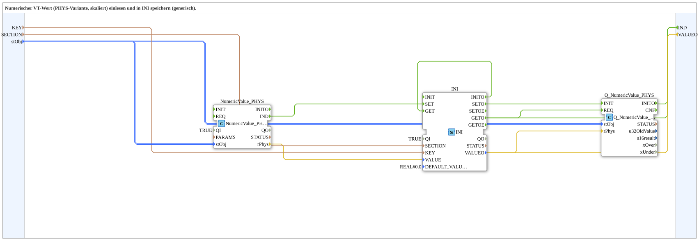

# NumericValue_PHYS_TO_INI

* * * * * * * * * *
## Einleitung

Die SubApp **NumericValue_PHYS_TO_INI** dient zum Einlesen eines numerischen Werts aus einer physikalischen Größe (z. B. einem Messwert mit Skalierung und Offset) und zum Speichern dieses Werts in eine INI-Datei. Sie kombiniert dabei die Funktionen eines physikalischen Wertaufnehmers (`NumericValue_PHYS`) mit einem INI-Speicher (`INI`) und einer Qualitätsüberwachung (`Q_NumericValue_PHYS`). Die SubApp ist generisch aufgebaut und ermöglicht die Wiederverwendung in verschiedenen Anwendungen, bei denen ein physikalischer Wert persistiert werden soll.

## Schnittstellenstruktur

### **Ereignis-Eingänge**

Die SubApp besitzt keine Ereignis-Eingänge. Die interne Verarbeitung wird vollständig durch die eingebetteten Funktionsblöcke angestoßen.

### **Ereignis-Ausgänge**

| Name | Typ | Kommentar |
|------|-----|-----------|
| `IND` | Event | Wird ausgelöst, nachdem der Wert in die INI-Datei geschrieben oder aus dieser gelesen wurde. |

### **Daten-Eingänge**

| Name | Datentyp | Kommentar |
|------|----------|-----------|
| `KEY` | `STRING` | Schlüsselname für den INI-Eintrag. |
| `SECTION` | `STRING` | Abschnittsname in der INI-Datei. |
| `stObj` | `logiBUS::utils::conversion::phys::NumericObjectPool_S` | Struktur mit physikalischen Parametern (z. B. Objekt-ID, Skalierung, Offset, Dezimalstellen). Initialwert: `(u16ObjId := ID_NULL, r32Scale := 1.0, i32Offset := 0, u8Decimals := 0)`. |

### **Daten-Ausgänge**

| Name | Datentyp | Kommentar |
|------|----------|-----------|
| `VALUEO` | `REAL` | Ausgangswert; entspricht dem Wert, der aus der INI-Datei zurückgelesen wird. |

### **Adapter**

Keine Adapter vorhanden.

## Funktionsweise

Die SubApp verwendet drei interne Funktionsblöcke:

1. **`NumericValue_PHYS`** (Typ `isobus::UT::io::NumericValue::NumericValue_PHYS`):  
   Liest den aktuellen physikalischen Wert (skaliert) und stellt ihn als REAL-Wert an seinem Ausgang `rPhys` bereit. Der Eingang `stObj` definiert die Parameter der physikalischen Umrechnung.

2. **`INI`** (Typ `eclipse4diac::storage::INI`):  
   Dient zum Lesen und Schreiben von Werten in einer INI-Datei. Über die Eingänge `KEY` und `SECTION` wird der Zielort festgelegt. Der Eingang `VALUE` erhält den zu speichernden Wert, während der Ausgang `VALUEO` den aus der Datei gelesenen Wert liefert. Der Parameter `DEFAULT_VALUE` ist auf `REAL#0.0` gesetzt.

3. **`Q_NumericValue_PHYS`** (Typ `isobus::UT::Q::Q_NumericValue_PHYS`):  
   Ein Qualitätsüberwachungsblock, der die Konsistenz des physikalischen Wertes prüft. Er erhält die gleichen physikalischen Parameter (`stObj`) sowie den aus der INI gelesenen Wert (`rPhys`) und wird über das Ereignis `REQ` aktiviert. Die Ausgänge dieses Blocks sind nicht weiter verbunden, dienen aber möglicherweise zur internen Diagnose.

**Ablauf:**

- Sobald `NumericValue_PHYS` einen neuen Wert erfasst, sendet es das Ereignis `IND` an den Eingang `SET` des INI-Blocks.
- Dadurch wird der aktuelle `rPhys`-Wert in die INI-Datei geschrieben. Nach erfolgreichem Schreiben gibt der INI-Block das Ereignis `SETO` aus.
- `SETO` triggert das Ereignis `IND` der SubApp, wodurch nach außen signalisiert wird, dass der Wert gespeichert wurde.
- Parallel dazu wird durch das Ereignis `INITO` (das bei der Initialisierung des INI-Blocks automatisch ausgelöst wird) der Eingang `GET` angestoßen. Dadurch wird der gespeicherte Wert aus der INI-Datei zurückgelesen.
- Nach dem Lesen erzeugt der INI-Block das Ereignis `GETO`. Dieses triggert sowohl den Qualitätsblock `Q_NumericValue_PHYS` (über `REQ`) als auch erneut das SubApp-Ereignis `IND`.
- Der aus der INI gelesene Wert steht am Ausgang `VALUEO` zur Verfügung und wird außerdem an den Qualitätsblock übergeben.

Die doppelte Ausgabe von `IND` (einmal nach `SETO` und einmal nach `GETO`) ermöglicht es dem Anwender, beide Schritte (Schreiben und Lesen) separat zu quittieren, sofern die Verbindungen entsprechend sichtbar geschaltet sind.

## Technische Besonderheiten

- **Generische Konfiguration:** Die SubApp ist vollständig über die Eingänge `KEY`, `SECTION` und `stObj` parametrierbar und kann dadurch für verschiedene physikalische Größen und INI-Abschnitte eingesetzt werden.
- **Integrierte Qualitätsprüfung:** Der Block `Q_NumericValue_PHYS` bietet eine zusätzliche Kontrollmöglichkeit, deren Ausgänge in der vorliegenden Verbindung nicht nach außen geführt sind. Er kann bei Bedarf erweitert oder um weitere Verbindungen ergänzt werden.
- **Initialwert des INI-Blocks:** Der `DEFAULT_VALUE` ist auf `REAL#0.0` gesetzt, was sicherstellt, dass beim Lesen eines nicht existierenden Eintrags ein definierter Wert zurückgegeben wird.
- **Verwendung von Strukturtypen:** Der Eingang `stObj` verwendet den komplexen Datentyp `NumericObjectPool_S`, der eine kompakte Bündelung aller physikalischen Parameter ermöglicht.
- **Interne Ereignisschleife:** Durch die Verbindung `INITO` → `GET` wird direkt nach der Initialisierung ein Lesevorgang angestoßen, sodass der INI-Wert sofort nach dem Start verfügbar ist.

## Zustandsübersicht

Die SubApp besitzt keinen expliziten Zustandsautomaten auf oberster Ebene. Ihr Verhalten wird durch die internen Funktionsblöcke gesteuert. Die wesentlichen Zustände lassen sich anhand der Ereignisse ableiten:

- **Initialisierung:** Beim ersten Aktivieren des INI-Blocks wird `INITO` gesetzt, was den Lesevorgang auslöst.
- **Schreiben:** Das Ereignis `SET` wird durch `NumericValue_PHYS.IND` ausgelöst. Nach Abschluss des Schreibvorgangs wird `SETO` erzeugt.
- **Lesen:** Das Ereignis `GET` wird durch `INITO` (initial) oder durch externe Anforderungen ausgelöst. Nach Abschluss des Lesevorgangs wird `GETO` erzeugt.
- **Warten:** Nach Ausgabe von `IND` wartet die SubApp auf das nächste Ereignis von `NumericValue_PHYS`.

Eine feinere Unterteilung könnte durch die Qualitätsüberwachung des Blocks `Q_NumericValue_PHYS` vorgenommen werden, deren Ausgänge hier jedoch nicht weiterverarbeitet werden.

## Anwendungsszenarien

- **Persistente Speicherung von Messwerten:** Ein physikalischer Sensor (z. B. Temperatur, Druck) liefert über `NumericValue_PHYS` einen skalierten Wert. Dieser wird in eine INI-Datei geschrieben, sodass er nach einem Neustart des Systems wieder verfügbar ist.
- **Parameterverwaltung:** Die SubApp kann verwendet werden, um aktuelle Geräteparameter in einer Konfigurationsdatei abzulegen und bei Bedarf wieder einzulesen.
- **Abgleich zwischen Live-Wert und gespeichertem Wert:** Durch die gleichzeitige Ausgabe von `VALUEO` (gelesener Wert) und den internen Verbindungen kann ein Vergleich zwischen dem aktuellen Messwert und dem zuletzt gespeicherten Wert durchgeführt werden.
- **Wiederverwendbare Baustein-Bibliothek:** Durch die Auslagerung aus einer bestehenden Übung (`Uebung_012e_sub`) kann der Baustein in verschiedenen Projekten eingesetzt werden, ohne die interne Logik neu zu implementieren.

## Vergleich mit ähnlichen Bausteinen

Im Vergleich zu einfachen INI-Schreib-/Lesebausteinen bietet `NumericValue_PHYS_TO_INI` eine integrierte physikalische Umrechnung und eine Qualitätsüberwachung. Während ein Standard-`INI`-Block nur die reine Speicherung übernimmt, übernimmt diese SubApp zusätzlich die Umrechnung eines rohen Messwerts in eine physikalische Größe (Skalierung, Offset) und die anschließende Persistierung. Der Qualitätsblock `Q_NumericValue_PHYS` hebt die SubApp von reinen Speicherlösungen ab und ermöglicht eine erweiterte Diagnose, auch wenn deren Ausgänge in der Standardkonfiguration nicht genutzt werden.

## Fazit

Die SubApp **NumericValue_PHYS_TO_INI** stellt eine flexible und wiederverwendbare Lösung dar, um physikalische Messwerte dauerhaft in einer INI-Datei zu speichern und gleichzeitig den aktuellen sowie den gespeicherten Wert bereitzustellen. Durch die klare Trennung von Messwerterfassung, Speicherung und optionaler Qualitätsprüfung eignet sie sich für verschiedenste Automatisierungs- und Steuerungsaufgaben. Die generische Parametrierung über `KEY`, `SECTION` und `stObj` macht sie zu einem vielseitigen Baustein für modulare Projekte.