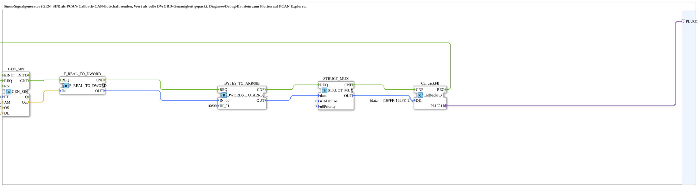

# SIN_TO_PCAN_Callback_DWord

* * * * * * * * * *
## Einleitung

Der Baustein **SIN_TO_PCAN_Callback_DWord** ist eine Subapplication, die ein intern erzeugtes Sinussignal als CAN-Botschaft über einen sogenannten **Callback-Adapter** an ein externes System (z. B. PCAN Explorer) sendet. Er dient als Diagnose- und Debug-Hilfe, um Signalverläufe direkt im CAN-Tool zu plotten. Der Sinuswert wird dabei mit voller **32-Bit-DWORD-Genauigkeit** in eine CAN-Nachricht verpackt und über standardisierte ISO-bus-PGN-Strukturen übertragen.

Die Subapplikation besitzt keine direkten Ein‑ oder Ausgänge; die gesamte Kommunikation erfolgt über einen einzigen Adapter (`PLUG1`) vom Typ `isobus::pgn::tx::Callback`. Dadurch ist sie als abgeschlossene, wiederverwendbare Funktionseinheit konzipiert, die sich einfach in bestehende CAN‑Kommunikationsarchitekturen integrieren lässt.

## Schnittstellenstruktur

### **Ereignis-Eingänge**  
Keine direkten Ereignis-Eingänge vorhanden. Der Baustein wird ausschließlich über den angeschlossenen Adapter durch externe Ereignisse (z. B. Trigger des Callback-Dienstes) aktiviert.

### **Ereignis-Ausgänge**  
Keine direkten Ereignis-Ausgänge. Die interne Verarbeitung und das Senden der Botschaft erfolgt über den Adapter; ein explizites Quittierungssignal wird nicht nach außen geführt.

### **Daten-Eingänge**  
Keine direkten Daten-Eingänge. Alle Parameter (Amplitude, Offset, Periodendauer) sind fest im Netzwerk voreingestellt und nicht von außen veränderbar.

### **Daten-Ausgänge**  
Keine direkten Daten-Ausgänge. Die erzeugte CAN-Botschaft wird über den Adapter gesendet und nicht als separates Datenwort bereitgestellt.

### **Adapter**  
- **PLUG1** – Typ: `isobus::pgn::tx::Callback`  
  Dieser Adapter (Stecker) stellt die Schnittstelle zum Senden von CAN-Botschaften bereit. Er wird mit einer externen Instanz verbunden, die den Callback-Mechanismus des ISO-bus‑PGN‑Protokolls implementiert (z. B. ein PCAN‑Empfänger).

## Funktionsweise

Die Subapplikation implementiert eine ereignisgesteuerte Datenkette:

1. **Auslösung:** Ein externes Ereignis (über den Adapter) erreicht den Baustein `CallbackFB`, der daraufhin das Signal `REQ` an den Sinusgenerator `GEN_SIN` sendet.
2. **Signalerzeugung:** `GEN_SIN` erzeugt mit den festen Parametern  
   - Periodendauer `PT = 10 s`,  
   - Amplitude `AM = 10.0`,  
   - Offset `OS = 5.0`,  
   - Verzögerung `DL = 0.0`  
   einen kontinuierlichen Sinuswert und liefert diesen über das Ereignis `CNF` an die nächste Stufe.
3. **Konvertierung:** Der reelle Sinuswert wird vom Baustein `F_REAL_TO_DWORD` in eine 32‑Bit‑DWORD-Ganzzahl umgewandelt.
4. **Byte-Reihenfolge:** `DWORDS_TO_ARR08B` (vom Typ `logiBUS::utils::conversion::arr::reversing`) zerlegt das DWORD in ein Byte‑Array und legt die Byte-Reihenfolge so fest, dass die Daten für den CAN-Bus korrekt interpretiert werden können (Little‑Endian bzw. Big‑Endian je nach Konfiguration; der Parameter `IN_01` zeigt die Startbelegung).
5. **Verpackung:** `STRUCT_MUX` (vom Typ `eclipse4diac::convert::STRUCT_MUX`) setzt die Bytes in die Struktur `isobus::pgn::CAN_MSG` ein. Dabei werden die Attribute `u8Priority` (=7) und `u16DaSize` (=0) gesetzt.
6. **Versand:** Die fertige CAN_Nachricht wird über `CallbackFB` an den Adapter `PLUG1` übergeben und von dort an das angeschlossene System (z. B. PCAN Explorer) gesendet.

Die Ereignis- und Datenverbindungen sind so verdrahtet, dass jeder Schritt nur nach erfolgreichem Abschluss des vorherigen ausgeführt wird (Kette: REQ → GEN_SIN → CNF → F_REAL_TO_DWORD → CNF → BYTES_TO_ARR08B → CNF → STRUCT_MUX → CNF → CallbackFB).

## Technische Besonderheiten

- **Volle DWORD-Genauigkeit:** Der Sinuswert wird nicht in ein kleineres Format (z. B. Integer mit Skalierung) umgewandelt, sondern als 32‑Bit‑Rohtyp übertragen, wodurch Nachkommastellen und Dynamik ohne Informationsverlust erhalten bleiben.  
- **Feste Parameter:** Die Parameter des Sinusgenerators sind hart im Netzwerk voreingestellt und können nur durch Änderung der Verbindungswerte angepasst werden. Dies macht den Baustein für schnelle Debug‑Tests ohne Neukonfiguration geeignet.  
- **ISO‑bus‑PGN‑Standard:** Die CAN-Nachricht wird in der standardisierten Struktur `isobus::pgn::CAN_MSG` abgelegt, was die Kompatibilität mit ISO‑bus‑basierten Systemen gewährleistet.  
- **Reversierende Byte‑Anordnung:** Der Baustein `DWORDS_TO_ARR08B` kehrt die Reihenfolge der Bytes um, um den gebräuchlichen Big‑Endian‑Format auf dem CAN-Bus zu entsprechen (konfigurierbar).  
- **Callback‑Mechanismus:** Die Übertragung erfolgt über den Adaptertyp `isobus::pgn::tx::Callback`, der eine ereignisgesteuerte, asynchrone Datenübergabe unterstützt.

## Zustandsübersicht

Die Subapplikation besitzt keinen expliziten Zustandsautomaten. Der Ablauf ist rein ereignisgesteuert und folgt der fest verdrahteten Kette der enthaltenen Funktionsblöcke. Es lassen sich vier logische Phasen unterscheiden:

1. **Bereit** – Warten auf ein Trigger-Ereignis vom Adapter.  
2. **Signalerzeugung** – `GEN_SIN` berechnet den nächsten Sinuswert.  
3. **Konvertierung & Verpackung** – Der Wert wird in DWORD, dann in Bytes und schließlich in die CAN_Msg‑Struktur gewandelt.  
4. **Sendung** – Die fertige Nachricht wird über den Adapter nach außen gegeben.

Diese Phasen wiederholen sich zyklisch, solange externe Trigger eintreffen.

## Anwendungsszenarien

- **Debugging und Visualisierung:** Der Sinuswert wird auf einem PCAN‑Explorer‑Plot dargestellt, um die korrekte Übertragung von Gleitkommawerten über CAN zu verifizieren.  
- **Test von CAN‑Konfigurationen:** Die Subapplikation dient als einfacher Signalgenerator für die Überprüfung der CAN‑Bus‑Verschaltung und der Empfänger‑Logik.  
- **Referenz für Datenkonvertierung:** Sie demonstriert die Kette von REAL → DWORD → Byte‑Array → CAN_Msg und kann als Vorlage für eigene Konvertierungen dienen.  
- **Integration in ISO‑bus‑Systeme:** Dank der standardisierten PGN‑Struktur kann sie direkt in bestehende ISOBUS‑Kommunikationsframeworks eingebunden werden.

## Vergleich mit ähnlichen Bausteinen

- **SIN_TO_PCAN_Callback_Real:** Eine mögliche Alternative, die den REAL‑Wert direkt (ohne DWORD‑Konvertierung) sendet – dadurch geringere Genauigkeit.  
- **SIN_TO_PCAN_Callback_Word:** Würde nur ein 16‑Bit‑Wort übertragen, was den Wertebereich einschränkt.  
- **Statische CAN‑Sender:** Andere Bausteine, die feste Nachrichten senden, bieten keine dynamische Signalgenerierung.  
- **Externe Signalgeneratoren:** Beispielsweise ein MATLAB‑Skript, das CAN‑Nachrichten erzeugt, erfordert zusätzliche Hardware und Software; dieser Baustein ist eine reine PLC‑interne Lösung.

Der vorliegende Baustein kombiniert die Vorteile eines flexiblen Sinusgenerators mit einer verlustfreien 32‑Bit‑Übertragung und der Integration in den ISO‑bus‑Standard.

## Fazit

**SIN_TO_PCAN_Callback_DWord** ist ein kompakter, wiederverwendbarer Baustein, der ohne externen Konfigurationsaufwand eine hochaufgelöste Sinusschwingung über CAN ausgibt. Durch die Verwendung eines Adapters vom Typ `isobus::pgn::tx::Callback` bleibt die Schnittstelle schlank und standardisiert. Die festen Parameter ermöglichen einen sofortigen Einsatz zu Test- und Debugzwecken, während die interne Struktur gut nachvollziehbar ist. Der Baustein ist ideal für Entwickler, die schnell einen Signalverlauf auf einem CAN‑Analysewerkzeug darstellen möchten, ohne eine separate Signalquelle zu benötigen.