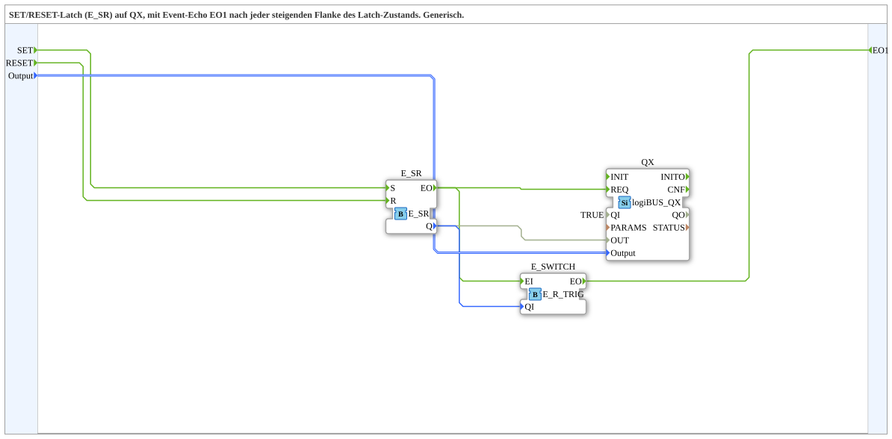

# SR_TO_QX_TRIG_EO

* * * * * * * * * *
## Einleitung
Der Funktionsblock **SR_TO_QX_TRIG_EO** ist eine generische Subapplikation, die einen digitalen Ausgang über einen logiBUS-Baustein (QX) ansteuert und dabei eine steigende Flanke des internen Latch-Zustands als Ereignis am Ausgang `EO1` signalisiert. Er kombiniert einen SR-Latch (Set/Reset), einen Ausgangstreiber für die logiBUS-Plattform und eine Flankenerkennung. Dadurch eignet er sich für Anwendungen, bei denen ein Ausgang gesetzt oder zurückgesetzt wird und gleichzeitig eine Meldung über das aktive Setzen (steigende Flanke) benötigt wird.

## Schnittstellenstruktur
### **Ereignis-Eingänge**
| Name | Beschreibung |
|------|-------------|
| `SET` | Setzt den internen Latch-Zustand auf `TRUE` und löst damit die Ausgabe am QX aus. |
| `RESET` | Setzt den internen Latch-Zustand auf `FALSE` und deaktiviert den Ausgang. |

### **Ereignis-Ausgänge**
| Name | Beschreibung |
|------|-------------|
| `EO1` | Wird ausgelöst, wenn der Latch-Zustand von `FALSE` auf `TRUE` wechselt (steigende Flanke). |

### **Daten-Eingänge**
| Name | Datentyp | Beschreibung |
|------|----------|-------------|
| `Output` | `logiBUS::io::DQ::logiBUS_DO_S` | Identifiziert den physischen Ausgang (z. B. `Output_Q1` bis `Output_Q8`). Initialwert: `logiBUS_DO::Invalid`. |

### **Daten-Ausgänge**
Keine.

### **Adapter**
Keine.

## Funktionsweise
Die Subapplikation besteht aus drei internen Bausteinen:
1. **E_SR** (SR-Latch): Speichert den Zustand, der durch die Events `SET` und `RESET` gesetzt bzw. zurückgesetzt wird.
2. **logiBUS_QX**: Schreibt den aktuellen Latch-Zustand (`Q`) auf den durch `Output` spezifizierten digitalen Ausgang.
3. **E_R_TRIG** (steigende Flankenerkennung): Überwacht das Signal `Q` und erzeugt bei einer Änderung von `FALSE` auf `TRUE` das Ausgangsereignis `EO1`.

Der Ablauf:
- Ein `SET`-Event setzt den Latch (`E_SR.S`), woraufhin `E_SR` das Ausgangsereignis `EO` auslöst. Gleichzeitig wird der Datenwert `Q` auf `TRUE` gesetzt.
- Das `EO`-Signal aktiviert sowohl den `QX` (um den Ausgang zu schreiben) als auch den `E_R_TRIG`. Der `E_R_TRIG` prüft die steigende Flanke von `Q` und generiert bei Bedarf `EO1`.
- Ein `RESET`-Event setzt den Latch zurück (`E_SR.R`), wodurch `Q` auf `FALSE` wechselt. Auch hier wird `QX` aktualisiert, aber keine steigende Flanke erkannt, sodass `EO1` nicht ausgelöst wird.

## Technische Besonderheiten
- Die Subapplikation nutzt die parametrisierbare Datenstruktur `logiBUS_DO_S`, um den Zielausgang flexibel zu wählen. Der Initialwert verhindert eine ungewollte Ausgabe.
- Die Verbindung zwischen `E_SR.EO` und `E_SWITCH.EI` (intern `E_R_TRIG`) ist so ausgelegt, dass die Flankenerkennung nur bei Zustandsänderungen des Latches ausgewertet wird – nicht bei jedem Clock.
- Der Ausgangsbaustein `QX` ist mit `QI = TRUE` fest konfiguriert, was bedeutet, dass der Ausgang immer aktiv schaltet.
- Durch die Auslagerung als Subapplikation wird eine Wiederverwendung in verschiedenen Projekten ermöglicht, ohne den internen Aufbau erneut erstellen zu müssen.

## Zustandsübersicht
Die Subapplikation besitzt implizit den Zustand des internen SR-Latches (`Q`). Dargestellt als Tabelle:

| Zustand von `Q` | Bedingung | Aktivitäten |
|-----------------|-----------|-------------|
| `FALSE` | Nach Initialisierung oder nach `RESET` | Ausgang ist inaktiv; bei `SET` wechselt Zustand auf `TRUE` und `EO1` wird ausgelöst. |
| `TRUE` | Nach `SET` | Ausgang ist aktiv; bei `RESET` wechselt Zustand auf `FALSE`. Eine erneutes `SET` ohne zwischenzeitliches `RESET` bewirkt keine Flanke, also kein `EO1` (da `Q` bereits `TRUE` ist). |

## Anwendungsszenarien
- **Ansteuerung eines logiBUS-Ausgangs mit Rückmeldung**: Wenn ein Ausgang gesetzt wird, soll eine Verarbeitung (z. B. in einer übergeordneten Steuerung) über das Setzen informiert werden.
- **Aufzug- oder Fördertechnik**: Signalisiert das Aktivieren eines Stellantriebs (Setzen) und meldet das erstmalige Aktivieren als Ereignis.
- **Prozesssteuerung**: Kombination von Ausgangsschalten und Flankenerkennung in einem einzigen Baustein reduziert die Komplexität des Netzwerks.

## Vergleich mit ähnlichen Bausteinen
- **SR_TO_QX** (ohne Trigger): Dieser Baustein würde nur den Ausgang setzen/zurücksetzen, aber kein Ereignis bei steigender Flanke ausgeben.
- **E_SR mit EO** (Standard-Event-SR): Liefert das Ergebnis als Datenwert, muss aber extern mit einem Flankenerkenner verbunden werden – hier ist die Kombination bereits integriert.
- **SR_TO_QX_TRIG**: Ähnlich, aber ohne das Echo-Ereignis `EO1`; hier wird die steigende Flanke direkt als Event geliefert.

## Fazit
Der Funktionsblock **SR_TO_QX_TRIG_EO** bietet eine kompakte und wiederverwendbare Lösung für die Ansteuerung digitaler Ausgänge mit integrierter Flankenerkennung. Er vereinfacht das Engineering, reduziert die Anzahl notwendiger Bausteine und erhöht die Übersichtlichkeit in Speicherprogrammierbaren Steuerungen (SPS). Dank der generischen Ausgangsauswahl ist er flexibel einsetzbar und eignet sich besonders für Anwendungen, die sowohl eine stabile Ausgangssteuerung als auch eine zuverlässige Ereignismeldung benötigen.