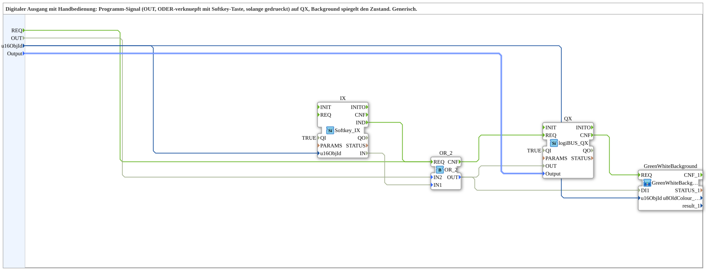

# SoftkeyOverride_TO_QX_BG

* * * * * * * * * *

## Einleitung

Der Funktionsblock **SoftkeyOverride_TO_QX_BG** realisiert einen digitalen Ausgang mit manueller Bedienmöglichkeit über eine Softkey-Taste. Das Programm-Signal `OUT` wird dabei per ODER-Verknüpfung mit dem Zustand der Softkey-Taste kombiniert und auf den physikalischen Ausgang `QX` ausgegeben. Ein Hintergrundobjekt (GreenWhiteBackground) spiegelt den aktuellen Zustand des Ausgangs wider. Der Baustein ist generisch einsetzbar und wurde zur Wiederverwendung aus einer bestehenden Übungsstruktur ausgelagert.

## Schnittstellenstruktur

### **Ereignis-Eingänge**

- `REQ` (Event) – Service Request: Triggert die Verarbeitung der Eingangsdaten und die Aktualisierung des Ausgangs.

### **Ereignis-Ausgänge**

- Keine (Es sind keine Ereignis-Ausgänge definiert; der Abschluss der Verarbeitung wird intern über `QX.CNF` an den Hintergrundbaustein weitergeleitet.)

### **Daten-Eingänge**

- `OUT` (BOOL) – Programmsignal für den Ausgang.
- `u16ObjId` (UINT) – Objekt-ID der Softkey-Taste (Initialwert `ID_NULL`).
- `Output` (logiBUS::io::DQ::logiBUS_DO_S) – Konfigurationsparameter für den logiBUS-Ausgang (Initialwert `logiBUS_DO::Invalid`).

### **Daten-Ausgänge**

- Keine (Der Ausgang erfolgt über den eingebetteten `QX`-Funktionsblock auf den physischen Kanal.)

### **Adapter**

- Keine (Es sind keine Adapter-Schnittstellen vorhanden.)

## Funktionsweise

Der Baustein kombiniert das Programm-Signal `OUT` mit dem Zustand einer Softkey-Taste (`IX.IN`). Die ODER-Verknüpfung (`OR_2`) erzeugt das effektive Ausgangssignal:

- `OR_2.OUT` wird `TRUE`, wenn entweder `OUT` oder die Softkey-Taste (`IX.IN`) aktiv ist.
- Dieses Signal wird an den Ausgangsbaustein `QX` übergeben, der den physischen Ausgang setzt.
- Parallel wird dasselbe Signal an den Hintergrundbaustein `GreenWhiteBackground` gesendet, um den optischen Zustand (z. B. Farbe) zu aktualisieren.

Die Ereignissteuerung:

- Das Eingangsereignis `REQ` und das Ereignis `IX.IND` (Softkey-Interrupt) triggern beide die `OR_2`-Verarbeitung.
- Nach Abschluss der QX-Aktualisierung signalisiert `QX.CNF` dem Hintergrundbaustein, dass eine Zustandsänderung vorliegt und der Hintergrund neu gezeichnet werden soll.

## Technische Besonderheiten

- Verwendung spezifischer Bibliotheksbausteine: `logiBUS::io::DQ::logiBUS_QX` für den Ausgang und `isobus::UT::io::Softkey::Softkey_IX` für die Softkey-Eingabe.
- Die SubApp enthält einen Parametereingang `Output` vom Typ `logiBUS_DO_S`, der die Ausgangskonfiguration (z. B. Kanaladresse) übergeben bekommt.
- Die Objekt-ID (`u16ObjId`) wird sowohl an den Softkey- als auch an den Hintergrundbaustein weitergeleitet, um eine konsistente Zuordnung zu gewährleisten.
- Die Verbindungen sind teilweise als unsichtbar markiert (`Visible="false"`), was auf eine bewusste Kapselung interner Verdrahtung hinweist.
- Der Baustein ist generisch gestaltet und kann für verschiedene Softkey-/Ausgangskombinationen wiederverwendet werden.

## Zustandsübersicht

Der Baustein besitzt keinen expliziten Zustandsautomaten auf SubApp-Ebene. Der logische Zustand ergibt sich aus der ODER-Verknüpfung:

- **Ausgang inaktiv:** `OUT = FALSE` und Softkey nicht gedrückt (`IX.IN = FALSE`) → `QX.OUT = FALSE`, Hintergrund zeigt „Aus“.
- **Ausgang aktiv durch Programm:** `OUT = TRUE`, Softkey egal → `QX.OUT = TRUE`, Hintergrund zeigt „Ein“.
- **Ausgang aktiv durch Softkey:** `OUT = FALSE`, Softkey gedrückt (`IX.IN = TRUE`) → `QX.OUT = TRUE`, Hintergrund zeigt „Ein“.
- **Beide aktiv:** triviale ODER-Bedingung, Ausgang bleibt aktiv.

Der Hintergrund wird bei jeder Änderung des Ausgangssignals über `QX.CNF` aktualisiert.

## Anwendungsszenarien

- **Handbetrieb an Maschinen:** Ein Bediener kann einen Ausgang (z. B. Ventil, Lampe) manuell einschalten, auch wenn das Programm das Signal nicht setzt – z. B. für Wartungs- oder Testzwecke.
- **Not-Aus-Override:** Temporäre Übersteuerung eines programmgesteuerten Ausgangs durch einen Softkey.
- **Visualisierung:** Der Hintergrundbaustein (GreenWhiteBackground) spiegelt den Zustand farblich wider (grün/weiß) und ermöglicht eine einfache Zustandsanzeige in HMI-Systemen.

## Vergleich mit ähnlichen Bausteinen

- **Einfacher QX-Baustein (ohne Override):** Nur das Programmsignal `OUT` steuert den Ausgang; keine manuelle Eingriffsmöglichkeit.
- **QX mit separatem Softkey-FB:** Man müsste die ODER-Verknüpfung und die Hintergrundaktualisierung extern verdrahten – hier ist dies gekapselt und wiederverwendbar.
- **Baustein mit Schaltfläche statt Softkey:** Die Funktionsweise wäre ähnlich, jedoch ist `Softkey_IX` speziell für physikalische Softkeys optimiert.

## Fazit

Der Baustein **SoftkeyOverride_TO_QX_BG** bietet eine kompakte und wiederverwendbare Lösung für digitale Ausgänge mit manueller Übersteuerung. Durch die integrierte ODER-Logik und die Kopplung an ein Hintergrundobjekt werden sowohl die Funktionalität als auch die Anzeige zentral abgebildet. Die klare Schnittstelle mit nur einem Ereignis- und drei Dateneingängen erleichtert die Integration in übergeordnete Steuerungen. Der Baustein ist ideal für Anwendungen, bei denen ein Ausgang sowohl programmgesteuert als auch manuell bedienbar sein muss.
