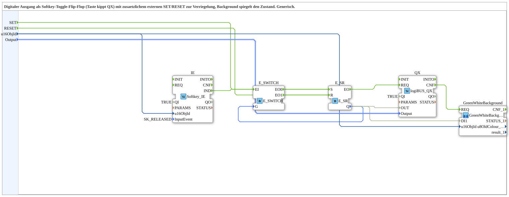

# Softkey_T_FF_ILOCK_TO_QX_BG

* * * * * * * * * *

## Einleitung

Der Funktionsblock **Softkey_T_FF_ILOCK_TO_QX_BG** ist eine generische Subapplikation (SubApp) zur Realisierung eines digitalen Ausgangs, der durch einen Softkey (Taster) im Toggle-Betrieb geschaltet wird. Zusätzlich kann der Ausgang über externe Ereignisse `SET` und `RESET` verriegelt (gesetzt oder zurückgesetzt) werden. Ein Hintergrundobjekt (`GreenWhiteBackground`) visualisiert den aktuellen Schaltzustand.

Die SubApp kombiniert Funktionen einer Toggle-Flipflop-Schaltung mit einer Interlock-Logik und einer direkten Ankopplung an einen logiBUS-Digitalausgang (`QX`). Sie ist konfigurierbar über die Objekt-ID des Softkeys und die Ausgangskonfiguration.

## Schnittstellenstruktur

Die SubApp besitzt ausschließlich Eingangsschnittstellen; Ausgänge (Ereignis, Daten, Adapter) sind nicht vorhanden.

### **Ereignis-Eingänge**

- **`SET`** – Setzt den Ausgang unabhängig vom Toggle-Verhalten auf `TRUE`.
- **`RESET`** – Setzt den Ausgang unabhängig vom Toggle-Verhalten auf `FALSE`.

### **Ereignis-Ausgänge**

Keine.

### **Daten-Eingänge**

- **`u16ObjId`** (`UINT`) – Objektidentifikation des Softkeys/Buttons. Initialwert: `ID_NULL`.
- **`Output`** (`logiBUS::io::DQ::logiBUS_DO_S`) – Ausgangskonfiguration für den logiBUS-Digitalausgang. Initialwert: `logiBUS_DO::Invalid`.

### **Daten-Ausgänge**

Keine.

### **Adapter**

Keine.

## Funktionsweise

Die SubApp realisiert eine kombinierte Toggle- und Interlock-Logik für einen Digitalausgang. Der interne Ablauf ist wie folgt:

1. **Softkey-Ereignis**: Der Block `Softkey_IE` (intern `IE`) überwacht den zugeordneten Softkey und erzeugt bei Loslassen (Ereignis `SK_RELEASED`) ein `IND`-Ereignis.
2. **Toggle-Decision**: Das `IND`-Ereignis wird an den Block `E_SWITCH` weitergeleitet. Dessen Steuereingang `G` ist mit dem Ausgang `Q` des internen Set-Reset-Flipflops `E_SR` verbunden. Ist der aktuelle Zustand `FALSE` (`Q=0`), wird das Ereignis an den Ausgang `EO0` durchgeschaltet, der das Setzen (`S`) von `E_SR` auslöst. Ist der Zustand `TRUE` (`Q=1`), geht das Ereignis über `EO1` zum Rücksetzen (`R`) des Flipflops. Dadurch wird bei jeder Betätigung der Zustand invertiert (Toggle).
3. **Externes Set/Reset**: Über die Ereigniseingänge `SET` und `RESET` kann der Zustand des Flipflops unabhängig von der Toggle-Funktion direkt geändert werden. Ein `SET` setzt `Q` auf `TRUE`, ein `RESET` auf `FALSE`. Diese externen Ereignisse haben Vorrang und können als Verriegelung (Interlock) verwendet werden.
4. **Ausgangssignal**: Der Ausgang `Q` von `E_SR` speist den Daten-Eingang `OUT` des Digitalausgangsblocks `QX` (Typ `logiBUS_QX`). Dieser setzt den physischen Ausgang entsprechend dem Signalpegel.
5. **Hintergrundvisualisierung**: Parallel wird `Q` an den Eingang `DI1` der SubApp `GreenWhiteBackground` übergeben. Diese steuert die Darstellung eines Hintergrundelements (z. B. Farbe) entsprechend dem Zustand. Die Objekt-ID aus `u16ObjId` wird sowohl an `GreenWhiteBackground` als auch an `Softkey_IE` weitergeleitet, um die richtige Zuordnung zu gewährleisten.
6. **Konfiguration**: Der externe Daten-Eingang `Output` (Typ `logiBUS_DO_S`) spezifiziert die Ausgangskonfiguration (z. B. logische Zuordnung) und wird direkt an den `QX`-Block übergeben. Der Qualifier `QI` des `QX`-Blocks ist fest auf `TRUE` gesetzt, sodass der Ausgang immer aktiv ist.

## Technische Besonderheiten

- **Toggle mit Verriegelung**: Die Kombination aus `E_SWITCH` und `E_SR` erzeugt ein Toggle-Verhalten, während externe Set/Reset-Ereignisse den Zustand überschreiben können. Dies ermöglicht eine sichere Übersteuerung durch übergeordnete Steuerlogik.
- **Ereignisgesteuerte Verarbeitung**: Alle Zustandsänderungen werden über Ereignisse ausgelöst, was eine ressourcenschonende und reaktionsschnelle Implementierung in der 4diac-IDEs erlaubt.
- **Wiederverwendung**: Die SubApp ist aus einem größeren Projekt ausgelagert und als generischer Baustein konzipiert. Sie kann in verschiedenen Anwendungen mit unterschiedlichen Objekt-IDs und Ausgangskonfigurationen eingesetzt werden.
- **Interne Bausteine**: Verwendet werden Standard-Funktionsblöcke aus der IEC 61499-Bibliothek (`E_SR`, `E_SWITCH`) sowie logiBUS- und isobus-spezifische Erweiterungen.
- **Visualisierung**: Der Zustand wird über `GreenWhiteBackground` auf einem HMI (Human Machine Interface) dargestellt, was die Betriebsüberwachung erleichtert.

## Zustandsübersicht

Die SubApp besitzt einen internen booleschen Zustand `Q`, der durch die Ereignisse verändert wird. Es ergeben sich zwei stabile Zustände:

- **Zustand `Q=0`** (Ausgang aus):  
  - Bei Tastendruck (Release) wird das Ereignis über `E_SWITCH` auf `EO0` geleitet → Setzen → `Q` wird `1`.  
  - Ein externes `RESET` hält den Zustand bei `0`, ein `SET` setzt auf `1`.  
- **Zustand `Q=1`** (Ausgang ein):  
  - Bei Tastendruck (Release) wird das Ereignis über `E_SWITCH` auf `EO1` geleitet → Rücksetzen → `Q` wird `0`.  
  - Ein externes `SET` hält den Zustand bei `1`, ein `RESET` setzt auf `0`.

Die Übergänge sind deterministisch und werden durch die eingehenden Ereignisse gesteuert. Die Priorität der externen SET/RESET liegt über dem Toggle-Ereignis, da diese direkt auf `E_SR` wirken.

## Anwendungsszenarien

Typische Einsatzszenarien sind:

- **Maschinenbedienung**: Ein Taster (Softkey) schaltet einen Ausgang (z. B. eine Leuchte oder ein Ventil) ein und aus. Übergeordnete Steuerungen können den Ausgang per `SET`/`RESET` verriegeln (z. B. Not-Aus oder Freigaben).
- **HMI-Integration**: In Verbindung mit dem `GreenWhiteBackground`-Baustein kann der Schaltzustand direkt auf einem Bedienpanel farblich dargestellt werden.
- **Steuerung von logiBUS-Ausgängen**: Der Baustein ist speziell für die Ansteuerung von logiBUS-Digitalausgängen (`logiBUS_QX`) ausgelegt und kann einfach in logiBUS-basierte Systeme eingebunden werden.
- **Wiederverwendbare Funktion**: Da die SubApp generisch ist, kann sie mit verschiedenen Softkey-Objekten und Ausgangskonfigurationen parametriert und in mehreren Projekten eingesetzt werden.

## Vergleich mit ähnlichen Bausteinen

Im Vergleich zu einfachen Toggle-Flipflops (z. B. einem `E_SR` mit Rückkopplung) bietet dieser Baustein eine integrierte Visualisierung und eine klare Trennung zwischen Toggle- und Verriegelungsfunktion. Während ein einfaches Toggle-Flipflop nur den Zustand wechselt, erlaubt dieser Block eine externe Prioritätssteuerung, was die Sicherheit in Steuerungsanwendungen erhöht. Gegenüber Bausteinen ohne Hintergrundvisualisierung entfällt die Notwendigkeit, den Zustand separat an ein Anzeigeelement zu übertragen. Der Baustein ist außerdem an logiBUS-Ausgänge angepasst, was eine direkte, konfigurierbare Anbindung physischer Ausgänge erleichtert.

## Fazit

Der Funktionsblock **Softkey_T_FF_ILOCK_TO_QX_BG** stellt eine robuste und flexible Lösung für die Ansteuerung digitaler Ausgänge über Softkeys dar. Durch die Kombination von Toggle-Logik, externer Verriegelung und integrierter Zustandsvisualisierung eignet er sich ideal für sicherheitsrelevante Bedienoberflächen in der Automatisierungstechnik. Die generische Ausführung ermöglicht eine breite Wiederverwendung in verschiedenen Projekten und vereinfacht die Projektierung erheblich.
