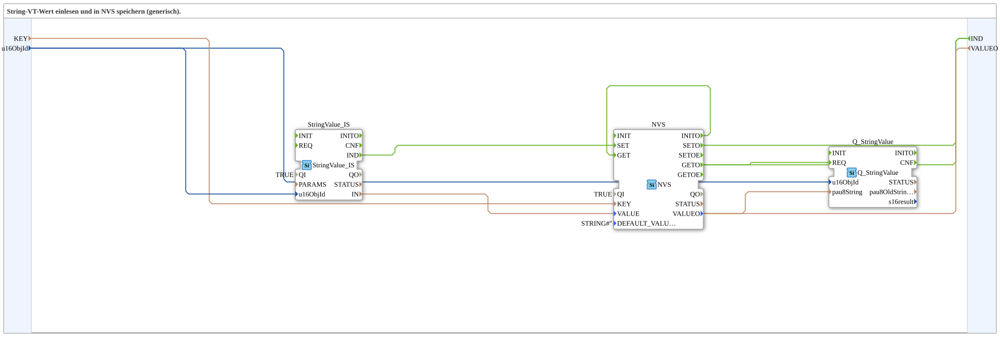

# StringValue_TO_NVS

* * * * * * * * * *

## Einleitung

Die Subapp **StringValue_TO_NVS** dient dazu, einen Stringwert, der über eine Objekt-ID (z.B. aus einem ISO-bus-System) eingelesen wird, dauerhaft in einem nichtflüchtigen Speicher (NVS – Non-Volatile Storage) zu speichern. Sie ist generisch einsetzbar und trennt die Lese-, Speicher- und Ausgabefunktionalität, sodass sie leicht in verschiedene Anwendungen integriert werden kann.

## Schnittstellenstruktur

### **Ereignis-Eingänge**

Es sind keine Ereignis-Eingänge definiert.

### **Ereignis-Ausgänge**

| Name  | Datentyp | Beschreibung |
|-------|----------|--------------|
| `IND` | Event    | Wird ausgelöst, nachdem ein Speicher- oder Lesevorgang abgeschlossen wurde (siehe Funktionsweise). |

### **Daten-Eingänge**

| Name       | Typ    | Initialwert | Beschreibung |
|------------|--------|-------------|--------------|
| `KEY`      | STRING | –           | Name des Schlüssels, unter dem der Wert im NVS abgelegt wird. |
| `u16ObjId` | UINT   | `ID_NULL`   | Objekt-ID, die für den Zugriff auf den Stringwert verwendet wird (z.B. bei ISO-bus). |

### **Daten-Ausgänge**

| Name        | Typ    | Beschreibung |
|-------------|--------|--------------|
| `VALUEO`    | STRING | Liest den aktuell im NVS gespeicherten String zurück (nach einem Lesevorgang). |

### **Adapter**

Keine.

## Funktionsweise

Die Subapp kombiniert drei Funktionsbausteine, um folgende Abläufe zu realisieren:

1. **Initialisierung**  
   Nach dem Start (oder Einschalten) wird der Baustein `NVS` über dessen `INITO`-Ereignis initialisiert. Unmittelbar danach wird ein Lesevorgang gestartet (`INITO` → `GET`). Der im NVS gespeicherte Wert wird über `VALUEO` an den Ausgang `VALUEO` der Subapp und zusätzlich an den Baustein `Q_StringValue` weitergegeben. Das `GETO`-Ereignis löst gleichzeitig das Ausgangsereignis `IND` aus.

2. **Speichern eines neuen Werts**  
   Wenn ein neuer Stringwert über die Objekt-ID verfügbar ist (Baustein `StringValue_IS`), wird dieser über dessen Ausgang `IN` an den Eingang `VALUE` des NVS-Bausteins übergeben. Das Ereignis `IND` von `StringValue_IS` triggert den Speichervorgang (`SET`). Nach erfolgreichem Speichern wird `SETO` ausgelöst, was wiederum das Ausgangsereignis `IND` der Subapp aktiviert.

3. **Rückgabe des gespeicherten Werts**  
   Der Baustein `Q_StringValue` dient zur Weiterverarbeitung bzw. Quittierung des ausgelesenen Strings. Durch die Verbindung `NVS.VALUEO → Q_StringValue.pau8String` wird der zwischengespeicherte Wert verfügbar gemacht. Ein Zugriff über das `GETO`-Ereignis (das auch direkt als `IND` an der Subapp erscheint) löst die Verarbeitung in `Q_StringValue` aus.

Die Ereignisverkabelung stellt sicher, dass sowohl nach einem Schreib- als auch nach einem Lesevorgang das Ausgangsereignis `IND` gesendet wird, sodass der aufrufende Baustein über den Abschluss informiert ist.

## Technische Besonderheiten

- **Generische Verwendbarkeit**: Die Objekt-ID (`u16ObjId`) und der Schlüssel (`KEY`) sind als Eingänge parametrierbar, wodurch die Subapp für unterschiedliche Stringwerte und Speicherbereiche eingesetzt werden kann.  
- **Verwendung von NVS**: Der Baustein `NVS` implementiert einen nichtflüchtigen Speicher auf ESP32-Basis, typischerweise über die integrierte Flash-Technologie. Dadurch bleiben Daten auch nach einem Reset erhalten.  
- **Initialisierungslogik**: Durch die Verbindung von `INITO` → `GET` wird beim Start automatisch der aktuell gespeicherte Wert gelesen und über `VALUEO` verfügbar gemacht.  
- **Quellcode-Kapselung**: Die interne Struktur (StringValue_IS, NVS, Q_StringValue) ist gekapselt, sodass die Subapp als einfacher, wiederverwendbarer Baustein in größere Systeme integriert werden kann.

## Zustandsübersicht

Da die Subapp keine expliziten Zustandsautomaten besitzt, lässt sich der Ablauf am besten über die Ereignisse und die beteiligten Baustein-Zustände beschreiben:

- **Idle**: Es liegen keine anstehenden Ereignisse vor. Der NVS-Wert ist gespeichert (kein Zugriff aktiv).  
- **Initialisieren**: Nach dem Einschalten wird der NVS initialisiert (INITO steht an).  
- **Lesen**: Nach der Initialisierung oder über einen internen Triggers wird ein Lesevorgang durchgeführt (GET). Nach Abschluss wird `GETO` erzeugt.  
- **Schreiben**: Wenn ein neuer Stringwert über StringValue_IS empfangen wird, löst dessen `IND`-Ereignis den SET-Vorgang aus. Nach dem Schreiben wird `SETO` erzeugt.  
- **Wert bereitstellen**: Nach einem Lesevorgang wird der Wert über `VALUEO` (und an Q_StringValue) bereitgestellt; nach einem Schreibvorgang wird der Wert ebenfalls gespeichert und bestätigt.

Die Ereignisausgänge `IND` signalisieren den Abschluss eines Zyklus, unabhängig davon, ob es sich um einen Lese- oder Schreibvorgang handelte.

## Anwendungsszenarien

- **Konfigurationsspeicherung**: Ein Stringwert, der über eine Objekt-ID (z.B. aus einem CAN-basierten ISO-Bus-System) gelesen wird, soll dauerhaft abgelegt werden (z.B. Geräteeinstellungen, Kalibrierwerte).  
- **Puffern von Werten**: Wenn ein Wert nur temporär verfügbar ist, kann er mit dieser Subapp in den NVS geschrieben und später wieder abgerufen werden.  
- **Redundanz**: Durch die Speicherung in NVS kann der letzte bekannte Wert nach einem Neustart automatisch wiederhergestellt werden, ohne dass eine erneute Kommunikation mit dem Sensor erforderlich ist.

## Vergleich mit ähnlichen Bausteinen

- **Direkter NVS-Zugriff**: Andere Bausteine (wie reine NVS-FBs) erfordern eine manuelle Anbindung an die Datenquelle und die Verwaltung von Schlüsseln. Diese Subapp kombiniert das Lesen (über eine Objekt-ID) und das Speichern in einem Schritt.  
- **Ohne Q_StringValue**: Einige Implementierungen bieten nur die Speicherung ohne zusätzliche Quittierungslogik; hier übernimmt `Q_StringValue` eine Weiterverarbeitung, z.B. für ein Ereignis- oder Datenaustauschprotokoll.  
- **SubApp vs. FB**: Als SubApp kapselt sie eine komplexere Logik und stellt nur eine einfache Schnittstelle bereit, was die Integration in übergeordnete Systeme vereinfacht.

## Fazit

**StringValue_TO_NVS** ist eine praktische Subapp, die das Einlesen von Stringwerten über eine Objekt-ID und deren dauerhafte Speicherung im NVS vereinfacht. Durch die klar definierte Schnittstelle mit nur einem Ereignisausgang, zwei Dateneingängen und einem Datenausgang lässt sie sich schnell in existierende Projekte einbinden. Die automatische Initialisierung und das Ereignismodell gewährleisten eine zuverlässige Kommunikation zwischen den internen Bausteinen. Durch die Option, Schlüssel und Objekt-ID zu parametrieren, bietet sie eine hohe Wiederverwendbarkeit in unterschiedlichen Kontexten.
