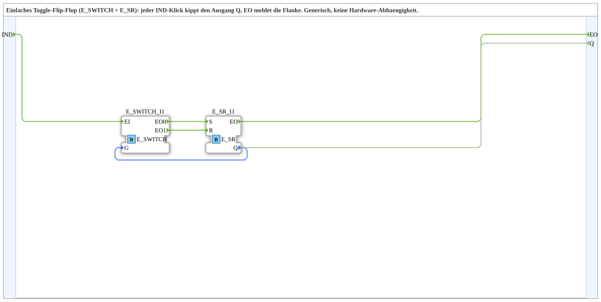

# T_FF_EVENT

* * * * * * * * * *

## Einleitung

Der Funktionsblock **T_FF_EVENT** ist ein Subapplikationstyp, der ein einfaches Toggle-Flip-Flop realisiert. Er verwendet die Grundbausteine `E_SWITCH` und `E_SR`, um bei jedem Ereignis am Eingang `IND` den Ausgangszustand `Q` zu kippen. Das Ereignis `EO` wird nach jedem Schaltvorgang ausgegeben. Der Baustein ist bewusst generisch aufgebaut – er besitzt keinerlei Hardware-Abhängigkeit und kann in unterschiedlichsten SPS- und Automatisierungsprojekten eingesetzt werden.

## Schnittstellenstruktur

### **Ereignis-Eingänge**
- **IND** : Eingangsereignis, das den Toggle-Vorgang auslöst. Jeder Impuls an `IND` verändert den Zustand von `Q`.

### **Ereignis-Ausgänge**
- **EO** : Ausgangsereignis, das nach erfolgreicher Zustandsänderung (nach jeder Toggle-Aktion) gesendet wird. Es signalisiert die Verarbeitung des `IND`-Ereignisses.

### **Daten-Eingänge**
- Keine Daten-Eingänge vorhanden.

### **Daten-Ausgänge**
- **Q** (BOOL) : Aktueller Zustand des Flip-Flops. Er wird bei jedem `IND`-Ereignis invertiert (von „false“ auf „true“ oder umgekehrt).

### **Adapter**
- Keine Adapter vorhanden.

## Funktionsweise

Die interne Logik besteht aus den Bausteinen `E_SWITCH` und `E_SR`. Der Ereignis-Eingang `IND` ist mit dem Ereigniseingang `EI` des `E_SWITCH` verbunden. Der Datenausgang `Q` des `E_SR` wird auf den Eingang `G` (Gate) des `E_SWITCH` geführt. Je nach Zustand von `Q` leitet der `E_SWITCH` das ankommende Ereignis entweder an den Ausgang `EO0` (wenn `G = false`, also `Q = false`) oder an `EO1` (wenn `G = true`, also `Q = true`). Diese Ausgänge sind mit dem Setz- (`S`) bzw. Rücksetz-Eingang (`R`) des `E_SR` verbunden. Dadurch wird bei `Q = false` der `E_SR` gesetzt (Q wird `true`), bei `Q = true` wird er zurückgesetzt (Q wird `false`). Das Ausgangsereignis `EO` des `E_SR` wird als `EO` nach außen gegeben und der aktuelle Zustand `Q` wird auch als Datenausgang `Q` bereitgestellt. Damit entsteht ein klassisches Toggle-Verhalten: Jeder `IND`-Impuls invertiert den Zustand.

## Technische Besonderheiten

- **Generische Bauweise**: Der Baustein ist vollständig in IEC 61499 implementiert und benötigt keine spezielle Hardware-Unterstützung.
- **Subapplikation**: Als SubAppType kann er in übergeordneten Anwendungen mehrfach instantiiert werden, wodurch eine Wiederverwendung in verschiedenen Projekten möglich wird.
- **Einfache Struktur**: Durch die Kombination von nur zwei Basisbausteinen bleibt die Logik transparent und leicht nachvollziehbar.
- **Kein Daten-Eingang**: Es sind keine externen Daten zum Konfigurieren erforderlich; der Baustein arbeitet ausschließlich ereignisgesteuert.

## Zustandsübersicht

Der Baustein besitzt zwei stabile Zustände, die durch das Boolesche Ausgangssignal `Q` repräsentiert werden:

- **Zustand Q = false (0)**: Beim nächsten `IND`-Ereignis wird `Q` auf `true` gesetzt (Setzen über `S`).
- **Zustand Q = true (1)**: Beim nächsten `IND`-Ereignis wird `Q` auf `false` gesetzt (Rücksetzen über `R`).

Die Zustandsübergänge erfolgen ausschließlich bei einem Ereignis an `IND`. Wichtig: Es existiert kein weiterer Steuereingang – der Wechsel ist deterministisch und alternierend.

## Anwendungsszenarien

- **Taster-Schaltung**: Ein impulsförmiger Taster (z. B. ein Lichttaster) kann mit `T_FF_EVENT` so realisiert werden, dass jeder Druck den Zustand einer Lampe oder eines Motors umschaltet.
- **Betriebsart-Umschaltung**: In Maschinensteuerungen kann zwischen zwei Betriebsmodi hin- und hergeschaltet werden.
- **Test- und Simulationsumgebungen**: Als einfacher Logik-Baustein dient er zur Erzeugung von Toggle-Verhalten in Test-Szenarien.
- **Blinkgenerator (mit zusätzlichem Takt)**: Kombiniert mit einem Timer kann ein periodisches Ein-/Ausschalten erzeugt werden.

## Vergleich mit ähnlichen Bausteinen

- **E_SR (Set/Reset-Flip-Flop)**: Das einfache `E_SR` wechselt den Zustand nur abhängig von separaten Set- und Reset-Ereignissen. Es besitzt keine interne Toggle-Funktion – **T_FF_EVENT** erweitert dies um die automatische Zustandsänderung bei jedem Ereignis.
- **E_RS (Reset/Set-Flip-Flop, priorisiert)**: Ähnlich wie `E_SR`, aber mit anderer Prioritätenlogik. Auch hier ist kein Toggle möglich.
- **T_FF mit Flankenauswertung**: Manche Bausteine benötigen einen zusätzlichen Eingang für die Flankenart (steigend/fallend). **T_FF_EVENT** ist dagegen ein Ereignis-getriebener Baustein, der direkt auf jedes Ereignis reagiert und dadurch einfacher in industriellen Steuerungen einsetzbar ist.

## Fazit

Der Funktionsblock **T_FF_EVENT** stellt eine kompakte und zuverlässige Lösung zur Realisierung eines Toggle-Flip-Flops dar. Durch die Verwendung von Standard-Bausteinen und den Verzicht auf externe Abhängigkeiten eignet er sich hervorragend für modulare Wiederverwendung in unterschiedlichen Automatisierungsprojekten. Seine Ereignissteuerung passt nahtlos in das IEC-61499-Konzept und bietet eine klare, nachvollziehbare Funktionalität.