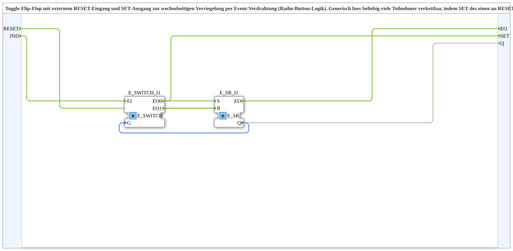

# T_FF_ILOCK_EVENT

* * * * * * * * * *

## Einleitung

Der Baustein **T_FF_ILOCK_EVENT** ist ein Toggle-Flip-Flop mit externem RESET-Eingang und einem SET-Ausgang zur wechselseitigen Verriegelung per Event-Verdrahtung. Er wurde konzipiert für die Umsetzung von Radio-Button-Logik, bei der aus einer Gruppe von Teilnehmern immer genau einer aktiv ist. Durch eine einfache Verkettung – SET des einen Bausteins mit RESET des nächsten verbunden – lässt sich eine beliebig große Kette verriegelter Toggles realisieren.

## Schnittstellenstruktur

### **Ereignis-Eingänge**

* **RESET** – Ereignis, das das Flip-Flop zurücksetzt (setzt Q auf FALSE).
* **IND** – Ereignis, das das Umschalten (Toggle) auslöst. Abhängig vom aktuellen Zustand Q wird entweder ein Setzen oder ein Rücksetzen ausgeführt.

### **Ereignis-Ausgänge**

* **EO** – Ausgangs-Ereignis, das nach jeder Zustandsänderung (Setzen oder Rücksetzen) erzeugt wird.
* **SET** – Ereignis, das nur bei einem Umschalten von Q = FALSE auf Q = TRUE ausgegeben wird. Dieses Signal dient zur Verkettung mit nachfolgenden Teilnehmern.

### **Daten-Eingänge**

Keine.

### **Daten-Ausgänge**

* **Q** (BOOL) – Aktueller Zustand des Flip-Flops (FALSE oder TRUE).

### **Adapter**

Keine.

## Funktionsweise

Der Baustein nutzt intern zwei Standardbausteine der IEC 61499-Bibliothek: einen **E_SR** (Set/Reset-Flip-Flop) und einen **E_SWITCH** (Ereignis-Schalter). Der E_SWITCH erhält das eingehende Ereignis **IND** und leitet es abhängig vom Daten-Eingang G weiter, der mit dem aktuellen Ausgang Q verbunden ist:

* Ist Q = FALSE, wird das Ereignis an den **Set**-Eingang (S) des E_SR durchgeschaltet. Dadurch wird Q auf TRUE gesetzt und das Ereignis **SET** sowie das Echo **EO** ausgegeben.
* Ist Q = TRUE, wird das Ereignis an den **Reset**-Eingang (R) des E_SR weitergeleitet. Q wird auf FALSE gesetzt, und es wird nur das Echo **EO** erzeugt.

Das externe Ereignis **RESET** ist ebenfalls mit dem Reset-Eingang des E_SR verbunden und setzt das Flip-Flop unabhängig vom aktuellen Zustand auf FALSE zurück. In jedem Fall wird nach einer Zustandsänderung das Ereignis **EO** ausgelöst.

Die Kombination aus E_SWITCH und E_SR realisiert also ein Toggle-Verhalten, bei dem jedes **IND**-Ereignis den Zustand umschaltet, solange kein externer Reset aktiv ist.

## Technische Besonderheiten

* Verwendung standardisierter Bausteine (**E_SR**, **E_SWITCH**) aus der IEC 61499-Bibliothek, was eine hohe Kompatibilität und einfache Wartung gewährleistet.
* Keine Daten-Eingänge – die Steuerung erfolgt ausschließlich über Ereignisse, was die Verkettung mehrerer Bausteine per Event-Logik erleichtert.
* Der dedizierte **SET**-Ausgang ermöglicht eine direkte Kaskadierung: Verbindet man SET eines Teilnehmers mit RESET des nächsten, so wird beim Aktivieren eines Teilnehmers automatisch der folgende zurückgesetzt – genau die gewünschte Sperrlogik.
* Die SubApp ist **generisch** einsetzbar, da sie keine feste Anzahl von Teilnehmern voraussetzt.

## Zustandsübersicht

| Q (vorher) | Ereignis | Q (nachher) | Ausgangs-Ereignisse |
|------------|----------|-------------|---------------------|
| FALSE      | IND      | TRUE        | EO, SET             |
| TRUE       | IND      | FALSE       | EO                  |
| FALSE      | RESET    | FALSE       | EO                  |
| TRUE       | RESET    | FALSE       | EO                  |

## Anwendungsszenarien

* **Radio-Button-Gruppen** – mehrere Schalter, bei denen stets nur einer aktiv sein darf (z. B. Betriebsartenauswahl).
* **Wechselseitige Sperre** – Verriegelung von Motoren oder Ventilen, sodass nicht mehrere gleichzeitig eingeschaltet werden können.
* **Zustandsketten** – in Automatisierungsabläufen, bei denen ein Teilnehmer die Freigabe für den nächsten gibt und ihn gleichzeitig sperrt.

## Vergleich mit ähnlichen Bausteinen

* **Einfaches Toggle-Flip-Flop (z. B. mit E_CTUD oder SR)**: Diese besitzen oft keinen separaten SET-Ausgang oder keinen externen Reset-Eingang, wodurch eine einfache Verkettung nicht möglich ist.
* **SR-Flip-Flop (E_SR)**: Erlaubt direktes Setzen und Rücksetzen über Ereignisse, bietet aber keine Toggle-Funktion und keinen Ereignisausgang für Sperrlogik.
* **E_SWITCH-basierte Konstruktionen**: Andere Realisierungen des Toggles sind meist weniger kompakt oder benötigen zusätzliche Logik zur Verarbeitung der Ausgangsereignisse.

## Fazit

Der Baustein **T_FF_ILOCK_EVENT** stellt eine kompakte und flexible Lösung für eine verriegelte Toggle-Funktion dar. Durch die Kombination von Set/Reset-Verhalten und gezielter Ereignisausgabe lassen sich mit minimalem Aufwand komplexe Sperrsysteme aufbauen. Die saubere Trennung von Ereignis- und Datenpfaden sowie die standardisierten Bausteine machen ihn zu einer robusten und wiederverwendbaren Komponente in der IEC-61499-Programmierung.