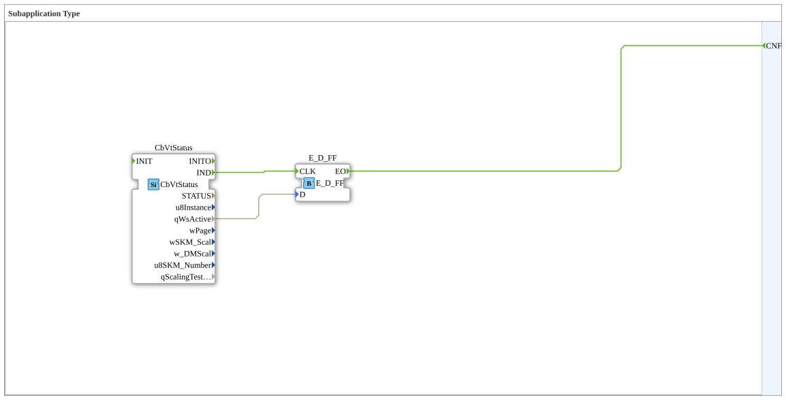

# page

* * * * * * * * * *
## Einleitung

Die Subapplication `page` ist ein gekapselter Baustein, der eine einfache Ereignis-Daten-Verarbeitung realisiert. Sie basiert auf zwei internen Funktionsblöcken: einem Status-überwachenden FB (CbVtStatus) und einem flankengetriggerten Flipflop (E_D_FF). Durch die Kombination dieser Bausteine wird ein spezifisches Verhalten erzeugt, das nach außen hin nur über einen Ereignis-Ausgang sichtbar ist.

## Schnittstellenstruktur

### **Ereignis-Eingänge**

Keine.

### **Ereignis-Ausgänge**

| Name  | Typ   | Kommentar                   |
|-------|-------|-----------------------------|
| CNF   | Event | Execution Confirmation        |

### **Daten-Eingänge**

Keine.

### **Daten-Ausgänge**

Keine.

### **Adapter**

Keine.

## Funktionsweise

Die Subapplication besitzt keine externen Ein- oder Ausgänge außer dem Ereignis-Ausgang `CNF`. Intern sind zwei Funktionsblöcke verschaltet:

1. **CbVtStatus** (Typ: `isobus::UT::status::CbVtStatus`): Dieser Block überwacht einen bestimmten Status (vermutlich eines VT – Virtual Terminal) und gibt bei einer Änderung oder einem Ereignis das Signal `IND` aus. Zusätzlich liefert er das Datensignal `qWsActive` (Workstation aktiv?).

2. **E_D_FF** (Typ: `iec61499::events::E_D_FF`): Ein flankengetriggertes D-Flipflop, das auf die steigende Flanke des Ereignisses `CLK` reagiert. Das Datensignal `D` wird bei jeder Flanke übernommen und der Ausgang `EO` wird als Ereignis ausgelöst, sobald eine gültige Flanke erkannt wurde.

Die Verbindung ist wie folgt:

- Das Ereignis `IND` von `CbVtStatus` wird als Takt (`CLK`) an das Flipflop `E_D_FF` weitergeleitet.
- Das Datensignal `qWsActive` wird auf den Dateneingang `D` des Flipflops gelegt.
- Das Ereignis `EO` des Flipflops ist direkt mit dem externen Ausgang `CNF` verbunden.

Somit wird jedes Mal, wenn `CbVtStatus` ein `IND`-Ereignis erzeugt, das Flipflop getaktet. Der aktuelle Wert von `qWsActive` wird als Zustand übernommen und ein `CNF`-Ereignis wird ausgegeben. Die Bedingung für die Ausgabe ist also das Eintreten eines Ereignisses von `CbVtStatus` – unabhängig davon, ob der Wert von `qWsActive` sich geändert hat oder nicht. Dadurch wird eine Quittung (CNF) an den übergeordneten Baustein gesendet.

## Technische Besonderheiten

- Es handelt sich um eine **Subapplication**, die die interne Logik vollständig kapselt. Nur der Ereignisausgang ist nach außen sichtbar; alle internen Verbindungen sind für den Aufrufer unsichtbar.
- Die Verwendung eines D-Flipflops (`E_D_FF`) bewirkt, dass der Zustand des Signals `qWsActive` bei jedem Ereignis `IND` erfasst und für die nächste Verarbeitung gespeichert wird. Dies kann zur Zustandsspeicherung oder zur Erzeugung eines einmaligen Quittungssignals verwendet werden.
- Die beiden Funktionsblöcke stammen aus unterschiedlichen Bibliotheken (`isobus` und `iec61499`), was auf eine modulare Integration hinweist.

## Zustandsübersicht

Da intern ein D-Flipflop verwendet wird, können zwei stabile Zustände unterschieden werden:

- **Zustand Q=0** (Logisch 0): Der aktuelle Wert von `D` (also `qWsActive`) ist 0, und das Flipflop hat diesen Wert übernommen. Ein `CNF`-Ereignis wurde nach der letzten Taktflanke mit diesem Wert ausgegeben.
- **Zustand Q=1** (Logisch 1): Der aktuelle Wert von `D` ist 1, und das Flipflop hat diesen Wert übernommen. Ein `CNF`-Ereignis wurde mit diesem Wert ausgegeben.

Das Flipflop wechselt bei jedem `IND`-Ereignis (Taktflanke) seinen Zustand entsprechend dem aktuellen `D`-Signal. Es gibt keinen Reset-Eingang; der Anfangszustand hängt vom initialen Wert von `qWsActive` nach dem Start der Subapplication ab.

## Anwendungsszenarien

- **Statusbenachrichtigung**: Überwachung eines Systems (z.B. eines ISO-Bus-Terminals) und Erzeugen eines Bestätigungsereignisses (`CNF`) bei jedem Statuswechsel, um übergeordnete Steuerungen zu informieren.
- **Ablaufsteuerung**: Einsatz als Trigger für nachfolgende Schritte, die nur bei einem bestimmten Ereignis ausgeführt werden sollen.
- **Test und Diagnose**: Einfache Möglichkeit, ein Ereignis von einer überwachten Komponente zu erhalten und gleichzeitig den Zustand eines Datenwerts intern zu speichern.

## Vergleich mit ähnlichen Bausteinen

Im Vergleich zu einfachen Ereignis- oder Datenbausteinen bietet `page` die Besonderheit, dass es ein Ereignis mit einer Datenspeicherung kombiniert. Ein direkter Ereignis-Weiterleitungsbaustein (z.B. `E_SPLIT`) würde nur das Ereignis weiterleiten, ohne den Dateneingang zu berücksichtigen. Ein reines D-Flipflop ohne Ereignissteuerung würde nur bei explizitem Takt reagieren, hier ist der Takt intern mit dem Ereignis von `CbVtStatus` verbunden.

## Fazit

Die Subapplication `page` realisiert eine kompakte Funktion: Sie verbindet die Statusüberwachung eines VT-Systems mit einem flankengetriggerten Flipflop und liefert bei jedem Ereignis eine Bestätigung (`CNF`). Durch die Kapselung in einer Subapplication bleibt die interne Logik übersichtlich und kann wiederverwendet werden, ohne dass externe Verbindungen geändert werden müssen. Dies macht sie zu einem nützlichen Baustein für Anwendungen, die eine ereignisbasierte Zustandsübernahme erfordern.