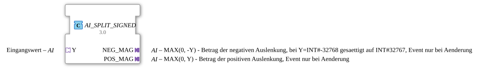

# AI_SPLIT_SIGNED



* * * * * * * * * *

## Einleitung

Der **AI_SPLIT_SIGNED** ist ein Adapter-Wrapper-Funktionsbaustein (Composite FB) zum Aufteilen eines vorzeichenbehafteten `INT`-Messwerts in zwei einseitige Betragskomponenten über unidirektionale Adapter (`adapter::types::unidirectional::AI`):

- `NEG_MAG`: Betrag der negativen Auslenkung (`MAX(0, -Y)`)
- `POS_MAG`: Betrag der positiven Auslenkung (`MAX(0, Y)`)

Der Baustein kapselt den Berechnungs-FB **SPLIT_SIGNED_INT** sowie zwei D-Flip-Flop-Bausteine vom Typ **E_D_FF_ANY**, um das initiale Ereignis beim ersten `CLK` und danach Ereignisse auf den Plugs `NEG_MAG` und `POS_MAG` **nur bei tatsächlicher Wertänderung** der jeweiligen Seite auszulösen.

## Schnittstellenstruktur

### **Adapter-Sockets (Eingang)**

| Name | Typ | Kommentar |
|---|---|---|
| `Y` | `adapter::types::unidirectional::AI` | Vorzeichenbehafteter Eingangswert (AI-Adapter-Socket) |

### **Adapter-Plugs (Ausgang)**

| Name | Typ | Kommentar |
|---|---|---|
| `NEG_MAG` | `adapter::types::unidirectional::AI` | Betrag der negativen Auslenkung (`MAX(0, -Y)`), initiales Ereignis beim 1. Aufruf, danach nur bei Wertänderung |
| `POS_MAG` | `adapter::types::unidirectional::AI` | Betrag der positiven Auslenkung (`MAX(0, Y)`), initiales Ereignis beim 1. Aufruf, danach nur bei Wertänderung |

## Funktionsweise

Intern besteht das Composite-Netzwerk aus drei Bausteinen:

1. **SPLIT (SPLIT_SIGNED_INT)**: Berechnet `NEG_MAG` und `POS_MAG` aus `Y.D1` bei jedem `Y.E1`-Ereignis.
2. **DEDUP_NEG (E_D_FF_ANY)**: Ein ereignisgesteuertes D-Flip-Flop, das beim ersten `CLK`-Ereignis das initiale Ausgangsereignis auslöst und danach `CLK` nur dann an `EO` weiterleitet und `Q := D` aktualisiert, wenn der neue Wert `D` ungleich dem bisherigen Ausgangswert `Q` ist (`D <> Q`).
3. **DEDUP_POS (E_D_FF_ANY)**: Ein zweites D-Flip-Flop derselben Bauart, das das initiale Ereignis beim 1. Aufruf ausgibt und spätere Ereignisse auf `POS_MAG.E1` ebenfalls nur bei einer echten Datenänderung (`POS_MAG.D1 <> POS_MAG.Q`) sendet.

```
Y (AI-Adapter-Socket)
 ├──> SPLIT (SPLIT_SIGNED_INT)
       ├──> NEG_MAG ──> DEDUP_NEG (E_D_FF_ANY D-Flip-Flop) ──> NEG_MAG (AI-Adapter-Plug)
       └──> POS_MAG ──> DEDUP_POS (E_D_FF_ANY D-Flip-Flop) ──> POS_MAG (AI-Adapter-Plug)
```

## Technische Besonderheiten

- **Adapterbasierte Architektur:** Vollständig kompatibel mit der unidirektionalen Adapterfamilie `adapter::types::unidirectional::AI`.
- **Ereignis-Filterung per D-Flip-Flop:** Durch die `E_D_FF_ANY` Bausteine wird sichergestellt, dass an `NEG_MAG.E1` bzw. `POS_MAG.E1` das initiale Ausgangsereignis beim ersten `CLK` gesendet wird und spätere Ereignisse per Definition nur dann erzeugt werden, wenn sich der neue Wert `D` vom bisherigen Zustand `Q` unterscheidet.
- **Überlaufsicherheit:** Vererbt die Sättigungslogik von `SPLIT_SIGNED_INT` für Zweierkomplement-Ganzzahlgrenzen.

## Anwendungsszenarien

- Anbindung von bipolaren Gebern (z. B. Lenkwinkelsensor, Neigungssensor, Joystick) an zwei getrennte VT-Bargraphen.
- Adapterbasierte Ansteuerung von Zylinderantrieben (Ausfahren/Einfahren).

## Vergleich mit ähnlichen Bausteinen

- **AI_SPLIT_SIGNED**: Composite FB mit Adapter-Schnittstellen und D-Flip-Flop Event-Filterung.
- **SPLIT_SIGNED_INT**: Unterlagerter Basic FB für reine Signalberechnung ohne Adapter.

## Fazit

**AI_SPLIT_SIGNED** bietet eine elegante, adapterbasierte und durch D-Flip-Flops ereigniseffiziente Lösung zur Vorzeichen-Signalaufteilung in IEC 61499 Anwendungen.
