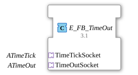

# E_FB_TimeOut

* * * * * * * * * *

## Einleitung

Der Funktionsbaustein `E_FB_TimeOut` bietet eine einfache Implementierung von Timeout-Diensten auf Basis eines internen Verzögerungsbausteins (`E_FB_DELAY`). Er ist als zusammengesetzter FB (Composite) konzipiert und verbindet eine Zeitgeber‑Schnittstelle (`TimeTickSocket`) mit einer Timeout‑Schnittstelle (`TimeOutSocket`). Die Funktionalität entspricht einem TON‑Baustein (Timer ON‑Delay) mit zyklischer Abfrage über Ticks.

## Schnittstellenstruktur

Der FB besitzt **keine direkten Ereignis- oder Datenein-/ausgänge**. Alle externen Anbindungen erfolgen ausschließlich über zwei **Adapter-Sockets**. Die tatsächlichen Signale werden über die jeweiligen Adaptertypen definiert.

### **Ereignis-Eingänge**

- Nicht vorhanden (es werden keine direkten Ereignisse angebunden).

### **Ereignis-Ausgänge**

- Nicht vorhanden (es werden keine direkten Ereignisse ausgegeben).

### **Daten-Eingänge**

- Nicht vorhanden (es werden keine direkten Daten angebunden).

### **Daten-Ausgänge**

- Nicht vorhanden (es werden keine direkten Daten ausgegeben).

### **Adapter**

| Socket | Typ | Beschreibung |
|--------|-----|--------------|
| `TimeTickSocket` | `adapter::events::TimeOut::ATimeTick` | Adapter für die zyklische Zeitabfrage (Tick‑Schnittstelle). Stellt Ereignisse wie `REQ`, `CNF`, `STARTO_IN`, `STOPO_IN` sowie Daten `ET`, `Q`, `PT` bereit. |
| `TimeOutSocket` | `iec61499::events::ATimeOut` | Adapter für den eigentlichen Timeout‑Dienst. Bietet Ereignisse `START`, `STOP`, `TimeOut` sowie Daten `DT`, `ET`, `Q`, `PT`. |

- **`ATimeTick`** (Zeitgeber): Empfängt `REQ` (Anforderung für einen Tick), liefert `CNF` (Bestätigung) und signalisiert Start/Stopp über `STARTO_IN`/`STOPO_IN`. Daten umfassen die verstrichene Zeit `ET`, das Ausgangssignal `Q` und die voreingestellte Zeit `PT`.
- **`ATimeOut`** (Timeout‑Dienst): Startet und stoppt den Timeout über `START`/`STOP`, generiert das Ereignis `TimeOut` nach Ablauf. Daten umfassen die Zielzeit `DT`, die verstrichene Zeit `ET`, den Ausgangsstatus `Q` und die Zeitvorgabe `PT`.

## Funktionsweise

Der FB realisiert einen timerbasierten Timeout wie folgt:

- **Ablauf**: Über `TimeOutSocket.START` wird der interne `E_FB_DELAY` gestartet. Die Sollzeit wird über `TimeOutSocket.DT` an den Delay‑Baustein übergeben.
- **Zeitbasis**: Der Zeitgeber wird über `TimeTickSocket.REQ` mit einem zyklischen Impuls versorgt. Jeder dieser Ticks veranlasst den Delay‑Baustein, seine interne Zeit zu aktualisieren und zu prüfen, ob die vorgegebene Zeit erreicht ist.
- **Abschluss**: Sobald die Zeit abgelaufen ist, erzeugt der Delay‑Baustein ein Ereignis am Ausgang `EO`. Dieses wird als `TimeOut` über den `TimeOutSocket` ausgegeben.
- **Stopp**: Über `TimeOutSocket.STOP` wird der Delay‑Baustein angehalten. Entsprechende Rückmeldungen über `CNF`, `STARTO_IN`, `STOPO_IN` und die Daten `ET`, `Q`, `PT` werden über den jeweils passenden Adapter in beide Richtungen kommuniziert.

Die Verbindungen im internen Netzwerk spiegeln exakt diese Kommunikation wider:  

- `TimeOutSocket.START` → `DLY.START`  
- `TimeOutSocket.STOP` → `DLY.STOP`  
- `DLY.EO` → `TimeOutSocket.TimeOut`  
- `TimeTickSocket.REQ` → `DLY.REQ`  
- `DLY.CNF` → `TimeTickSocket.CNF`  
- `DLY.STARTO` → `TimeTickSocket.STARTO_IN`  
- `DLY.STOPO` → `TimeTickSocket.STOPO_IN`  

Daten:  

- `TimeOutSocket.DT` → `DLY.DT`  
- `DLY.ET` → `TimeTickSocket.ET`  
- `DLY.Q` → `TimeTickSocket.Q`  
- `DLY.PT` → `TimeTickSocket.PT`

## Technische Besonderheiten

- **Adapterbasiert**: Die gesamte Funktionalität ist in Adapterstrukturen gekapselt, wodurch eine hohe Wiederverwendbarkeit und modulare Einbindung in größere Systeme erreicht wird.
- **Zyklische Zeitbasis**: Der Timeout wird nicht über einen eigenständigen Hardware‑Timer, sondern über externe Ticks (z. B. von einem zyklischen Taktgeber) realisiert. Dies erlaubt eine präzise Synchronisation mit anderen zyklischen Prozessen.
- **Kompatibilität**: Laut Versionshinweisen wurde der FB in Anlehnung an das Standard‑TON‑Verhalten (IEC 61131‑3) entwickelt, jedoch mit einem ereignisgesteuerten Adapterinterface.
- **Flexible Parametrierung**: Die Zeitvorgabe (`PT`) und die Zielzeit (`DT`) werden über die Adapterdaten übergeben; dadurch ist der FB dynamisch konfigurierbar.

## Zustandsübersicht

Der `E_FB_TimeOut` besitzt keine eigenen expliziten Zustände, da die Logik vollständig im internen `E_FB_DELAY` implementiert ist. Das Verhalten entspricht einem klassischen Timer‑Zustandsautomaten:

- **Idle**: Kein Timeout aktiv.
- **Counting**: Nach `START` läuft der Zähler, solange `STOP` nicht gesetzt wurde.
- **Expired**: Nach Erreichen der eingestellten Zeit wird `TimeOut` generiert, der Zähler bleibt solange aktiv, bis `STOP` oder ein erneuter `START` (Reset) erfolgt.

Die Zustands‑Rückmeldungen (`Q`, `ET`) werden über die Adapter an die angeschlossenen Applikationen kommuniziert.

## Anwendungsszenarien

- **Überwachung von Kommunikationsprotokollen**: Einsatz als Kommunikationstimeout, z. B. um auf fehlende Antworten in Bussystemen zu reagieren.
- **Prozesssteuerung**: Absicherung von zeitkritischen Schritten in Fertigungsanlagen.
- **Test- und Diagnosesysteme**: Erzeugung definierter Verzögerungen oder Timeout‑Auslösungen in Testumgebungen.
- **Energiemanagement**: Abschaltung von Komponenten nach einer festgelegten Inaktivitätszeit.

## Vergleich mit ähnlichen Bausteinen

- **Standard‑TON (IEC 61131‑3)**: Basiert auf einer festen, internen Zeitbasis; im Gegensatz dazu verwendet `E_FB_TimeOut` eine externe Tick‑Schnittstelle, was eine flexiblere Integration in ereignisgesteuerte Systeme ermöglicht.
- **Andere Timeout‑FBs (z. B. `E_FB_Timer`)**: Diese verwenden oft interne Timer‑Ressourcen; `E_FB_TimeOut` delegiert die Zeitmessung an einen internen Delay‑FB und nutzt Adapter, wodurch eine saubere Trennung von Logik und Zeitgeber erfolgt.
- **Adapter‑basierte Timeouts**: Im Gegensatz zu reinen Funktionsblöcken mit direkten Ein‑/Ausgängen bietet dieser FB eine standardisierte, wiederverwendbare Schnittstelle, die sich leicht in existierende Adapter‑Netzwerke einfügt.

## Fazit

Der `E_FB_TimeOut` ist ein kompakter, adapterorientierter Baustein, der einen zuverlässigen Timeout‑Mechanismus auf Basis eines zyklischen Zeitgebers realisiert. Durch die klare Trennung von Zeitgeber‑ und Timeout‑Schnittstelle eignet er sich besonders für modulare Systeme, in denen eine flexible und erweiterbare Zeitsteuerung benötigt wird. Die Implementierung folgt bewährten IEC‑61499‑Strukturen und kann in verschiedenen Anwendungskontexten ohne großen Aufwand integriert werden.
