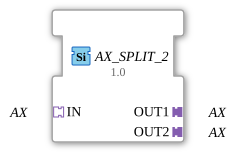

# AX_SPLIT_2

* * * * * * * * * *

## Einleitung

Der AX_SPLIT_2 Funktionsblock dient als generischer Baustein zur Verteilung eines AX-Signals auf zwei separate Ausgänge. Der Block ermöglicht die Aufteilung eines eingehenden AX-Signals auf zwei unabhängige Ausgabekanäle.

## Schnittstellenstruktur

### **Ereignis-Eingänge**

Keine direkten Ereignis-Eingänge vorhanden

### **Ereignis-Ausgänge**

Keine direkten Ereignis-Ausgänge vorhanden

### **Daten-Eingänge**

Keine direkten Daten-Eingänge vorhanden

### **Daten-Ausgänge**

Keine direkten Daten-Ausgänge vorhanden

### **Adapter**

**Eingangsadapter:**

- **IN**: AX-Adapter (unidirectional) - Empfängt das eingehende AX-Signal

**Ausgangsadapter:**

- **OUT1**: AX-Adapter (unidirectional) - Erster Ausgangskanal für das verteilte Signal
- **OUT2**: AX-Adapter (unidirectional) - Zweiter Ausgangskanal für das verteilte Signal

## Funktionsweise

Der AX_SPLIT_2 Funktionsblock empfängt ein AX-Signal über den IN-Adapter und verteilt dieses Signal gleichzeitig auf beide Ausgangsadapter OUT1 und OUT2. Es handelt sich um eine 1:2-Verteilung, bei der das eingehende Signal ohne Änderung an beide Ausgänge weitergeleitet wird.

## Technische Besonderheiten

- Generische Implementierung für AX-Signale
- Unidirektionale Signalübertragung
- Keine Signalverzögerung zwischen Ein- und Ausgang
- Gleichzeitige Aktivierung beider Ausgänge

## Zustandsübersicht

Der Funktionsblock arbeitet zustandslos - bei jedem eingehenden Signal über den IN-Adapter werden sofort beide Ausgangsadapter aktiviert.

## Anwendungsszenarien

- Signalverteilung in Steuerungssystemen
- Parallele Versorgung mehrerer Komponenten mit demselben Signal
- Verzweigung von AX-Kommunikationspfaden
- Redundante Signalweiterleitung

## ⚖️ Vergleich mit ähnlichen Bausteinen

Im Vergleich zu anderen Verteilungsbausteinen bietet AX_SPLIT_2 eine spezifische 1:2-Aufteilung für AX-Signale. Andere Splitter-Bausteine könnten unterschiedliche Anzahlen von Ausgängen oder andere Signaltypen unterstützen.

Vergleich mit [E_SPLIT](../../../../../StandardLibraries/events/E_SPLIT.md)

- **[`AX_SPLIT_2_UNGATED`](AX_SPLIT_2_UNGATED.md)**: Ungegatete Variante – aktualisiert den Ausgang bei jedem Durchlauf, auch ohne Wertänderung.

## 🛠️ Zugehörige Übungen

- [Uebung_002_AX](https://docs.ms-muc-docs.de/projects/visual-programming-languages-docs/en/latest/Uebungen/test_AX/Uebungen_doc/Uebung_002_AX/)
- [Uebung_004b_AX](https://docs.ms-muc-docs.de/projects/visual-programming-languages-docs/en/latest/Uebungen/test_AX/Uebungen_doc/Uebung_004b_AX/)
- [Uebung_004b_AX_ASR](https://docs.ms-muc-docs.de/projects/visual-programming-languages-docs/en/latest/Uebungen/test_AX/Uebungen_doc/Uebung_004b_AX_ASR/)
- [Uebung_004b_AX_ASR_X](https://docs.ms-muc-docs.de/projects/visual-programming-languages-docs/en/latest/Uebungen/test_AX/Uebungen_doc/Uebung_004b_AX_ASR_X/)
- [Uebung_006a3_sub_AX](https://docs.ms-muc-docs.de/projects/visual-programming-languages-docs/en/latest/Uebungen/test_AX/Uebungen_doc/Uebung_006a3_sub_AX/)
- [Uebung_007a3_AX](https://docs.ms-muc-docs.de/projects/visual-programming-languages-docs/en/latest/Uebungen/test_AX/Uebungen_doc/Uebung_007a3_AX/)
- [Uebung_008_AX](https://docs.ms-muc-docs.de/projects/visual-programming-languages-docs/en/latest/Uebungen/test_AX/Uebungen_doc/Uebung_008_AX/)
- [Uebung_010c2_AX](https://docs.ms-muc-docs.de/projects/visual-programming-languages-docs/en/latest/Uebungen/test_AX/Uebungen_doc/Uebung_010c2_AX/)
- [Uebung_010c3_sub_AX](https://docs.ms-muc-docs.de/projects/visual-programming-languages-docs/en/latest/Uebungen/test_AX/Uebungen_doc/Uebung_010c3_sub_AX/)
- [Uebung_010c4_sub_AX](https://docs.ms-muc-docs.de/projects/visual-programming-languages-docs/en/latest/Uebungen/test_AX/Uebungen_doc/Uebung_010c4_sub_AX/)
- [Uebung_010c_AX](https://docs.ms-muc-docs.de/projects/visual-programming-languages-docs/en/latest/Uebungen/test_AX/Uebungen_doc/Uebung_010c_AX/)
- [Uebung_020c3_AX](https://docs.ms-muc-docs.de/projects/visual-programming-languages-docs/en/latest/Uebungen/test_AX/Uebungen_doc/Uebung_020c3_AX/)
- [Uebung_020e2_AX](https://docs.ms-muc-docs.de/projects/visual-programming-languages-docs/en/latest/Uebungen/test_AX/Uebungen_doc/Uebung_020e2_AX/)
- [Uebung_020f2_AX](https://docs.ms-muc-docs.de/projects/visual-programming-languages-docs/en/latest/Uebungen/test_AX/Uebungen_doc/Uebung_020f2_AX/)
- [Uebung_020j2_AX_sub](https://docs.ms-muc-docs.de/projects/visual-programming-languages-docs/en/latest/Uebungen/test_AX/Uebungen_doc/Uebung_020j2_AX_sub/)
- [Uebung_020j_AX](https://docs.ms-muc-docs.de/projects/visual-programming-languages-docs/en/latest/Uebungen/test_AX/Uebungen_doc/Uebung_020j_AX/)
- [Uebung_035a2_AX](https://docs.ms-muc-docs.de/projects/visual-programming-languages-docs/en/latest/Uebungen/test_AX/Uebungen_doc/Uebung_035a2_AX/)
- [Uebung_035a3_AX](https://docs.ms-muc-docs.de/projects/visual-programming-languages-docs/en/latest/Uebungen/test_AX/Uebungen_doc/Uebung_035a3_AX/)
- [Uebung_094a_AX](https://docs.ms-muc-docs.de/projects/visual-programming-languages-docs/en/latest/Uebungen/test_AX/Uebungen_doc/Uebung_094a_AX/)
- [Uebung_160_AX](https://docs.ms-muc-docs.de/projects/visual-programming-languages-docs/en/latest/Uebungen/test_AX/Uebungen_doc/Uebung_160_AX/)
- [Uebung_160b2_AX](https://docs.ms-muc-docs.de/projects/visual-programming-languages-docs/en/latest/Uebungen/test_AX/Uebungen_doc/Uebung_160b2_AX/)
- [Uebung_160b_AX](https://docs.ms-muc-docs.de/projects/visual-programming-languages-docs/en/latest/Uebungen/test_AX/Uebungen_doc/Uebung_160b_AX/)

## Änderungserkennung

Jeder Ausgangs-Plug wird unabhängig aktualisiert: Der eingehende Wert wird nur dann auf einen Ausgang geschrieben und dessen Adapter-Event gesendet, wenn er sich vom aktuellen Wert dieses Ausgangs unterscheidet. Bereits synchrone Ausgänge bleiben still, während ein gerade erst verbundener (oder nicht mehr synchroner) Ausgang weiterhin die nötige Aktualisierung erhält.

## Fazit

Der AX_SPLIT_2 Funktionsblock stellt eine einfache und effiziente Lösung zur Verteilung von AX-Signalen auf zwei Ausgänge dar. Seine generische Natur und die unidirektionale Architektur machen ihn zu einem vielseitig einsetzbaren Baustein in verteilten Automatisierungssystemen.
