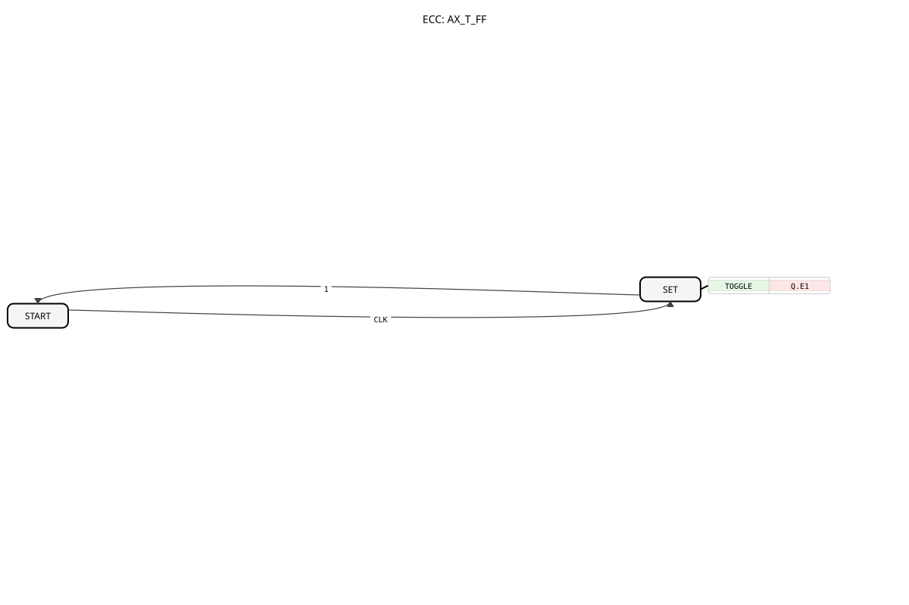

# AX_T_FF

* * * * * * * * * *

## Einleitung

Der AX_T_FF (Toggle Flip-Flop) ist ein grundlegender Speicherbaustein in 4diac, der als Toggle-Flipflop fungiert. Bei jedem Taktereignis wechselt der Ausgabewert zwischen den beiden möglichen Zuständen. Der Baustein implementiert ein einfaches Schaltverhalten, bei dem der Ausgangswert bei jedem Taktimpuls umgeschaltet wird.

## Schnittstellenstruktur

### **Ereignis-Eingänge**

- **CLK**: Takteingang, der eine Ausgangsumschaltung auslöst

### **Ereignis-Ausgänge**

- Keine direkten Ereignisausgänge vorhanden

### **Daten-Eingänge**

- Keine Dateneingänge vorhanden

### **Daten-Ausgänge**

- Keine direkten Datenausgänge vorhanden

### **Adapter**

- **Q**: Unidirektionaler Adapter vom Typ AX, der den aktuellen Flipflop-Wert bereitstellt

## Funktionsweise

Der AX_T_FF arbeitet als einfacher Toggle-Flipflop. Bei jedem eingehenden CLK-Ereignis wird der Algorithmus TOGGLE ausgeführt, der den aktuellen Wert des Adapters Q.D1 invertiert. Der Baustein beginnt im START-Zustand und wechselt bei jedem CLK-Ereignis in den SET-Zustand, wo die Umschaltung durchgeführt wird.

## Technische Besonderheiten

- Verwendet einen unidirektionalen Adapter für die Ausgabe
- Implementiert als Basic Function Block (BFB)
- Besitzt einen einfachen Zustandsautomaten mit zwei Zuständen
- Der Algorithmus TOGGLE führt eine logische Negation des Ausgabewerts durch

## Zustandsübersicht

Der Baustein verfügt über zwei Zustände:

1. **START**: Initialzustand, wartet auf CLK-Ereignis
2. **SET**: Aktiver Zustand, in dem der TOGGLE-Algorithmus ausgeführt wird

Zustandsübergänge:

- START → SET: Bei CLK-Ereignis
- SET → START: Immer (Condition "1" = wahr)

## Anwendungsszenarien

- Frequenzteilung von Taktsignalen
- Erzeugung von Rechtecksignalen mit halber Eingangsfrequenz
- Zähler- und Teiler-Schaltungen
- Zustandssteuerungen mit alternierendem Verhalten

## ⚖️ Vergleich mit ähnlichen Bausteinen

Im Vergleich zu anderen Flipflop-Typen wie RS- oder D-Flipflops bietet der Toggle-Flipflop eine spezialisierte Funktionalität für reine Umschaltoperationen. Er ist einfacher aufgebaut als universellere Flipflop-Typen und benötigt keine zusätzlichen Dateneingänge.

Vergleich mit [E_T_FF](../../../../../StandardLibraries/events/E_T_FF.md)

## 🛠️ Zugehörige Übungen

- [Uebung_004a2_AX](https://meisterschulen-am-ostbahnhof-munchen-docs.readthedocs.io/projects/4diac-exercises-docs-en/en/latest/Uebungen/test_AX/Uebungen_doc/Uebung_004a2_AX/)
- [Uebung_004a3_AX](https://meisterschulen-am-ostbahnhof-munchen-docs.readthedocs.io/projects/4diac-exercises-docs-en/en/latest/Uebungen/test_AX/Uebungen_doc/Uebung_004a3_AX/)
- [Uebung_004a4_AX](https://meisterschulen-am-ostbahnhof-munchen-docs.readthedocs.io/projects/4diac-exercises-docs-en/en/latest/Uebungen/test_AX/Uebungen_doc/Uebung_004a4_AX/)
- [Uebung_004a5_AX](https://meisterschulen-am-ostbahnhof-munchen-docs.readthedocs.io/projects/4diac-exercises-docs-en/en/latest/Uebungen/test_AX/Uebungen_doc/Uebung_004a5_AX/)
- [Uebung_004a6_AX](https://meisterschulen-am-ostbahnhof-munchen-docs.readthedocs.io/projects/4diac-exercises-docs-en/en/latest/Uebungen/test_AX/Uebungen_doc/Uebung_004a6_AX/)
- [Uebung_004a8_AX](https://meisterschulen-am-ostbahnhof-munchen-docs.readthedocs.io/projects/4diac-exercises-docs-en/en/latest/Uebungen/test_AX/Uebungen_doc/Uebung_004a8_AX/)
- [Uebung_004a9_AX](https://meisterschulen-am-ostbahnhof-munchen-docs.readthedocs.io/projects/4diac-exercises-docs-en/en/latest/Uebungen/test_AX/Uebungen_doc/Uebung_004a9_AX/)
- [Uebung_004a_AX](https://meisterschulen-am-ostbahnhof-munchen-docs.readthedocs.io/projects/4diac-exercises-docs-en/en/latest/Uebungen/test_AX/Uebungen_doc/Uebung_004a_AX/)
- [Uebung_004c1_AX](https://meisterschulen-am-ostbahnhof-munchen-docs.readthedocs.io/projects/4diac-exercises-docs-en/en/latest/Uebungen/test_AX/Uebungen_doc/Uebung_004c1_AX/)
- [Uebung_004c2_AX](https://meisterschulen-am-ostbahnhof-munchen-docs.readthedocs.io/projects/4diac-exercises-docs-en/en/latest/Uebungen/test_AX/Uebungen_doc/Uebung_004c2_AX/)
- [Uebung_004c3_AX](https://meisterschulen-am-ostbahnhof-munchen-docs.readthedocs.io/projects/4diac-exercises-docs-en/en/latest/Uebungen/test_AX/Uebungen_doc/Uebung_004c3_AX/)
- [Uebung_004c4_AX](https://meisterschulen-am-ostbahnhof-munchen-docs.readthedocs.io/projects/4diac-exercises-docs-en/en/latest/Uebungen/test_AX/Uebungen_doc/Uebung_004c4_AX/)
- [Uebung_004c5_AX](https://meisterschulen-am-ostbahnhof-munchen-docs.readthedocs.io/projects/4diac-exercises-docs-en/en/latest/Uebungen/test_AX/Uebungen_doc/Uebung_004c5_AX/)
- [Uebung_004c6_AX](https://meisterschulen-am-ostbahnhof-munchen-docs.readthedocs.io/projects/4diac-exercises-docs-en/en/latest/Uebungen/test_AX/Uebungen_doc/Uebung_004c6_AX/)
- [Uebung_004c7_AX](https://meisterschulen-am-ostbahnhof-munchen-docs.readthedocs.io/projects/4diac-exercises-docs-en/en/latest/Uebungen/test_AX/Uebungen_doc/Uebung_004c7_AX/)
- [Uebung_005_AX](https://meisterschulen-am-ostbahnhof-munchen-docs.readthedocs.io/projects/4diac-exercises-docs-en/en/latest/Uebungen/test_AX/Uebungen_doc/Uebung_005_AX/)
- [Uebung_006a3_sub_AX](https://meisterschulen-am-ostbahnhof-munchen-docs.readthedocs.io/projects/4diac-exercises-docs-en/en/latest/Uebungen/test_AX/Uebungen_doc/Uebung_006a3_sub_AX/)
- [Uebung_007_AX](https://meisterschulen-am-ostbahnhof-munchen-docs.readthedocs.io/projects/4diac-exercises-docs-en/en/latest/Uebungen/test_AX/Uebungen_doc/Uebung_007_AX/)
- [Uebung_007a1_AX](https://meisterschulen-am-ostbahnhof-munchen-docs.readthedocs.io/projects/4diac-exercises-docs-en/en/latest/Uebungen/test_AX/Uebungen_doc/Uebung_007a1_AX/)
- [Uebung_007a2_AX](https://meisterschulen-am-ostbahnhof-munchen-docs.readthedocs.io/projects/4diac-exercises-docs-en/en/latest/Uebungen/test_AX/Uebungen_doc/Uebung_007a2_AX/)
- [Uebung_010b2_AX](https://meisterschulen-am-ostbahnhof-munchen-docs.readthedocs.io/projects/4diac-exercises-docs-en/en/latest/Uebungen/test_AX/Uebungen_doc/Uebung_010b2_AX/)
- [Uebung_010b3_AX](https://meisterschulen-am-ostbahnhof-munchen-docs.readthedocs.io/projects/4diac-exercises-docs-en/en/latest/Uebungen/test_AX/Uebungen_doc/Uebung_010b3_AX/)
- [Uebung_010b6_AX](https://meisterschulen-am-ostbahnhof-munchen-docs.readthedocs.io/projects/4diac-exercises-docs-en/en/latest/Uebungen/test_AX/Uebungen_doc/Uebung_010b6_AX/)
- [Uebung_010b7_AX](https://meisterschulen-am-ostbahnhof-munchen-docs.readthedocs.io/projects/4diac-exercises-docs-en/en/latest/Uebungen/test_AX/Uebungen_doc/Uebung_010b7_AX/)
- [Uebung_010b8_AX](https://meisterschulen-am-ostbahnhof-munchen-docs.readthedocs.io/projects/4diac-exercises-docs-en/en/latest/Uebungen/test_AX/Uebungen_doc/Uebung_010b8_AX/)
- [Uebung_010b9_AX](https://meisterschulen-am-ostbahnhof-munchen-docs.readthedocs.io/projects/4diac-exercises-docs-en/en/latest/Uebungen/test_AX/Uebungen_doc/Uebung_010b9_AX/)
- [Uebung_010bA2_AX](https://meisterschulen-am-ostbahnhof-munchen-docs.readthedocs.io/projects/4diac-exercises-docs-en/en/latest/Uebungen/test_AX/Uebungen_doc/Uebung_010bA2_AX/)
- [Uebung_010bA3_AX](https://meisterschulen-am-ostbahnhof-munchen-docs.readthedocs.io/projects/4diac-exercises-docs-en/en/latest/Uebungen/test_AX/Uebungen_doc/Uebung_010bA3_AX/)
- [Uebung_010bA4_AX](https://meisterschulen-am-ostbahnhof-munchen-docs.readthedocs.io/projects/4diac-exercises-docs-en/en/latest/Uebungen/test_AX/Uebungen_doc/Uebung_010bA4_AX/)
- [Uebung_010bA_AX](https://meisterschulen-am-ostbahnhof-munchen-docs.readthedocs.io/projects/4diac-exercises-docs-en/en/latest/Uebungen/test_AX/Uebungen_doc/Uebung_010bA_AX/)
- [Uebung_035a2_AX](https://meisterschulen-am-ostbahnhof-munchen-docs.readthedocs.io/projects/4diac-exercises-docs-en/en/latest/Uebungen/test_AX/Uebungen_doc/Uebung_035a2_AX/)
- [Uebung_094a_AX](https://meisterschulen-am-ostbahnhof-munchen-docs.readthedocs.io/projects/4diac-exercises-docs-en/en/latest/Uebungen/test_AX/Uebungen_doc/Uebung_094a_AX/)
- [Uebung_095_AX](https://meisterschulen-am-ostbahnhof-munchen-docs.readthedocs.io/projects/4diac-exercises-docs-en/en/latest/Uebungen/test_AX/Uebungen_doc/Uebung_095_AX/)
- [Uebung_150_AX](https://meisterschulen-am-ostbahnhof-munchen-docs.readthedocs.io/projects/4diac-exercises-docs-en/en/latest/Uebungen/test_AX/Uebungen_doc/Uebung_150_AX/)
- [Uebung_151_AX](https://meisterschulen-am-ostbahnhof-munchen-docs.readthedocs.io/projects/4diac-exercises-docs-en/en/latest/Uebungen/test_AX/Uebungen_doc/Uebung_151_AX/)

## Fazit

Der AX_T_FF ist ein spezialisierter und effizienter Baustein für Anwendungen, die ein reines Toggle-Verhalten benötigen. Seine einfache Struktur und klare Funktionsweise machen ihn zu einer zuverlässigen Komponente für Frequenzteilung und Zustandsalternierung in Steuerungssystemen.

---

### 🌐 Passende Themen-Unterseiten auf ms-muc-docs.de

- [🌐 Eclipse 4diac IDE & Farb-Referenz auf ms-muc-docs.de](https://www.ms-muc-docs.de/iec-61499/eclipse-4diac/)
