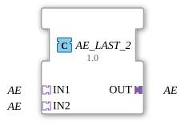

# AE_LAST_2

## Einleitung

Der AE_LAST_2 Funktionsblock führt zwei reine Ereignis-Adapter-Signale (**AE**, ohne Nutzdaten) auf einen gemeinsamen Ausgang (**OUT**) zusammen. Da AE keinerlei Datenwert trägt, gibt es beim "Zusammenführen" nichts zu arbitrieren außer dem Ereignis selbst - das letzte eintreffende Ereignis "gewinnt" in dem Sinne, dass es (wie jedes andere auch) unverändert an OUT weitergereicht wird.

## Schnittstellenstruktur

### **Adapter**

**Eingangsadapter (Sockets):**

- **IN1**: AE-Adapter (unidirectional) - erste Ereignisquelle
- **IN2**: AE-Adapter (unidirectional) - zweite Ereignisquelle

**Ausgangsadapter (Plug):**

- **OUT**: AE-Adapter (unidirectional) - zusammengeführtes Ereignis

## Funktionsweise

Anders als die datentragenden LAST_2-Varianten (z. B. [`AX_LAST_2`](../BOOL/AX_LAST_2.md)) ist AE_LAST_2 kein Basic-FB mit ECC, sondern ein Composite-FB: beide Eingangsereignisse werden direkt per Ereignisverbindung auf dasselbe Ausgangsereignis geführt (`IN1.E1 → OUT.E1` und `IN2.E1 → OUT.E1`). Das ist in IEC 61499 zulässig, weil Ereignisverbindungen (anders als Datenverbindungen) mehrere Quellen auf ein gemeinsames Ziel erlauben. Da AE keine Nutzdaten transportiert, ist kein ECC nötig, um "den letzten Wert" zu bestimmen - jedes Ereignis wird einfach durchgereicht, unabhängig davon, von welchem Socket es kam.

## Technische Besonderheiten

- Reines Ereignis-Fan-in, kein ECC/Algorithmus nötig
- Nutzt die IEC-61499-Eigenschaft, dass mehrere Ereignisquellen auf ein gemeinsames Ziel verbunden werden dürfen
- Keine Signalverzögerung: jedes Ereignis wird im selben Zyklus durchgereicht, in dem es eintrifft
- Strukturell die einfachste LAST_2-Variante, da keine Daten zu vergleichen/kopieren sind

## Anwendungsszenarien

- Zusammenführen zweier gleichwertiger Ereignisquellen (z. B. zwei Taster, die dieselbe Aktion auslösen sollen) auf einen gemeinsamen AE-Adapterpfad
- Vereinfachung von Netzwerken, die sonst zwei separate Ereignisverbindungen zum selben Ziel benötigen würden

## ⚖️ Vergleich mit ähnlichen Bausteinen

AE_LAST_2 ist die reine Ereignis-Variante des generischen LAST_2-Musters (vgl. [`AX_LAST_2`](../BOOL/AX_LAST_2.md) für die datentragende Variante). Für den Sonderfall des Set/Reset-Ereignis-Adapters siehe [`ASR_LAST_2`](ASR_LAST_2.md), das zwei getrennte Ereignispaare (SET, RESET) zusammenführt.
