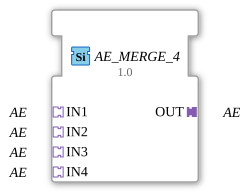

# AE_MERGE_4

* * * * * * * * * *

## Einleitung

Der Funktionsblock **AE_MERGE_4** führt 4 unidirektionale AE-Adapter (reinen Ereignisadapter, keine Nutzdaten) auf einen gemeinsamen Ausgangsadapter zusammen. Er ist die 4-Eingangs-Variante von [AE_MERGE_2](AE_MERGE_2.md) und wie dieser als generischer FB implementiert (`GenericClassName: 'GEN_AE_MERGE'`) — dieselbe C++-Basis (`CGenUnidirectMergeBase`), nur mit 4 statt 2 Sockets.

## Schnittstellenstruktur

### **Ereignis-Eingänge**

Keine. Die Ereignisübernahme erfolgt ausschließlich über die Adapter-Sockets.

### **Ereignis-Ausgänge**

Keine. Die Ereignisweitergabe erfolgt ausschließlich über den Adapter-Plug.

### **Daten-Eingänge**

Keine.

### **Daten-Ausgänge**

Keine.

### **Adapter**

| Rolle | Name | Typ | Beschreibung |
| ------- | ------ | ----- | -------------- |
| Socket (Eingang 1) | `IN1` | `adapter::types::unidirectional::AE` | 1. Quelle. |
| Socket (Eingang 2) | `IN2` | `adapter::types::unidirectional::AE` | 2. Quelle. |
| Socket (Eingang 3) | `IN3` | `adapter::types::unidirectional::AE` | 3. Quelle. |
| Socket (Eingang 4) | `IN4` | `adapter::types::unidirectional::AE` | 4. Quelle. |
| Plug (Ausgang) | `OUT` | `adapter::types::unidirectional::AE` | Zusammengeführtes Signal. |

## Funktionsweise

Trifft `E1` an einem der 4 Sockets (`IN1`, `IN2`, `IN3`, `IN4`) ein, wird es als gleichartiges Ereignis unverändert an `OUT` weitergereicht. Alle Ereignistypen werden unabhängig voneinander behandelt, und alle 4 Sockets werden gleichberechtigt behandelt — welcher Socket zuerst geprüft wird, folgt der Reihenfolge `IN1` … `IN4`, was nur bei mehreren innerhalb desselben Ausführungszyklus eintreffenden Ereignissen relevant wird. Da `AE` keinen Datenwert transportiert, gibt es nichts zu arbitrieren außer dem jeweiligen Ereignistyp selbst.

## Technische Besonderheiten

- **Generischer Typ**: Implementiert über die generische Basisklasse `CGenUnidirectMergeBase` (N Sockets, 1 Plug); die Anzahl der Eingangs-Sockets wird über den generischen Suffix (`_4`) zur Übersetzungszeit festgelegt.
- **Keine Zustände / Algorithmen**: Da `AE` keinen Datenwert trägt, gibt es keine Änderungserkennung und kein ECC.
- **Beliebige Eingangsanzahl**: Dieselbe Implementierung deckt AE_MERGE_2 bis AE_MERGE_7 ab; für andere Eingangsanzahlen siehe `AE_MERGE_2`, `AE_MERGE_3`, `AE_MERGE_5`, `AE_MERGE_6`, `AE_MERGE_7`.

## Zustandsübersicht

Der Baustein besitzt **keinen Zustandsautomaten**. Das Verhalten ist rein kombinatorisch: Jedes eingehende Ereignis an einem der 4 Sockets wird unmittelbar an `OUT` weitergereicht.

## Anwendungsszenarien

- **Zusammenführen mehrerer gleichwertiger Signalquellen** (z. B. 4 redundante oder alternative Auslösepfade) auf einen gemeinsamen AE-Adapterausgang.
- **Vereinfachung von Netzwerken**, die sonst 4 separate Ereignisverbindungen zum selben Ziel benötigen würden.

## Vergleich mit ähnlichen Bausteinen

- **[AE_SPLIT_2](AE_SPLIT_2.md)**: die Umkehrrichtung für 2 Ausgänge (bei ASRT zusätzlich AE_SPLIT_3 bis AE_SPLIT_9 verfügbar).
- **`AE_MERGE_2`, `AE_MERGE_3`, `AE_MERGE_5`, `AE_MERGE_6`, `AE_MERGE_7`**: dieselbe generische Implementierung mit anderer Eingangsanzahl.
- [ASR_MERGE_4](ASR_MERGE_4.md), [ASRT_MERGE_4](ASRT_MERGE_4.md): dieselbe Zusammenführungslogik für die jeweils anderen unidirektionalen Ereignisadapter.

## Fazit

`AE_MERGE_4` liefert eine generisch implementierte Zusammenführung von 4 `AE`-Ereignisquellen auf einen gemeinsamen Adapterausgang und ergänzt die `GEN_AE_MERGE`-Familie um die 4-Eingangs-Variante.
