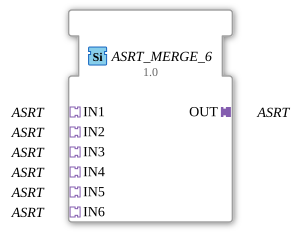

# ASRT_MERGE_6

* * * * * * * * * *

## Einleitung

Der Funktionsblock **ASRT_MERGE_6** führt 6 unidirektionale ASRT-Adapter (Set/Reset/Toggle-Ereignisadapter, keine Nutzdaten) auf einen gemeinsamen Ausgangsadapter zusammen. Er ist die 6-Eingangs-Variante von [ASRT_MERGE_2](ASRT_MERGE_2.md) und wie dieser als generischer FB implementiert (`GenericClassName: 'GEN_ASRT_MERGE'`) — dieselbe C++-Basis (`CGenUnidirectMergeBase`), nur mit 6 statt 2 Sockets.

## Schnittstellenstruktur

### **Ereignis-Eingänge**

Keine. Die Ereignisübernahme erfolgt ausschließlich über die Adapter-Sockets.

### **Ereignis-Ausgänge**

Keine. Die Ereignisweitergabe erfolgt ausschließlich über den Adapter-Plug.

### **Daten-Eingänge**

Keine.

### **Daten-Ausgänge**

Keine.

### **Adapter**

| Rolle | Name | Typ | Beschreibung |
| ------- | ------ | ----- | -------------- |
| Socket (Eingang 1) | `IN1` | `adapter::types::unidirectional::ASRT` | 1. Quelle. |
| Socket (Eingang 2) | `IN2` | `adapter::types::unidirectional::ASRT` | 2. Quelle. |
| Socket (Eingang 3) | `IN3` | `adapter::types::unidirectional::ASRT` | 3. Quelle. |
| Socket (Eingang 4) | `IN4` | `adapter::types::unidirectional::ASRT` | 4. Quelle. |
| Socket (Eingang 5) | `IN5` | `adapter::types::unidirectional::ASRT` | 5. Quelle. |
| Socket (Eingang 6) | `IN6` | `adapter::types::unidirectional::ASRT` | 6. Quelle. |
| Plug (Ausgang) | `OUT` | `adapter::types::unidirectional::ASRT` | Zusammengeführtes Signal. |

## Funktionsweise

Trifft `SET` bzw. `RESET` bzw. `TOGGLE` an einem der 6 Sockets (`IN1`, `IN2`, `IN3`, `IN4`, `IN5`, `IN6`) ein, wird es als gleichartiges Ereignis unverändert an `OUT` weitergereicht. Alle Ereignistypen werden unabhängig voneinander behandelt, und alle 6 Sockets werden gleichberechtigt behandelt — welcher Socket zuerst geprüft wird, folgt der Reihenfolge `IN1` … `IN6`, was nur bei mehreren innerhalb desselben Ausführungszyklus eintreffenden Ereignissen relevant wird. Da `ASRT` keinen Datenwert transportiert, gibt es nichts zu arbitrieren außer dem jeweiligen Ereignistyp selbst.

## Technische Besonderheiten

- **Generischer Typ**: Implementiert über die generische Basisklasse `CGenUnidirectMergeBase` (N Sockets, 1 Plug); die Anzahl der Eingangs-Sockets wird über den generischen Suffix (`_6`) zur Übersetzungszeit festgelegt.
- **Keine Zustände / Algorithmen**: Da `ASRT` keinen Datenwert trägt, gibt es keine Änderungserkennung und kein ECC.
- **Beliebige Eingangsanzahl**: Dieselbe Implementierung deckt ASRT_MERGE_2 bis ASRT_MERGE_7 ab; für andere Eingangsanzahlen siehe `ASRT_MERGE_2`, `ASRT_MERGE_3`, `ASRT_MERGE_4`, `ASRT_MERGE_5`, `ASRT_MERGE_7`.

## Zustandsübersicht

Der Baustein besitzt **keinen Zustandsautomaten**. Das Verhalten ist rein kombinatorisch: Jedes eingehende Ereignis an einem der 6 Sockets wird unmittelbar an `OUT` weitergereicht.

## Anwendungsszenarien

- **Zusammenführen mehrerer gleichwertiger Signalquellen** (z. B. 6 redundante oder alternative Auslösepfade) auf einen gemeinsamen ASRT-Adapterausgang.
- **Vereinfachung von Netzwerken**, die sonst 6 separate Ereignisverbindungen zum selben Ziel benötigen würden.

## Vergleich mit ähnlichen Bausteinen

- **[ASRT_SPLIT_2](ASRT_SPLIT_2.md)**: die Umkehrrichtung für 2 Ausgänge (bei ASRT zusätzlich ASRT_SPLIT_3 bis ASRT_SPLIT_9 verfügbar).
- **`ASRT_MERGE_2`, `ASRT_MERGE_3`, `ASRT_MERGE_4`, `ASRT_MERGE_5`, `ASRT_MERGE_7`**: dieselbe generische Implementierung mit anderer Eingangsanzahl.
- [AE_MERGE_6](AE_MERGE_6.md), [ASR_MERGE_6](ASR_MERGE_6.md): dieselbe Zusammenführungslogik für die jeweils anderen unidirektionalen Ereignisadapter.

## Fazit

`ASRT_MERGE_6` liefert eine generisch implementierte Zusammenführung von 6 `ASRT`-Ereignisquellen auf einen gemeinsamen Adapterausgang und ergänzt die `GEN_ASRT_MERGE`-Familie um die 6-Eingangs-Variante.
