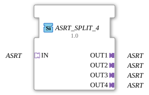

# ASRT_SPLIT_4

* * * * * * * * * *

## Einleitung

Der Funktionsblock **ASRT_SPLIT_4** verteilt einen eingehenden unidirektionalen ASRT-Adapter (Set/Reset/Toggle-Ereignisadapter, keine Nutzdaten) auf 4 identische Ausgangsadapter. Er ist die 4-Ausgangs-Variante von [ASRT_SPLIT_2](ASRT_SPLIT_2.md) und wie dieser als generischer FB implementiert (`GenericClassName: 'GEN_ASRT_SPLIT'`) — dieselbe C++-Basis (`CGenUnidirectSplitBase`), nur mit 4 statt 2 Plugs.

## Schnittstellenstruktur

### **Ereignis-Eingänge**

Keine. Die Ereignisübernahme erfolgt ausschließlich über den Adapter-Socket.

### **Ereignis-Ausgänge**

Keine. Die Ereignisweitergabe erfolgt ausschließlich über die Adapter-Plugs.

### **Daten-Eingänge**

Keine.

### **Daten-Ausgänge**

Keine.

### **Adapter**

| Rolle | Name | Typ | Beschreibung |
| ------- | ------ | ----- | -------------- |
| Socket (Eingang) | `IN` | `adapter::types::unidirectional::ASRT` | Empfängt `SET` bzw. `RESET` bzw. `TOGGLE`, das auf alle 4 Ausgänge verteilt wird. |
| Plug (Ausgang 1) | `OUT1` | `adapter::types::unidirectional::ASRT` | 1. Ausgang für das duplizierte Ereignis. |
| Plug (Ausgang 2) | `OUT2` | `adapter::types::unidirectional::ASRT` | 2. Ausgang für das duplizierte Ereignis. |
| Plug (Ausgang 3) | `OUT3` | `adapter::types::unidirectional::ASRT` | 3. Ausgang für das duplizierte Ereignis. |
| Plug (Ausgang 4) | `OUT4` | `adapter::types::unidirectional::ASRT` | 4. Ausgang für das duplizierte Ereignis. |

## Funktionsweise

Sobald am Adapter-Socket `IN` `SET` bzw. `RESET` bzw. `TOGGLE` eintrifft, wird es **sofort und parallel** als gleichartiges Ereignis an alle 4 Ausgangs-Plugs (`OUT1`, `OUT2`, `OUT3`, `OUT4`) weitergeleitet. Der Baustein führt keinerlei Logik, Filterung oder Verzögerung durch – er fungiert als reiner Splitter auf Adapterebene.

## Technische Besonderheiten

- **Generischer Typ**: Implementiert über die generische Basisklasse `CGenUnidirectSplitBase` (1 Socket, N Plugs); die Anzahl der Ausgangs-Plugs wird über den generischen Suffix (`_4`) zur Übersetzungszeit festgelegt.
- **Keine Zustände / Algorithmen**: Da `ASRT` keinen Datenwert trägt, gibt es keine Änderungserkennung und kein ECC.
- **Beliebige Ausgangsanzahl**: Dieselbe Implementierung deckt ASRT_SPLIT_2 bis ASRT_SPLIT_9 ab; für andere Ausgangsanzahlen siehe `ASRT_SPLIT_2`, `ASRT_SPLIT_3`, `ASRT_SPLIT_5`, `ASRT_SPLIT_6`, `ASRT_SPLIT_7`, `ASRT_SPLIT_8`, `ASRT_SPLIT_9`.

## Zustandsübersicht

Der Baustein besitzt **keinen Zustandsautomaten**. Das Verhalten ist rein kombinatorisch: Jedes eingehende Ereignis am Socket `IN` wird unmittelbar an allen 4 Ausgängen dupliziert.

## Anwendungsszenarien

- **Ereignisverteilung**: Ein Signal soll von 4 unabhängigen Subsystemen verarbeitet werden.
- **Parallelschaltung**: Aufteilung eines ASRT-Signals zur gleichzeitigen Ansteuerung mehrerer Aktoren.

## Vergleich mit ähnlichen Bausteinen

- **[ASRT_MERGE_2](ASRT_MERGE_2.md)**: die Umkehrrichtung für 2 Eingänge (bei ASRT zusätzlich ASRT_MERGE_3 bis ASRT_MERGE_7 verfügbar).
- **`ASRT_SPLIT_2`, `ASRT_SPLIT_3`, `ASRT_SPLIT_5`, `ASRT_SPLIT_6`, `ASRT_SPLIT_7`, `ASRT_SPLIT_8`, `ASRT_SPLIT_9`**: dieselbe generische Implementierung mit anderer Ausgangsanzahl.

## Fazit

`ASRT_SPLIT_4` liefert eine generisch implementierte Verteilung eines `ASRT`-Ereignisses auf 4 Adapterausgänge und ergänzt die `GEN_ASRT_SPLIT`-Familie um die 4-Ausgangs-Variante.
