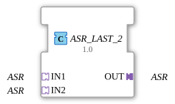

# ASR_LAST_2

## Einleitung

Der ASR_LAST_2 Funktionsblock führt zwei ASR-Adapter-Signale (Set/Reset-Ereignisadapter, ohne Nutzdaten) auf einen gemeinsamen Ausgang (**OUT**) zusammen. Wie bei [`AE_LAST_2`](AE_LAST_2.md) gibt es keinen Datenwert zu arbitrieren - hier werden allerdings zwei unabhängige Ereignispaare zusammengeführt: SET und RESET, jeweils für sich.

## Schnittstellenstruktur

### **Adapter**

**Eingangsadapter (Sockets):**

- **IN1**: ASR-Adapter (unidirectional) - erste Set/Reset-Quelle
- **IN2**: ASR-Adapter (unidirectional) - zweite Set/Reset-Quelle

**Ausgangsadapter (Plug):**

- **OUT**: ASR-Adapter (unidirectional) - zusammengeführtes Set/Reset-Signal

## Funktionsweise

Wie AE_LAST_2 ist ASR_LAST_2 ein Composite-FB ohne ECC: beide SET-Ereignisse werden per Ereignisverbindung auf `OUT.SET` geführt (`IN1.SET → OUT.SET`, `IN2.SET → OUT.SET`), und unabhängig davon beide RESET-Ereignisse auf `OUT.RESET` (`IN1.RESET → OUT.RESET`, `IN2.RESET → OUT.RESET`). SET und RESET werden also getrennt gemergt - ein SET von IN1 schließt ein gleichzeitiges RESET von IN2 nicht aus, beide Ereignisse laufen unabhängig durch.

## Technische Besonderheiten

- Reines Ereignis-Fan-in für zwei unabhängige Ereignispaare (SET, RESET), kein ECC/Algorithmus nötig
- Nutzt dieselbe IEC-61499-Eigenschaft wie AE_LAST_2: mehrere Ereignisquellen auf ein gemeinsames Ziel
- Keine Signalverzögerung: jedes Ereignis wird im selben Zyklus durchgereicht, in dem es eintrifft
- SET- und RESET-Pfad sind vollständig unabhängig voneinander - keine Priorität zwischen ihnen auf Ebene dieses Bausteins

## Anwendungsszenarien

- Zusammenführen zweier gleichwertiger Set/Reset-Quellen (z. B. zwei Bedienstellen, die dieselbe SR-Logik ansteuern dürfen) auf einen gemeinsamen ASR-Adapterpfad
- Vereinfachung von Netzwerken, die sonst vier separate Ereignisverbindungen (2× SET, 2× RESET) zum selben Ziel benötigen würden

## ⚖️ Vergleich mit ähnlichen Bausteinen

ASR_LAST_2 ist die Set/Reset-Variante des reinen Ereignis-Fan-ins, strukturell identisch zu [`AE_LAST_2`](AE_LAST_2.md), nur mit zwei statt einem Ereignispaar. Für die datentragende Grundvariante siehe [`AX_LAST_2`](../BOOL/AX_LAST_2.md).
