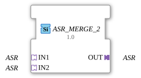

# ASR_MERGE_2

* * * * * * * * * *

## Einleitung

Der Funktionsblock **ASR_MERGE_2** führt zwei unidirektionale ASR-Adapter (Set/Reset-Ereignispaar, keine Nutzdaten) auf einen gemeinsamen Ausgangsadapter zusammen. Er ist die Umkehrung von [ASR_SPLIT_2](ASR_SPLIT_2.md): Statt ein Set/Reset-Signal auf zwei Ausgänge zu verteilen, führt er zwei unabhängige Set/Reset-Quellen auf einen gemeinsamen Ausgang. Der Baustein ist als generischer FB implementiert (`GenericClassName: 'GEN_ASR_MERGE'`).

## Schnittstellenstruktur

### **Ereignis-Eingänge**

Keine. Die Ereignisübernahme erfolgt ausschließlich über die Adapter-Sockets.

### **Ereignis-Ausgänge**

Keine. Die Ereignisweitergabe erfolgt ausschließlich über den Adapter-Plug.

### **Daten-Eingänge**

Keine.

### **Daten-Ausgänge**

Keine.

### **Adapter**

| Rolle | Name | Typ | Beschreibung |
| ------- | ------ | ----- | -------------- |
| Socket (Eingang 1) | `IN1` | `adapter::types::unidirectional::ASR` | Erste SET/RESET-Quelle. |
| Socket (Eingang 2) | `IN2` | `adapter::types::unidirectional::ASR` | Zweite SET/RESET-Quelle. |
| Plug (Ausgang) | `OUT` | `adapter::types::unidirectional::ASR` | Zusammengeführtes SET/RESET-Signal. |

## Funktionsweise

Trifft ein `SET`-Ereignis an `IN1` **oder** `IN2` ein, wird ein `SET` an `OUT` weitergereicht; analog wird ein `RESET` an `IN1`/`IN2` an `OUT` als `RESET` durchgereicht. Beide Ereignistypen werden unabhängig voneinander behandelt – ein `SET` an `IN1` beeinflusst nicht, ob ein `RESET` an `IN2` durchgereicht wird. Da `ASR` keinen Datenwert transportiert, gibt es nichts zu arbitrieren außer dem jeweiligen Ereignistyp selbst.

## Technische Besonderheiten

- **Generischer Typ**: Implementiert über die generische Basisklasse `CGenUnidirectMergeBase` (N Sockets, 1 Plug) – dieselbe C++-Basis, die auch `GEN_AE_MERGE` und `GEN_ASRT_MERGE` zugrunde liegt.
- **Zwei unabhängige Ereigniskanäle**: `SET` und `RESET` werden getrennt geprüft und weitergeleitet; ein Socket kann z. B. nur `SET`-Ereignisse liefern, während der andere nur `RESET` liefert, ohne dass sich beide gegenseitig stören.
- **Keine Zustände / Algorithmen**: Da `ASR` keinen Datenwert trägt, gibt es keine Änderungserkennung und kein ECC.

## Zustandsübersicht

Der Baustein besitzt **keinen Zustandsautomaten**. Das Verhalten ist rein kombinatorisch: Jedes eingehende `SET`- oder `RESET`-Ereignis an `IN1` oder `IN2` wird unmittelbar als gleichartiges Ereignis an `OUT` weitergereicht.

## Anwendungsszenarien

- **Zusammenführen redundanter Set/Reset-Quellen**: Zwei unabhängige Bedienstellen oder Sicherheitspfade sollen denselben ASR-Ausgang setzen bzw. zurücksetzen können.
- **Vereinfachung von Netzwerken**, die sonst zwei separate SET/RESET-Ereignisverbindungspaare zum selben Ziel benötigen würden.

## Vergleich mit ähnlichen Bausteinen

- **[ASR_SPLIT_2](ASR_SPLIT_2.md)**: die Umkehrrichtung – verteilt ein eingehendes Set/Reset-Signal auf zwei Ausgänge, statt zwei Eingänge zusammenzuführen.
- **[AE_MERGE_2](AE_MERGE_2.md)**: dieselbe Zusammenführungslogik für den reinen Ereignisadapter `AE` (1 Ereignis statt SET/RESET).
- **[ASRT_MERGE_2](ASRT_MERGE_2.md)**: dieselbe Zusammenführungslogik für den Set/Reset/Toggle-Ereignisadapter `ASRT` (zusätzlich `TOGGLE`).

## Fazit

Der **ASR_MERGE_2** ist ein minimaler generischer Baustein zur Zusammenführung zweier Set/Reset-Ereignisquellen auf einen gemeinsamen ASR-Adapterausgang und schließt die zuvor als „hypothetisch“ vermerkte Lücke zu [ASR_SPLIT_2](ASR_SPLIT_2.md).
