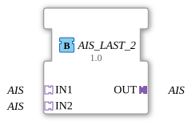

# AIS_LAST_2

## Einleitung

Der AIS_LAST_2 Funktionsblock führt zwei gleichartige STRING-Adapter-Signale (**IN1**, **IN2**) auf einen gemeinsamen Ausgang (**OUT**) zusammen, nach dem Prinzip **Last Writer Wins**: welcher der beiden Sockets zuletzt ein Ereignis geschrieben hat, gewinnt, und sein Datenwert wird sofort und unverändert an OUT durchgereicht. Es handelt sich ausdrücklich nicht um ein naives Zusammenführen (z. B. Mittelwert oder ODER-Verknüpfung), sondern um eine reine Arbitrierung nach zeitlicher Reihenfolge.

## Schnittstellenstruktur

### **Adapter**

**Eingangsadapter (Sockets):**

- **IN1**: STRING-Adapter (unidirectional) - erste Signalquelle
- **IN2**: STRING-Adapter (unidirectional) - zweite Signalquelle

**Ausgangsadapter (Plug):**

- **OUT**: STRING-Adapter (unidirectional) - zusammengeführtes Signal

## Funktionsweise

Der Baustein ist als einfacher Basic-FB mit einer 3-Zustands-ECC umgesetzt (START, PASS1, PASS2). Trifft an IN1 ein Ereignis ein, wechselt die ECC nach PASS1: der aktuelle Datenwert von IN1 wird nach OUT kopiert und das Adapter-Ereignis an OUT gesendet. Trifft an IN2 ein Ereignis ein, geschieht dasselbe symmetrisch über PASS2. Nach jeder Durchreichung kehrt die ECC sofort wieder nach START zurück und ist bereit für das nächste Ereignis von IN1 oder IN2.

## Technische Besonderheiten

- Last-Writer-Wins-Semantik statt naiver Datenverknüpfung
- Einfacher Basic-FB (ECC mit 3 Zuständen), kein zusätzlicher Zwischenspeicher nötig
- Keine Signalverzögerung: der Wert wird im selben Zyklus durchgereicht, in dem das auslösende Ereignis eintrifft
- Beide Eingänge sind gleichberechtigt - es gibt keine feste Priorität außer der zeitlichen Reihenfolge

## Anwendungsszenarien

- Zusammenführen zweier gleichwertiger STRING-Signalquellen zu einem einzigen nachgeschalteten Adapterpfad (z. B. zwei redundante Sensoren, oder ein manueller und ein automatischer Sollwertgeber)
- Arbitrierung zwischen zwei Bedienstellen, die denselben STRING-Wert schreiben dürfen
- Vereinfachung von Netzwerken, die sonst ein `F_SEL`/`E_RS`-Konstrukt inline verdrahten müssten

## ⚖️ Vergleich mit ähnlichen Bausteinen

AIS_LAST_2 ist die Umkehrung von [`AIS_SPLIT_2`](AIS_SPLIT_2.md): AIS_SPLIT_2 verteilt 1 Eingang auf 2 Ausgänge, AIS_LAST_2 führt 2 Eingänge auf 1 Ausgang zusammen. Für Mischbetrieb zwischen einem Daten- und einem reinen Ereignisadapter (z. B. AX + AE) ist stattdessen [`AX_AE_MERGE`](../BOOL/AX_AE_MERGE.md) gedacht, das nur das Ereignis mischt, ohne den Datenwert zu verändern.
