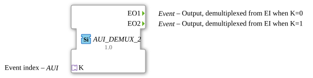

# AUI_DEMUX_2

* * * * * * * * * *

## Einleitung

Der Funktionsbaustein **AUI_DEMUX_2** ist ein Ereignis-Demultiplexer mit zwei Ausgängen. Er verteilt eingehende Ereignisse anhand eines über einen Adapter gelieferten Index auf einen der beiden Ausgänge. Im Gegensatz zu dem klassischen Baustein `E_DEMUX_2` wird die Steuerinformation nicht über einen separaten Dateneingang, sondern über einen **AUI-Adapter** (Socket) bereitgestellt. Dadurch ist eine entkoppelte und flexiblere Anbindung an andere Bausteine möglich.

## Schnittstellenstruktur

### **Ereignis-Eingänge**

Keine vorhanden.

### **Ereignis-Ausgänge**

| Name  | Datentyp | Kommentar                                    |
|-------|----------|----------------------------------------------|
| `EO1` | `Event`  | Ausgang für Index `0`                        |
| `EO2` | `Event`  | Ausgang für Index `1`                        |

### **Daten-Eingänge**

Keine vorhanden.

### **Daten-Ausgänge**

Keine vorhanden.

### **Adapter**

| Name | Richtung | Typ                                    | Kommentar                          |
|------|----------|----------------------------------------|------------------------------------|
| `K`  | Socket   | `adapter::types::unidirectional::AUI`  | Liefert den Index zur Demultiplexierung |

## Funktionsweise

Der Baustein wartet auf ein Ereignis, das über den Adapter `K` eintrifft. Der Adapter übermittelt dabei zusätzlich einen Wert (typischerweise 0 oder 1), der als Demultiplex-Index interpretiert wird.  

- Bei Index `0` wird der Ereignisausgang `EO1` ausgelöst.  
- Bei Index `1` wird der Ereignisausgang `EO2` ausgelöst.  

Die Verarbeitung erfolgt rein ereignisgesteuert; es werden keine Daten zwischengespeichert oder weitergeleitet. Der Baustein verhält sich wie ein 1-zu-2-Demultiplexer, wobei die Steuerung über eine standardisierte Adapterschnittstelle erfolgt.

## Technische Besonderheiten

- **Adapterbasierte Steuerung**: Statt eines separaten Dateneingangs wird der Index über einen AUI-Adapter bereitgestellt. Dies ermöglicht eine lose Kopplung und vereinfacht die Wiederverwendung in unterschiedlichen Kontexten.  
- **Generische Struktur**: Der Baustein ist als generischer Funktionsblock (`GEN_E_DEMUX`) gekennzeichnet und kann je nach Konfiguration auch mit anderen Adaptertypen arbeiten – im vorliegenden Fall ist der Typ `AUI` festgelegt.  
- **Keine Datenübertragung**: Der Baustein überträgt keine Nutzdaten, nur Ereignisse werden weitergegeben.  

## Zustandsübersicht

Der Baustein besitzt **keine internen Zustände**. Er ist ereignisgetrieben und reagiert ausschließlich auf das Eintreffen eines Ereignisses am Adapter. Die Auswahl des Ausgangs erfolgt deterministisch anhand des empfangenen Index.

## Anwendungsszenarien

- **Ereignisverteilung in Automatisierungssystemen**: Wenn eine übergeordnete Steuerung ein Ereignis basierend auf einem Auswahlwert an verschiedene Verarbeitungszweige weiterleiten muss.  
- **Modulare Architekturen**: Wenn die Steuerinformation über einen Adapter aus einer externen Quelle (z. B. einer Datenbank oder einem Kommunikationsmodul) stammt und eine flexible Anbindung gewünscht ist.  
- **Sichere Ereignisweiche**: Einsatz als einfache Weiche, die ein Ereignis nur an einen von zwei möglichen Empfängern sendet.

## Vergleich mit ähnlichen Bausteinen

Der klassische `E_DEMUX_2` besitzt einen separaten Ereigniseingang (`EI`) und einen Dateneingang (`K`). Der vorliegende Baustein `AUI_DEMUX_2` ersetzt diese beiden Eingänge durch einen einzelnen Adapter. Vorteile sind eine reduzierte Anzahl an Verbindungen und eine klarere Schnittstellenabstraktion. Nachteilig könnte die Abhängigkeit von einem spezifischen Adaptertyp sein, falls keine generische Konfiguration vorgenommen wird.

## Fazit

Der `AUI_DEMUX_2` ist ein praktischer Ereignis-Demultiplexer, der sich durch seine adapterbasierte Steuerung besonders für modulare und serviceorientierte Architekturen eignet. Er reduziert die Verdrahtung und erhöht die Flexibilität gegenüber klassischen Demultiplexern, ohne dabei an Funktionalität einzubüßen. Seine einfache, ereignisgesteuerte Struktur macht ihn zu einem vielseitigen Werkzeug in der industriellen Automatisierungstechnik.
