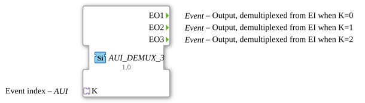

# AUI_DEMUX_3

* * * * * * * * * *
## Einleitung
Der Funktionsblock **AUI_DEMUX_3** ist ein ereignisbasierter Demultiplexer, der über einen AUI-Adapter (Application-to-Unification Interface) einen Index empfängt und das ankommende Ereignis auf einen von drei Ausgängen weiterleitet. Er stellt eine kompakte Variante des klassischen `E_DEMUX_3` dar, bei dem der Ereignis-Eingang und der Index-Eingang in einem einzigen AUI-Adapter zusammengefasst sind. Dadurch vereinfacht sich die Verdrahtung in Systemen, die bereits AUI-Kommunikation verwenden.

## Schnittstellenstruktur

### **Ereignis-Eingänge**
- Keine vorhanden. Das auslösende Ereignis wird über den Adapter `K` übertragen.

### **Ereignis-Ausgänge**
- `EO1` (Typ: Event) – Ausgang, der aktiviert wird, wenn der Index den Wert 0 hat.  
- `EO2` (Typ: Event) – Ausgang, der aktiviert wird, wenn der Index den Wert 1 hat.  
- `EO3` (Typ: Event) – Ausgang, der aktiviert wird, wenn der Index den Wert 2 hat.

### **Daten-Eingänge**
- Keine vorhanden.

### **Daten-Ausgänge**
- Keine vorhanden.

### **Adapter**
- `K` (Socket, Typ: `adapter::types::unidirectional::AUI`) – Ein unidirektionaler AUI-Adapter, der den Index (z.B. als Ganzzahl) liefert und gleichzeitig das Ereignis transportiert, das den Demultiplexer triggert.

## Funktionsweise
Der Funktionsblock wartet auf ein Ereignis, das über den AUI-Adapter `K` ankommt. Zeitgleich wird über denselben Adapter ein Indexwert (0, 1 oder 2) bereitgestellt. Sobald das Ereignis eintrifft, wird es je nach Indexwert an den entsprechenden Ausgang (`EO1`, `EO2` oder `EO3`) weitergeleitet. Ist der Index ungleich 0, 1 oder 2, wird das Ereignis verworfen (der FB reagiert nicht). Die Verarbeitung erfolgt ereignisgesteuert ohne interne Zustandslogik; jeder ankommende Event wird sofort verarbeitet.

## Technische Besonderheiten
- **Adapter-basierte Schnittstelle**: Der FB nutzt einen AUI-Adapter anstelle separater Event- und Daten-Eingänge, was die Anzahl der Verbindungen reduziert und die Integration in adapterorientierte Architekturen erleichtert.  
- **Generische Erweiterbarkeit**: Durch das Attribut `eclipse4diac::core::GenericClassName` mit dem Wert `'GEN_E_DEMUX'` kann der FB generisch für andere Ausgangsanzahlen (z.B. `AUI_DEMUX_N`) angepasst werden.  
- **Kompakte Parametrierung**: Der Adapter übernimmt sowohl die Ereignis- als auch die Datenübertragung, wodurch eine klare Trennung von Steuerfluss und Datenfluss entfällt.  
- **Keine internen Zustände**: Der FB ist vollständig ereignisgetrieben und benötigt keine Zustandsverwaltung.

## Zustandsübersicht
Es existiert kein expliziter interner Zustand. Der FB verhält sich wie ein reiner Multiplexer: Bei jedem eingehenden Ereignis wird der aktuelle Index ausgewertet und das Ereignis direkt an einen Ausgang weitergegeben. Damit ist der FB deterministisch und benötigt keine Initialisierung oder Reset.

## Anwendungsszenarien
- **Routing von Ereignissen**: In Automatisierungssystemen, wenn ein einzelnes Ereignis (z.B. eine Messung oder ein Alarm) je nach Kontext verschiedene nachgelagerte Verarbeitungspfade auslösen soll.  
- **Adapterorientierte Systeme**: Überall dort, wo bereits eine AUI-basierte Kommunikation verwendet wird und Ereignisse mit einem Index (z.B. einer Priorität oder einer Betriebsart) verbunden sind.  
- **Vereinfachung von Verschaltungen**: Reduziert die Anzahl der Verbindungen gegenüber klassischen Demultiplexern und verbessert die Lesbarkeit großer Steuerungslogiken.

## Vergleich mit ähnlichen Bausteinen
- **E_DEMUX_3** (klassisch): Verfügt über getrennte Eingänge für das Ereignis (`EI`) und den Index (`K`). Erfordert zwei separate Verdrahtungen, ist aber in Standardumgebungen weiter verbreitet.  
- **AUI_DEMUX_3** (dieser FB): Bündelt beide Funktionen in einem AUI-Adapter. Dies reduziert die Anzahl der Ports und macht die Verbindung kompakter, erfordert jedoch eine passende AUI-Infrastruktur.  
- **Weitere Demultiplexer**: Z.B. `E_DEMUX` mit variabler Ausgangsanzahl. Die AUI-Variante bietet den Vorteil einer einheitlichen Schnittstellenbeschreibung und erleichtert die Wiederverwendung von Adaptertypen.

## Fazit
Der Funktionsblock `AUI_DEMUX_3` ist eine praktische und moderne Alternative zum klassischen `E_DEMUX_3`, die durch die Verwendung eines AUI-Adapters eine kompakte und klar strukturierte Schnittstelle bietet. Er eignet sich besonders für Systeme, die bereits mit AUI-Adaptern arbeiten und eine flexible Ereignisweiterleitung benötigen. Die generische Auslegung ermöglicht eine einfache Erweiterung auf andere Ausgangsanzahlen, wodurch der Baustein in einer Vielzahl von Steuerungs- und Automatisierungsanwendungen eingesetzt werden kann.