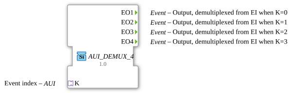

# AUI_DEMUX_4

* * * * * * * * * *

## Einleitung

Der Funktionsbaustein **AUI_DEMUX_4** ist ein Ereignis-Demultiplexer mit vier Ausgängen. Er empfängt ein Ereignis über einen AUI-Adapter (Application Interconnection Unit) und leitet es – abhängig von einem über denselben Adapter übermittelten Index – an einen der vier Ereignis-Ausgänge weiter. Im Gegensatz zum klassischen `E_DEMUX`, bei dem Ereignis (`EI`) und Index (`K`) als getrennte Schnittstellen vorliegen, werden hier beide Informationen über einen unidirektionalen Adapter gebündelt. Dadurch vereinfacht sich die Verdrahtung in komplexen Systemen und die Schnittstelle wird kompakter.

Der Baustein ist als generischer Funktionsbaustein (`GEN_E_DEMUX`) implementiert und kann bei Bedarf auf andere Kanalzahlen erweitert werden.

## Schnittstellenstruktur

### **Ereignis-Eingänge**

Der Baustein besitzt **keine** konventionellen Ereignis-Eingänge. Ereignisse werden ausschließlich über den Adapter `K` empfangen, der das Ereignis und den Demultiplex-Index in einem einzigen logischen Kanal bündelt.

### **Ereignis-Ausgänge**

| Name | Typ   | Kommentar                                    |
|------|-------|----------------------------------------------|
| EO1  | Event | Ausgang, demultiplext von K, wenn Index = 0 |
| EO2  | Event | Ausgang, demultiplext von K, wenn Index = 1 |
| EO3  | Event | Ausgang, demultiplext von K, wenn Index = 2 |
| EO4  | Event | Ausgang, demultiplext von K, wenn Index = 3 |

### **Daten-Eingänge**

Es sind keine separaten Daten-Eingänge vorhanden. Der Index wird über den Adapter transportiert.

### **Daten-Ausgänge**

Es sind keine Daten-Ausgänge vorhanden.

### **Adapter**

| Name | Typ                                  | Kommentar                     |
|------|--------------------------------------|-------------------------------|
| K    | `adapter::types::unidirectional::AUI` | Ereignis-Index (Demultiplex)  |

Der Adapter ist ein **Socket** und erwartet einen unidirektionalen Datenfluss von einem Plug, der sowohl das Ereignis als auch den Indexwert bereitstellt.

## Funktionsweise

Der Baustein operiert rein ereignisgesteuert. Sobald über den Adapter `K` ein Ereignis eintrifft, wird der im Adapter enthaltene Indexwert ausgewertet. Abhängig von diesem Index wird das Ereignis an genau einen der vier Ausgänge (`EO1`, `EO2`, `EO3` oder `EO4`) weitergeleitet. Der Index kann Werte von 0 bis 3 annehmen, wobei gilt:

- Index 0 → Ereignis an `EO1`
- Index 1 → Ereignis an `EO2`
- Index 2 → Ereignis an `EO3`
- Index 3 → Ereignis an `EO4`

Die Weiterleitung erfolgt synchron zum eintreffenden Ereignis; es findet keine Zwischenspeicherung oder Warteschlangenbildung statt. Der Baustein ist damit ein klassischer 1-zu-4-Demultiplexer auf Ereignisebene.

## Technische Besonderheiten

- **Adapterbasierte Schnittstelle**: Die Verwendung des AUI-Adapters kapselt Ereignis und Index in einem einzigen Kanal. Dies reduziert die Anzahl der Verdrahtungsverbindungen und erhöht die Modularität.
- **Generische Implementierung**: Der Baustein ist als Instanz des generischen Bausteins `GEN_E_DEMUX` definiert. Dadurch kann er – je nach Konfiguration – auch für andere Kanalzahlen (z. B. 2, 8, 16) eingesetzt werden, ohne die interne Logik neu implementieren zu müssen.
- **Unidirektionaler Adapter**: Der Adapter `K` ist als Socket vom Typ `adapter::types::unidirectional::AUI` ausgeführt. Er erwartet ausschließlich eingehende Daten und stellt keine Rückkanal zur Verfügung.
- **Keine Datenpfade**: Der Baustein verarbeitet ausschließlich Ereignisse und Indizes; es werden keine Nutzdaten (z. B. Werte) durchgereicht.

## Zustandsübersicht

Der Baustein besitzt keinen persistenten internen Zustand. Er verhält sich rein kombinatorisch (ereignisgesteuert) und reagiert unmittelbar auf jedes eintreffende Ereignis am Adapter. Es gibt keine Initialisierungs- oder Wartezustände. Die Funktionsweise lässt sich als ereignisbasierte Verzweigung beschreiben, die ohne Speicherung von Zuständen arbeitet.

## Anwendungsszenarien

- **Verteilen von Ereignissen in Steuerungen**: In einer Automatisierungsumgebung können Ereignisse (z. B. Startsignale, Messimpulse) je nach einem Indexwert an verschiedene Aktoren oder Teilnehmer weitergeleitet werden.
- **Modulare Aufrufsteuerung**: In SPS-Programmen kann der Baustein verwendet werden, um verschiedene Funktionsbausteine selektiv zu aktivieren, ohne mehrere parallele Verbindungen aufzubauen.
- **Datenfluss-Management**: In Kommunikationsprotokollen kann ein Ereignis mit einem Adress- oder Kanalindex versehen werden und so an die entsprechende Verarbeitungseinheit geroutet werden.
- **Basis für erweiterte Demultiplexer**: Durch Anpassung der Kanalzahl (generische Variante) lässt sich der Baustein für Systeme mit mehr oder weniger Ausgängen skalieren.

## Vergleich mit ähnlichen Bausteinen

| Baustein                | Beschreibung                                                                 |
|-------------------------|------------------------------------------------------------------------------|
| `E_DEMUX`               | Klassischer Demultiplexer mit separatem Ereignis-Eingang `EI` und Index-Eingang `K` (Daten). Kein Adapter. |
| `AUI_DEMUX_4`          | Adapterbasierte Variante, wie hier beschrieben.                              |
| `GEN_E_DEMUX`           | Generischer Basisbaustein, der je nach Parameter unterschiedliche Kanalzahlen (2, 4, 8, …) unterstützt. `AUI_DEMUX_4` ist eine instanziierte Ausprägung. |
| `E_MUX` (Ereignis-Multiplexer) | Führt mehrere Ereignisse zu einem Ausgang zusammen – Gegenrichtung zum Demultiplexer. |

Der wesentliche Unterschied zu `E_DEMUX` ist die Kapselung von Ereignis und Index über den AUI-Adapter. Dadurch entfällt die separate Datenleitung für den Index und die Schnittstelle wird abgeschlossen und typsicher. Im Vergleich zum generischen Baustein bietet `AUI_DEMUX_4` eine feste Kanalzahl von 4, wodurch die Schnittstelle im Projekt klar dokumentiert ist.

## Fazit

Der `AUI_DEMUX_4` ist ein kompakter, ereignisbasierter Demultiplexer, der durch die Verwendung eines AUI-Adapters die Schnittstelle moderner und modularer gestaltet als klassische Demultiplexer-Bausteine. Er eignet sich hervorragend für verteilte Automatisierungssysteme, in denen eine saubere Trennung von Ereignis- und Indexübertragung gefordert ist. Durch seine generische Basis lässt er sich außerdem leicht auf andere Kanalzahlen erweitern, was die Wiederverwendbarkeit erhöht. Die Implementierung ist bewusst schlank gehalten und verzichtet auf unnötige Datenpfade, wodurch sie sich ideal für ereignisgesteuerte Steuerungsanwendungen eignet.
