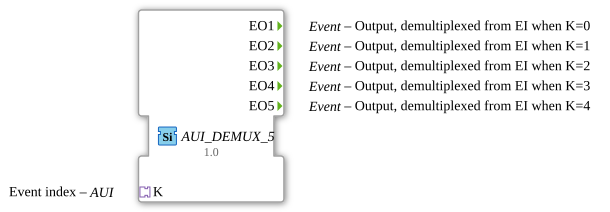

# AUI_DEMUX_5

* * * * * * * * * *

## Einleitung

Der Funktionsblock **AUI_DEMUX_5** ist ein ereignisbasierter Demultiplexer mit fünf Ausgängen. Er empfängt ein Ereignis sowie einen Auswahlindex über einen AUI-Adapter (unidirektional) und leitet das Ereignis an genau einen der fünf Ereignis-Ausgänge weiter, abhängig vom Wert des Index. Der Baustein stellt eine Adapter-basierte Variante des klassischen **E_DEMUX_5** dar und ist generisch implementiert (Generic-Class **GEN_E_DEMUX**). Dadurch kann er flexibel in verschiedenen Kontexten eingesetzt werden, in denen eine Demultiplexierung von Ereignissen über eine standardisierte Adapterschnittstelle erforderlich ist.

## Schnittstellenstruktur

### **Ereignis-Eingänge**

Der Baustein besitzt keine expliziten Ereignis-Eingänge. Das eingehende Ereignis wird ausschließlich über den AUI-Adapter (Socket **K**) transportiert, der sowohl das Ereignis als auch den Auswahlindex (als Dateninhalt des Adapters) übermittelt.

### **Ereignis-Ausgänge**

| Ausgang | Datentyp | Kommentar |
|---------|----------|-----------|
| **EO1** | Event    | Demultiplextes Ereignis, wenn `K = 0` |
| **EO2** | Event    | Demultiplextes Ereignis, wenn `K = 1` |
| **EO3** | Event    | Demultiplextes Ereignis, wenn `K = 2` |
| **EO4** | Event    | Demultiplextes Ereignis, wenn `K = 3` |
| **EO5** | Event    | Demultiplextes Ereignis, wenn `K = 4` |

### **Daten-Eingänge**

Keine.

### **Daten-Ausgänge**

Keine.

### **Adapter**

| Typ | Richtung | Name | Kommentar |
|-----|----------|------|-----------|
| `adapter::types::unidirectional::AUI` | Socket | **K** | Ereignisindex (0–4) zur Auswahl des Ausgangs |

Der Adapter **K** ist unidirektional und liefert sowohl das auslösende Ereignis als auch den numerischen Index (`0` bis `4`) für die Demultiplexierung.

## Funktionsweise

Der **AUI_DEMUX_5** arbeitet nach dem Prinzip eines Ereignis-Demultiplexers:

1. Über den AUI-Adapter **K** wird ein Ereignis empfangen. Der Adapter übermittelt zusätzlich einen Wert (Index) im Bereich 0–4.
2. Der Baustein wertet den empfangenen Index aus.
3. Abhängig vom Index wird das eingehende Ereignis an genau einen der fünf Ausgänge weitergeleitet:
   - `K = 0` → Ereignis an `EO1`
   - `K = 1` → Ereignis an `EO2`
   - `K = 2` → Ereignis an `EO3`
   - `K = 3` → Ereignis an `EO4`
   - `K = 4` → Ereignis an `EO5`

Alle anderen Ausgänge bleiben währenddessen inaktiv. Das Ereignis wird nicht verzögert oder verändert weitergegeben; es handelt sich um eine reine Weiterleitung an den selektierten Ausgang.

## Technische Besonderheiten

- **Adapter-basiert:** Statt herkömmlicher Einzel-Eingänge (Ereignis + Dateneingang für Index) verwendet der Baustein einen AUI-Adapter (unidirektional), was die Integration in moderne, adapterorientierte Systeme erleichtert.
- **Generische Implementierung:** Der Baustein ist als generische Klasse (GenericClassName `GEN_E_DEMUX`) im System hinterlegt. Dadurch kann er in verschiedenen Kontexten mit unterschiedlichen Adaptertypen wiederverwendet werden, ohne dass der Quellcode angepasst werden muss.
- **Keine Datenpfade:** Der Baustein verarbeitet ausschließlich Ereignisse; es werden keine Daten weitergeleitet oder transformiert.
- **Unidirektionaler Adapter:** Der Socket ist als unidirektionaler AUI definiert, d.h. er sendet nur Informationen in den Baustein hinein (Ereignis + Index), nicht nach außen.

## Zustandsübersicht

Der Baustein besitzt keinen persistenten internen Zustand. Er ist rein funktional: Bei jedem eingehenden Ereignis am Adapter wird unmittelbar der entsprechende Ausgang aktiviert. Sobald das Ereignis verarbeitet ist, kehrt der Baustein in einen passiven Ruhezustand zurück, bis das nächste Ereignis eintrifft. Eine explizite Zustandsmaschine ist daher nicht erforderlich.

## Anwendungsszenarien

- **Ereignisweiche in Steuerungssystemen:** Verteilung eines zentralen Ereignisses an verschiedene Verarbeitungseinheiten abhängig von einem Prioritäts- oder Modusindikator.
- **Multiplex-Kommunikation:** Einsatz in Systemen, in denen über einen gemeinsamen Adapterkanal Ereignisse mit einer Kennung gesendet werden, die eine gezielte Weiterleitung an verschiedene Funktionsblöcke ermöglicht.
- **Modulare Architekturen:** Nutzung als Schnittstellenbaustein in prozessnahen oder automatisierten Anlagen, wo eine standardisierte Adapterverbindung die Verdrahtung zwischen Komponenten vereinfacht.

## Vergleich mit ähnlichen Bausteinen

| Baustein | Unterschied |
|----------|-------------|
| **E_DEMUX_5** | Klassischer Demultiplexer mit separatem Ereignis-Eingang `EI` und Dateneingang `K` (INT). Verwendet keine Adapter. |
| **GEN_E_DEMUX** | Generische Basis, die je nach Konfiguration unterschiedliche Schnittstellen (auch Adapter) aufweisen kann. `AUI_DEMUX_5` ist eine konkrete Instanziierung mit AUI. |
| **AUI_DEMUX_8** (analog) | Variante mit acht Ausgängen; Skalierung des Indexbereichs. |

Gegenüber dem klassischen **E_DEMUX_5** bietet die Adaptervariante eine einheitliche, gekapselte Schnittstelle, die in Adapter-basierten Architekturen einfacher zu integrieren ist. Dafür entfällt die Möglichkeit, das Ereignis und den Index getrennt über verschiedene Eingänge zu speisen.

## Fazit

Der **AUI_DEMUX_5** ist ein kompakter, adapterbasierter Ereignis-Demultiplexer für fünf Ausgänge. Er eignet sich besonders für moderne Systeme, die eine standardisierte unidirektionale Adapterkommunikation verwenden. Durch seine generische Implementierung und die klare Funktionsweise ist er flexibel einsetzbar und bildet eine zuverlässige Grundlage für Ereignisverteilung in verteilten Automatisierungsumgebungen.