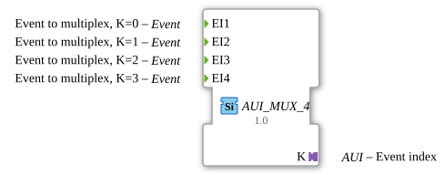

# AUI_MUX_4

* * * * * * * * * *
## Einleitung

Der Baustein `AUI_MUX_4` ist ein Ereignis-Multiplexer, der aus vier Ereignis-Eingängen ein einzelnes Ereignis auswählt und über einen AUI-Adapter als Ausgang weiterleitet. Im Gegensatz zum klassischen `E_MUX_4`, der separate Ereignis-Ausgänge und einen Dateneingang für den Index verwendet, fasst `AUI_MUX_4` das ausgewählte Ereignis und den zugehörigen Index in einem einzigen AUI-Adapterkanal zusammen. Dadurch wird die Schnittstellenanzahl reduziert und eine kompakte, generische Ereignisverteilung ermöglicht.

## Schnittstellenstruktur

### **Ereignis-Eingänge**

| Name | Typ   | Kommentar                         |
|------|-------|-----------------------------------|
| EI1  | Event | Ereignis zum Multiplexen, K = 0   |
| EI2  | Event | Ereignis zum Multiplexen, K = 1   |
| EI3  | Event | Ereignis zum Multiplexen, K = 2   |
| EI4  | Event | Ereignis zum Multiplexen, K = 3   |

### **Ereignis-Ausgänge**

Keine vorhanden.

### **Daten-Eingänge**

Keine vorhanden.

### **Daten-Ausgänge**

Keine vorhanden.

### **Adapter**

| Name | Typ                                | Kommentar     |
|------|------------------------------------|---------------|
| K    | `adapter::types::unidirectional::AUI` | Ereignisindex |

Der Adapter `K` ist als Plug (Server) ausgelegt und dient als Ausgang für das multiplexierte Ereignis. Über den Adapter wird sowohl das Ereignis als auch der zugehörige Index (0–3) übertragen.

## Funktionsweise

Der Baustein `AUI_MUX_4` verhält sich wie ein Ereignis-Multiplexer: Wird an einem der vier Ereignis-Eingänge `EI1` bis `EI4` ein Ereignis empfangen, so wird dieses Ereignis über den Adapter `K` ausgegeben. Der eindeutige Index des Eingangs (0 für `EI1`, 1 für `EI2`, 2 für `EI3`, 3 für `EI4`) wird dabei als Teil der AUI-Kommunikation mitgesendet. Dies ermöglicht dem Empfänger, die Herkunft des Ereignisses zu identifizieren, ohne separate Leitungen für jeden Kanal zu benötigen.

Der Baustein ist als generischer Funktionsbaustein definiert (GenericClassName `'GEN_E_MUX'`), was eine flexible Wiederverwendung in verschiedenen Kontexten erlaubt. Die eigentliche Auswahl- und Übertragungslogik wird durch die generische Implementierung bereitgestellt, während die konkrete Ereignisanzahl und der AUI-Typ über die Schnittstelle festgelegt sind.

## Technische Besonderheiten

- **Verwendung eines AUI-Adapters**: Statt getrennter Ereignis-Ausgänge und eines Dateneingangs wird der Index über den AUI-Adapter `K` transportiert. Dadurch wird die Schnittstellenanzahl auf ein Minimum reduziert und die Datenintegrität durch die Adapterkapselung erhöht.
- **Unidirektionaler Adapter**: Der Typ `unidirectional` bedeutet, dass der Adapter nur in eine Richtung Daten sendet (hier als Ausgang). Dies vereinfacht die Verwendung und verhindert unbeabsichtigte Rückkopplungen.
- **Generische Instanziierung**: Durch das Attribut `GenericClassName` kann der Baustein als generische Vorlage für ähnliche Multiplexer-Konfigurationen dienen, z. B. für andere Kanalanzahlen.
- **Keine Ereignis-Ausgänge**: Die Weiterleitung erfolgt ausschließlich über den Adapter, was die korrekte Handhabung des Ereignisses und des Index in einem Paket sicherstellt.

## Zustandsübersicht

Da `AUI_MUX_4` als ereignisgesteuerter Baustein ohne explizite Zustandsmaschine (ECC) implementiert ist, erfolgt die Verarbeitung direkt bei Auftreten eines Ereignisses an einem der Eingänge. Es gibt keine internen Zustände; jeder Eingabeereignis führt zu einer unmittelbaren Ausgabe über den Adapter. Die Logik ist rein reaktiv und ereignisbasiert.

## Anwendungsszenarien

- **Ereignisbündelung**: Mehrere Ereignisquellen (z. B. Sensoren oder Steuersignale) können über separate Eingänge angebunden werden. Das ausgewählte Ereignis wird mitsamt seines Index über einen einzigen AUI-Kanal an eine übergeordnete Steuerung oder ein Kommunikationsmodul übertragen.
- **Schnittstellenreduzierung**: In Systemen mit begrenzten I/O-Ressourcen ersetzt `AUI_MUX_4` mehrere separate Ereignisausgänge durch einen einzigen Adapter, wodurch Verdrahtung und Konfiguration vereinfacht werden.
- **Indexbasierte Ereignisweitergabe**: Wenn nachfolgende Bausteine den Ursprung eines Ereignisses benötigen, liefert `AUI_MUX_4` diesen Index direkt über den Adapter, ohne zusätzliche Datenleitungen.

## Vergleich mit ähnlichen Bausteinen

Der Standard-Funktionsbaustein `E_MUX_4` besitzt vier Ereignis-Eingänge, vier Ereignis-Ausgänge und einen Dateneingang `K` zur Auswahl des aktiven Kanals. Im Gegensatz dazu verwendet `AUI_MUX_4` einen einzelnen AUI-Adapter als Ausgang, der das ausgewählte Ereignis und den Index zusammen transportiert. Dies reduziert die Anzahl der Ausgänge erheblich und bietet eine kompaktere, integrierte Lösung. Der Preis dafür ist eine spezifische Adapterabhängigkeit und eine weniger intuitive Schnittstellenstruktur, da kein separater Index-Dateneingang vorhanden ist – der Index wird implizit über die AUI-Kommunikation übermittelt. Bausteine wie `GEN_E_MUX` (generische Version) können ähnliche Funktionalitäten ohne AUI-Adapter realisieren, jedoch mit höherer Ausgangsanzahl.

## Fazit

`AUI_MUX_4` ist ein spezialisierter Ereignis-Multiplexer, der die Vorteile der Adaptertechnik nutzt, um eine kompakte und effiziente Ereignisweitergabe mit Indexinformation zu realisieren. Durch den Verzicht auf separate Ausgänge wird die Schnittstelle vereinfacht und die Integration in komplexe Automatisierungssysteme erleichtert. Die generische Definition ermöglicht zudem eine flexible Anpassung an unterschiedliche Anforderungen. Für Anwendungen, bei denen eine direkte Auswahl über einen Dateneingang bevorzugt wird, ist der klassische `E_MUX_4` weiterhin eine geeignete Alternative. Insgesamt stellt `AUI_MUX_4` jedoch eine moderne und platzsparende Lösung für ereignisbasierte Multiplexaufgaben dar.