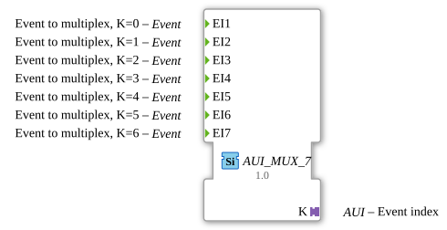

# AUI_MUX_7

* * * * * * * * * *

## Einleitung

Der AUI_MUX_7 ist ein Ereignis-Multiplexer, der sieben Ereignis-Eingänge besitzt und das jeweils empfangene Ereignis über einen AUI-Adapter weitergibt. Anstatt des klassischen Ausgangs bestehend aus einem Ereignis-Ausgang (EO) und einem Datenausgang für den Index (K), bündelt der Adapter beide Informationen in einer standardisierten Schnittstelle. Dadurch wird die Verkabelung vereinfacht und eine einheitliche Kommunikationsstruktur ermöglicht.

## Schnittstellenstruktur

### **Ereignis-Eingänge**

- `EI1` – Ereignis, dem der Index 0 zugeordnet ist
- `EI2` – Ereignis, dem der Index 1 zugeordnet ist
- `EI3` – Ereignis, dem der Index 2 zugeordnet ist
- `EI4` – Ereignis, dem der Index 3 zugeordnet ist
- `EI5` – Ereignis, dem der Index 4 zugeordnet ist
- `EI6` – Ereignis, dem der Index 5 zugeordnet ist
- `EI7` – Ereignis, dem der Index 6 zugeordnet ist

### **Ereignis-Ausgänge**

- Keine vorhanden. Die Ereignisausgabe erfolgt ausschließlich über den Adapter.

### **Daten-Eingänge**

- Keine vorhanden.

### **Daten-Ausgänge**

- Keine vorhanden.

### **Adapter**

- **Plug `K`** vom Typ `adapter::types::unidirectional::AUI` – Dieser Adapter dient als Ausgangsschnittstelle. Er überträgt das empfangene Ereignis sowie den zugehörigen Index (1 bis 7) gebündelt an einen passenden Gegenspieler.

## Funktionsweise

Der AUI_MUX_7 arbeitet als selektiver Weiterleiter. Sobald an einem der Ereignis-Eingänge (`EI1` … `EI7`) ein Ereignis auftritt, wird dieses über den AUI-Adapter `K` ausgegeben. Parallel dazu liefert der Adapter den Index des auslösenden Eingangs, sodass der Empfänger eindeutig erkennen kann, welche Quelle das Ereignis erzeugt hat. Es wird angenommen, dass nur ein Ereignis zu einem Zeitpunkt aktiv ist; bei gleichzeitigem Auftreten erfolgt die Auswahl gemäß der internen Logik des generischen Bausteins (im Normalfall priorisiert nach der niedrigsten Eingangsnummer).

## Technische Besonderheiten

- Der Baustein ist als generischer Funktionsbaustein angelegt, erkennbar an den Attributen `eclipse4diac::core::GenericClassName` mit Wert `'GEN_E_MUX'` und `eclipse4diac::core::TypeHash` mit leerem Wert.
- Die Verwendung eines AUI-Adapters anstatt separater EO-/K-Ausgänge reduziert die Anzahl benötigter Verbindungen und vereinheitlicht die Schnittstelle.
- Die Anzahl der Eingänge ist fest auf sieben konfiguriert, kann aber durch Anpassung der Generik auf andere Werte erweitert oder reduziert werden.

## Zustandsübersicht

Der AUI_MUX_7 besitzt keine expliziten internen Zustände. Er ist rein reaktiv und leitet jedes ankommende Ereignis unmittelbar an den Adapter weiter. Es findet keine Speicherung oder Verzögerung statt.

## Anwendungsszenarien

- In Automatisierungssystemen, in denen mehrere Ereignisquellen (z. B. Sensoren) auf einen gemeinsamen Verarbeitungsbaustein geführt werden sollen, wobei der Index die Quellenidentifikation liefert.
- Bei modularen Steuerungen, die über genormte AUI-Schnittstellen kommunizieren und dadurch eine einfache Austauschbarkeit der Komponenten ermöglichen.
- Überall dort, wo eine saubere Trennung zwischen Ereignisübertragung und zusätzlicher Information (Index) gewünscht ist, ohne separate Leitungen zu verdrahten.

## Vergleich mit ähnlichen Bausteinen

- **Vergleich mit dem klassischen `E_MUX`**: Der AUI_MUX_7 ersetzt die separate Ereignis- und Datenausgabe durch einen einzelnen AUI-Adapter. Das reduziert die Verdrahtung und bietet eine kompaktere Schnittstelle.
- **Gegenüber einem Event-Fan-Out** (z. B. E_SPLIT): Der Multiplexer wählt nur einen Eingang aus und gibt nicht alle Ereignisse unverändert weiter, sondern ergänzt die Indexinformation.

## Fazit

Der AUI_MUX_7 ist ein praktischer Ereignis-Multiplexer, der durch die Verwendung eines AUI-Adapters eine moderne und standardisierte Verbindungstechnik unterstützt. Er vereinfacht die Verdrahtung, verbessert die Modularität von Steuerungssystemen und bietet eine klare Zuordnung eingehender Ereignisse über den Index. Dank seiner generischen Struktur lässt er sich leicht an unterschiedliche Anforderungen anpassen.
