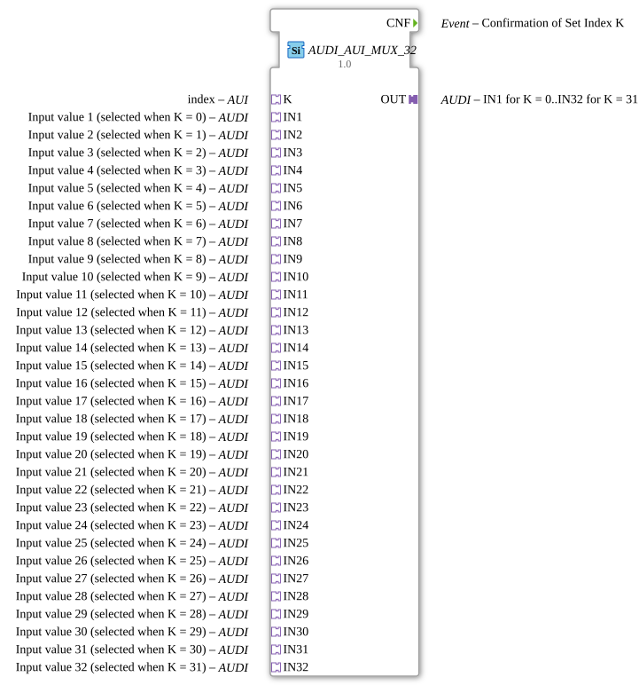

# AUDI_AUI_MUX_32

* * * * * * * * * *

## Einleitung

Der Funktionsblock `AUDI_AUI_MUX_32` ist ein generischer Multiplexer, der es ermöglicht, aus 32 unidirektionalen Eingangssignalen (`IN1` bis `IN32`) genau eines auszuwählen und auf einen unidirektionalen Ausgang (`OUT`) zu übertragen. Die Auswahl wird über einen separaten Indexadapter `K` gesteuert, der den Wert des gewünschten Kanals (0 bis 31) liefert. Ein besonderes Merkmal ist, dass das ausgegebene Signal nur dann aktualisiert wird, wenn sich der Wert des ausgewählten Eingangs tatsächlich ändert. Das Ereignis `CNF` bestätigt eine solche Aktualisierung. Der Baustein ist als generischer Typ (`GEN_AUDI_AUI_MUX`) implementiert und kann dadurch mit unterschiedlichen Datentypen verwendet werden, solange die verwendeten Adapter vom entsprechenden Typ sind.

## Schnittstellenstruktur

### **Ereignis-Eingänge**

Der Funktionsblock besitzt **keine** Ereignis-Eingänge.

### **Ereignis-Ausgänge**

| Name | Kommentar |
|------|-----------|
| `CNF` | Bestätigung der Übernahme eines neuen Indexwerts oder eines geänderten Eingangswerts (nur bei tatsächlicher Änderung). |

### **Daten-Eingänge**

Der Funktionsblock besitzt **keine** direkten Dateneingänge. Die Datenübertragung erfolgt ausschließlich über Adapter.

### **Daten-Ausgänge**

Der Funktionsblock besitzt **keine** direkten Datenausgänge. Die Datenausgabe erfolgt über den Adapter `OUT`.

### **Adapter**

Der Funktionsblock verwendet ausschließlich Adapter für seine Ein- und Ausgaben. Alle Adapter sind **unidirektional** und stammen aus den Typen `AUDI` bzw. `AUI`.

| Name | Richtung | Typ | Kommentar |
|------|----------|-----|-----------|
| `OUT` | Plug | `adapter::types::unidirectional::AUDI` | Ausgang: liefert den ausgewählten Eingangswert. |
| `K` | Socket | `adapter::types::unidirectional::AUI` | Index (0 bis 31), der den aktiven Eingang bestimmt. |
| `IN1` | Socket | `adapter::types::unidirectional::AUDI` | Eingang 1, aktiv bei K = 0. |
| `IN2` | Socket | `adapter::types::unidirectional::AUDI` | Eingang 2, aktiv bei K = 1. |
| `IN3` | Socket | `adapter::types::unidirectional::AUDI` | Eingang 3, aktiv bei K = 2. |
| `IN4` | Socket | `adapter::types::unidirectional::AUDI` | Eingang 4, aktiv bei K = 3. |
| `IN5` | Socket | `adapter::types::unidirectional::AUDI` | Eingang 5, aktiv bei K = 4. |
| `IN6` | Socket | `adapter::types::unidirectional::AUDI` | Eingang 6, aktiv bei K = 5. |
| `IN7` | Socket | `adapter::types::unidirectional::AUDI` | Eingang 7, aktiv bei K = 6. |
| `IN8` | Socket | `adapter::types::unidirectional::AUDI` | Eingang 8, aktiv bei K = 7. |
| `IN9` | Socket | `adapter::types::unidirectional::AUDI` | Eingang 9, aktiv bei K = 8. |
| `IN10` | Socket | `adapter::types::unidirectional::AUDI` | Eingang 10, aktiv bei K = 9. |
| `IN11` | Socket | `adapter::types::unidirectional::AUDI` | Eingang 11, aktiv bei K = 10. |
| `IN12` | Socket | `adapter::types::unidirectional::AUDI` | Eingang 12, aktiv bei K = 11. |
| `IN13` | Socket | `adapter::types::unidirectional::AUDI` | Eingang 13, aktiv bei K = 12. |
| `IN14` | Socket | `adapter::types::unidirectional::AUDI` | Eingang 14, aktiv bei K = 13. |
| `IN15` | Socket | `adapter::types::unidirectional::AUDI` | Eingang 15, aktiv bei K = 14. |
| `IN16` | Socket | `adapter::types::unidirectional::AUDI` | Eingang 16, aktiv bei K = 15. |
| `IN17` | Socket | `adapter::types::unidirectional::AUDI` | Eingang 17, aktiv bei K = 16. |
| `IN18` | Socket | `adapter::types::unidirectional::AUDI` | Eingang 18, aktiv bei K = 17. |
| `IN19` | Socket | `adapter::types::unidirectional::AUDI` | Eingang 19, aktiv bei K = 18. |
| `IN20` | Socket | `adapter::types::unidirectional::AUDI` | Eingang 20, aktiv bei K = 19. |
| `IN21` | Socket | `adapter::types::unidirectional::AUDI` | Eingang 21, aktiv bei K = 20. |
| `IN22` | Socket | `adapter::types::unidirectional::AUDI` | Eingang 22, aktiv bei K = 21. |
| `IN23` | Socket | `adapter::types::unidirectional::AUDI` | Eingang 23, aktiv bei K = 22. |
| `IN24` | Socket | `adapter::types::unidirectional::AUDI` | Eingang 24, aktiv bei K = 23. |
| `IN25` | Socket | `adapter::types::unidirectional::AUDI` | Eingang 25, aktiv bei K = 24. |
| `IN26` | Socket | `adapter::types::unidirectional::AUDI` | Eingang 26, aktiv bei K = 25. |
| `IN27` | Socket | `adapter::types::unidirectional::AUDI` | Eingang 27, aktiv bei K = 26. |
| `IN28` | Socket | `adapter::types::unidirectional::AUDI` | Eingang 28, aktiv bei K = 27. |
| `IN29` | Socket | `adapter::types::unidirectional::AUDI` | Eingang 29, aktiv bei K = 28. |
| `IN30` | Socket | `adapter::types::unidirectional::AUDI` | Eingang 30, aktiv bei K = 29. |
| `IN31` | Socket | `adapter::types::unidirectional::AUDI` | Eingang 31, aktiv bei K = 30. |
| `IN32` | Socket | `adapter::types::unidirectional::AUDI` | Eingang 32, aktiv bei K = 31. |

## Funktionsweise

Der `AUDI_AUI_MUX_32` arbeitet als klassischer Multiplexer mit 32 Kanälen. Der über den Adapter `K` anliegende Wert bestimmt, welcher der 32 Eingänge (`IN1` bis `IN32`) auf den Ausgang `OUT` durchgeschaltet wird. Der Index `K` wird als ganzzahliger Wert erwartet, wobei gültige Werte von 0 bis 31 reichen (bei Werten außerhalb dieses Bereichs wird das Verhalten nicht definiert und das ausgewählte Signal bleibt unverändert).

Die Besonderheit dieses Bausteins liegt in der auslösenden Bedingung für die Ausgangsaktualisierung: Der Ausgang `OUT` wird nur dann mit einem neuen Wert belegt, wenn sich der Wert des aktuell ausgewählten Eingangs gegenüber dem zuletzt übertragenen Wert geändert hat. Eine Änderung des Index `K` allein löst noch keine Aktualisierung aus, es sei denn, der neu ausgewählte Eingang hat einen anderen Wert als der zuvor aktive. Sobald eine solche Änderung erkannt wird, wird der Ausgang aktualisiert und das Ereignis `CNF` (Confirmation) ausgelöst. Dies reduziert unnötigen Datenverkehr und Ereignisfrequenzen im nachgeschalteten System.

Die Kommunikation über die Adapter ist unidirektional: Die Eingangsadapter (`IN*`) liefern Daten an den Baustein, der Indexadapter `K` liefert den Steuerwert, und der Ausgangsadapter `OUT` überträgt das ausgewählte Signal an die aufnehmende Einheit. Intern basiert der Baustein auf dem generischen Typ `GEN_AUDI_AUI_MUX`, sodass er mit unterschiedlichen Datentypen wie z. B. `INT`, `REAL`, `BOOL` oder auch strukturierten Typen arbeiten kann, sofern die jeweils verwendeten Adapter vom Typ `AUDI` und `AUI` passend instanziiert sind.

## Technische Besonderheiten

- **Generischer Aufbau:** Der FB ist als generischer Baustein implementiert (Attribut `GenericClassName` = `'GEN_AUDI_AUI_MUX'`), wodurch er für verschiedene Datentypen verwendet werden kann. Die konkrete Datentypbindung erfolgt über die Typisierung der verwendeten Adapter.
- **Ereignisgesteuerte Aktualisierung:** Das Ereignis `CNF` wird nur dann ausgelöst, wenn sich der Wert des ausgewählten Eingangs tatsächlich ändert. Bei gleichbleibenden Werten wird kein Ereignis erzeugt, was die Systemlast minimiert.
- **Unidirektionale Adapter:** Alle Adapter sind als unidirektional deklariert. Dadurch wird eine klare Datenflussrichtung ohne Rückwärtskommunikation gewährleistet.
- **32 Kanäle:** Der Baustein unterstützt 32 Eingänge und einen einzigen Ausgang – ideal für Anwendungen, bei denen viele Signale auf einen gemeinsamen Bus ausgewählt werden müssen.

## Zustandsübersicht

Der Baustein besitzt **keinen** expliziten endlichen Zustandsautomaten im klassischen Sinn. Intern kann man sich eine Speicherung des letzten aktiven Index und des letzten ausgegebenen Werts vorstellen. Es gibt keine Zustände wie „IDLE“ oder „BUSY“, sondern lediglich die datenflussbasierte Verarbeitung. Der Baustein ist permanent aktiv und reagiert auf Änderungen an den Eingängen bzw. am Index.

## Anwendungsszenarien

- **Sensorauswahl:** In einer Maschine mit vielen analogen oder digitalen Sensoren (z. B. Temperaturen, Drücke, Positionen) kann über den Indexadapter `K` jeweils der gewünschte Sensorwert auf einen einzigen Ausgang gelegt und an ein zentrales Steuerungssystem weitergeleitet werden.
- **Datenpriorisierung:** In Kommunikationsprotokollen kann der Multiplexer dazu verwendet werden, je nach Betriebsmodus den relevanten Datenkanal auszuwählen.
- **Test- und Überwachungsanwendungen:** Zur Überprüfung einzelner Signalpfade können nacheinander verschiedene Eingänge durchgeschaltet werden, ohne dass mehrere parallele Ausgänge benötigt werden.
- **Konfigurierbare Verschaltung:** In Automatisierungssystemen, bei denen die Zuordnung von Eingangssignalen zu einem Ausgang zur Laufzeit geändert werden muss, bietet dieser FB eine flexible Lösung.

## Vergleich mit ähnlichen Bausteinen

Im Vergleich zu einem Standard-Multiplexer, der bei *jeder* Änderung an einem Eingang oder am Index ein Ereignis auslöst, zeichnet sich dieser Baustein durch seine **änderungsbasierte** Ausgangsaktualisierung aus. Dadurch wird verhindert, dass unnötige Ereignisse gesendet werden, wenn sich das ausgewählte Signal nicht ändert. Ein weiterer Unterschied ist die Verwendung von **unidirektionalen Adaptern** anstelle von direkten Datenein-/-ausgängen, was die Wiederverwendbarkeit und Flexibilität erhöht. Typische mehrstufig aufgebaute Multiplexer mit mehreren Bausteinen (z. B. Baumstruktur) würden bei gleicher Kanalzahl mehr Bausteine und Verdrahtung benötigen; `AUDI_AUI_MUX_32` integriert hingegen die komplette 32-zu-1-Auswahl in einem einzigen FB.

## Fazit

Der `AUDI_AUI_MUX_32` ist ein leistungsfähiger, generischer Multiplexer für 32 unidirektionale Signale. Seine Stärke liegt in der effizienten, ereignisgesteuerten Auswahl von Eingängen auf einen gemeinsamen Ausgang, wobei nur tatsächliche Wertänderungen kommuniziert werden. Die Verwendung von Adaptern erlaubt eine flexible Anpassung an unterschiedliche Datentypen und sorgt für eine saubere Schnittstellenstruktur. Der Baustein eignet sich insbesondere für Automatisierungslösungen, in denen eine dynamische Kanalwahl bei minimierter Ereignislast gefordert ist.
