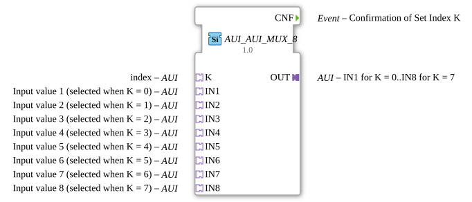

# AUI_AUI_MUX_8

* * * * * * * * * *

## Einleitung

Der Funktionsblock **AUI_AUI_MUX_8** ist ein generischer Multiplexer auf Basis von AUI-Adaptern. Er wählt aus acht Eingangsadaptern (IN1 bis IN8) denjenigen aus, dessen Index über den Adapter **K** bestimmt wird, und stellt den Wert über den Ausgangsadapter **OUT** bereit. Dabei wird der Ausgangswert nur bei tatsächlicher Änderung aktualisiert; ein Ereignis am Ausgang **CNF** signalisiert eine erfolgreiche Übernahme des neuen Index oder eines neuen Wertes.

## Schnittstellenstruktur

### **Ereignis-Eingänge**

Keine.

### **Ereignis-Ausgänge**

- **CNF** (Event) – Bestätigung, dass der über **K** gesetzte Index akzeptiert wurde und der Ausgang den entsprechenden Wert übernommen hat.

### **Daten-Eingänge**

Keine (die Eingabewerte werden ausschließlich über Adapter bereitgestellt).

### **Daten-Ausgänge**

Keine (der Ausgabewert wird ausschließlich über einen Adapter bereitgestellt).

### **Adapter**

| Typ        | Name | Richtung | Kommentar                                                                 |
|------------|------|----------|---------------------------------------------------------------------------|
| Plug       | OUT  | Ausgang  | Ausgewählter AUI-Wert (0..7 je nach Index K)                              |
| Socket     | K    | Eingang  | Index zur Auswahl des Eingangs (Wert 0..7)                                |
| Socket     | IN1  | Eingang  | Eingabewert 1, wird bei K = 0 ausgewählt                                  |
| Socket     | IN2  | Eingang  | Eingabewert 2, wird bei K = 1 ausgewählt                                  |
| Socket     | IN3  | Eingang  | Eingabewert 3, wird bei K = 2 ausgewählt                                  |
| Socket     | IN4  | Eingang  | Eingabewert 4, wird bei K = 3 ausgewählt                                  |
| Socket     | IN5  | Eingang  | Eingabewert 5, wird bei K = 4 ausgewählt                                  |
| Socket     | IN6  | Eingang  | Eingabewert 6, wird bei K = 5 ausgewählt                                  |
| Socket     | IN7  | Eingang  | Eingabewert 7, wird bei K = 6 ausgewählt                                  |
| Socket     | IN8  | Eingang  | Eingabewert 8, wird bei K = 7 ausgewählt                                  |

Alle Adapter sind vom Typ `adapter::types::unidirectional::AUI` und arbeiten unidirektional.

## Funktionsweise

Der Funktionsblock überwacht den Indexadapter **K** sowie alle acht Eingangsadapter **IN1** bis **IN8**. Sobald sich der Wert von **K** ändert, wird der entsprechende Eingang ausgewählt. Der Wert dieses Eingangs wird direkt auf den Ausgangsadapter **OUT** übertragen.  
Eine Aktualisierung des Ausgangs erfolgt jedoch nur dann, wenn sich der Wert des ausgewählten Eingangs gegenüber dem zuletzt ausgegebenen Wert tatsächlich geändert hat. In diesem Fall wird am Ereignisausgang **CNF** ein Ereignis erzeugt, das den erfolgreichen Transfer bestätigt. Dadurch werden unnötige Ausgangsaktivierungen vermieden und nachgeschaltete Bausteine werden nur bei echten Wertänderungen benachrichtigt.

## Technische Besonderheiten

- **Generischer Funktionsblock** – Der Baustein ist als generischer Typ mit dem Klassennamen `GEN_AUI_AUI_MUX` definiert und kann für verschiedene Anwendungen instanziiert werden.
- **Reine Adapter-basierte Kommunikation** – Es gibt keine direkten Daten- oder eventbasierten Ein-/Ausgänge; die gesamte Datenübertragung erfolgt über AUI-Adapter.
- **Änderungsdetektion** – Der Ausgang wird nur bei einer tatsächlichen Wertänderung des ausgewählten Eingangs aktualisiert; das CNF-Ereignis wird entsprechend nur dann ausgelöst.
- **Unidirektionale Adapter** – Alle AUI-Adapter sind unidirektional, d.h. die Daten fließen nur in eine Richtung (Sockets liefern Werte, Plugs geben Werte aus).

## Zustandsübersicht

Der Funktionsblock besitzt keinen expliziten Zustandsautomaten, sondern verwendet intern einen Speicher für den zuletzt auf **OUT** ausgegebenen Wert. Dieser Speicher dient als Referenz zur Erkennung von Wertänderungen. Der Zustand kann wie folgt beschrieben werden:

- **Bereit** oder **Wartend** – wartet auf eine Änderung von **K** oder eines Eingangswerts.
- **Aktualisierung** – wenn sich der ausgewählte Eingangswert ändert, wird der neue Wert auf **OUT** übernommen und **CNF** ausgelöst.
Dieser einfache Zustandsübergang ist implizit und erfordert keine spezielle Konfiguration.

## Anwendungsszenarien

- **Signalumschaltung in der Automatisierungstechnik** – Auswahl eines von acht analogen oder digitalen Messwerten (z.B. Temperatur, Druck, Füllstand) für die weitere Verarbeitung.
- **Flexibles Routing** – Dynamische Umleitung von Datensignalen in Produktionsanlagen oder Prozesssteuerungen, ohne fest verdrahtete Verschaltung.
- **Redundanz- und Qualitätsüberwachung** – Durch die Ereignisausgabe nur bei Änderungen können überwachte Werte effizient an Leitsysteme oder Visualisierungen weitergegeben werden.

## Vergleich mit ähnlichen Bausteinen

Im Vergleich zu klassischen Multiplexern (z.B. in IEC 61499 mit einfachen Datenports) bietet **AUI_AUI_MUX_8** folgende Vorteile:

- **Adapter-basierte Schnittstellen** – Einheitliche, wiederverwendbare Kommunikationsstruktur über AUI-Typen.
- **Änderungsbasierte Ausgabe** – Reduziert die Anzahl der Ereignisse im System und senkt die Last in nachfolgenden Funktionsblöcken.
- **Generische Implementierung** – Kann über Klassennamen angepasst und für verschiedene Adaptertypen wiederverwendet werden.
Nachteile gegenüber einfachen Multiplexern sind die Abhängigkeit von passenden AUI-Adaptertypen und die etwas komplexere Einbindung in ein Netzwerk.

## Fazit

Der **AUI_AUI_MUX_8** ist ein vielseitiger Multiplexer für AUI-basierte Systeme, der eine kompakte und effiziente Auswahl eines von acht Eingangswerten ermöglicht. Dank seiner ereignisgesteuerten Änderungserkennung eignet er sich besonders für Anwendungen, bei denen eine minimale Kommunikationslast und präzise Wertübertragung gefordert sind. Die reine Adapter-Schnittstelle erleichtert die Integration in moderne IEC-61499-Architekturen und fördert die Wiederverwendbarkeit des Bausteins.
