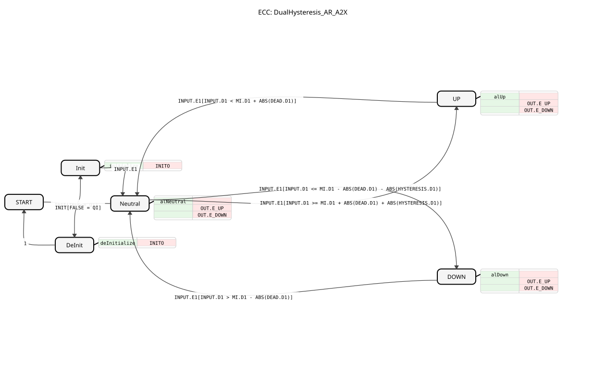

# DualHysteresis_AR_A2X

* * * * * * * * * *

## Einleitung

Der Funktionsblock **DualHysteresis_AR_A2X** realisiert eine zweistufige Analog-Digital-Umwandlung mit Hysterese und Totzone. Er vergleicht einen analogen Eingangswert `INPUT` kontinuierlich mit einem konfigurierbaren Mittelpunkt `MI`, einer Totzone `DEAD` und einer Hysterese `HYSTERESIS`. Basierend auf dem Vergleich werden zwei binäre Ausgangssignale `UP` und `DOWN` erzeugt, die über den unidirektionalen Adapter `OUT` (Typ `A2X`) ausgegeben werden. Diese Signale können beispielsweise zur Ansteuerung von Aktoren oder zur Überwachung von Prozesswerten dienen, wobei die Hysterese ein häufiges Umschalten bei kleinen Schwankungen verhindert.

Der Baustein ist als grundlegender FB (BasicFB) mit einer ereignisgesteuerten Zustandsmaschine (ECC) implementiert und erfüllt die Anforderungen der Norm IEC 61499-2.

## Schnittstellenstruktur

### **Ereignis-Eingänge**

| Ereignis | Typ   | Beschreibung                                  |
|----------|-------|-----------------------------------------------|
| `INIT`   | EInit | Initialisierungsanforderung (Aufruf mit QI).  |

### **Ereignis-Ausgänge**

| Ereignis | Typ   | Beschreibung                                  |
|----------|-------|-----------------------------------------------|
| `INITO`  | EInit | Bestätigung der Initialisierung/Deinitialisierung. |

### **Daten-Eingänge**

| Variable | Typ  | Beschreibung                                  |
|----------|------|-----------------------------------------------|
| `QI`     | BOOL | Eingangsqualifizierer: Aktiviert die normale Funktionsweise (TRUE = aktiv). |

### **Daten-Ausgänge**

| Variable | Typ  | Beschreibung                                  |
|----------|------|-----------------------------------------------|
| `QO`     | BOOL | Ausgangsqualifizierer: Übernimmt den Wert von `QI` bei normaler Operation. |

### **Adapter**

**Sockets (Eingänge):**

| Adapter | Typ | Beschreibung                                                  |
|---------|-----|---------------------------------------------------------------|
| `INPUT` | AR  | Analoger Eingangswert, der überwacht wird.                    |
| `MI`    | AR  | Mittelpunkt (z. B. 0,5 für 50 %).                             |
| `DEAD`  | AR  | Totbreite um `MI` (absoluter Wert). Ausschaltpunkte: MI ± \|DEAD\|. |
| `HYSTERESIS` | AR | Hysterese (absoluter Wert). Einschaltpunkte: MI ± (\|DEAD\| + \|HYSTERESIS\|). |

**Plugs (Ausgänge):**

| Adapter | Typ | Beschreibung                                      |
|---------|-----|---------------------------------------------------|
| `OUT`   | A2X | Unidirektionaler Ausgang mit den Bool-Werten `UP` und `DOWN`. Zusätzlich werden Ereignisse `E_UP` und `E_DOWN` ausgelöst. |

## Funktionsweise

Der Funktionsblock durchläuft nach der Initialisierung einen sicheren Neutralzustand. Je nach analogen Eingangswert `INPUT` und den Parametern `MI`, `DEAD` und `HYSTERESIS` wird in den Zustand `UP` oder `DOWN` gewechselt. Die Schaltbedingungen sind:

- **Einschalten UP** (Zustandsübergang von `Neutral` nach `UP`):  
  `INPUT >= MI + |DEAD| + |HYSTERESIS|`
- **Ausschalten UP** (Übergang von `UP` nach `Neutral`):  
  `INPUT < MI + |DEAD|` (strikt)
- **Einschalten DOWN** (Übergang von `Neutral` nach `DOWN`):  
  `INPUT <= MI - |DEAD| - |HYSTERESIS|`
- **Ausschalten DOWN** (Übergang von `DOWN` nach `Neutral`):  
  `INPUT > MI - |DEAD|` (strikt)

In jedem Zustand wird der Ausgang `QO` auf den Wert von `QI` gesetzt. Liegt `QI` auf `TRUE`, wird der entsprechende Ausgang (`UP` oder `DOWN`) aktiviert; andernfalls werden alle Ausgänge auf `FALSE` gesetzt (sicherer Zustand). Die Ausgabe erfolgt über den Adapter `OUT` mit den zugehörigen Ereignissen `OUT.E_UP` und `OUT.E_DOWN`.

Die Initialisierung erfolgt über das Ereignis `INIT` mit `QI = TRUE`. Dabei werden alle Ausgänge auf `FALSE` gesetzt und der Baustein wechselt in den `Neutral`-Zustand. Eine Deinitialisierung wird durch `INIT` mit `QI = FALSE` ausgelöst.

## Technische Besonderheiten

- **Verwendung von Absolutwerten**: Die Parameter `DEAD` und `HYSTERESIS` werden intern als Absolutwerte interpretiert, sodass auch negative Eingangswerte korrekt verarbeitet werden.
- **Hysterese & Totzone**: Die Kombination aus Totzone und Hysterese verhindert ein schnelles Oszillieren der Ausgänge bei kleinen Änderungen in der Nähe der Schaltpunkte.
- **Sicherheitszustand**: Solange `QI = FALSE` ist, werden alle Ausgänge auf `FALSE` gehalten (`OUT.UP` und `OUT.DOWN`), unabhängig vom Vergleichsergebnis. Dies erhöht die Zuverlässigkeit in sicherheitskritischen Anwendungen.
- **Adapterbasierte Kommunikation**: Die Ein- und Ausgänge sind als unidirektionale Adapter (`AR` und `A2X`) definiert, was eine flexible Verkabelung innerhalb von 4diac-Projekten ermöglicht.
- **Ereignisgesteuerte Zustandsmaschine**: Der FB verwendet ein klassisches ECC-Modell, das deterministisches Verhalten garantiert.

## Zustandsübersicht

| Zustand    | Beschreibung                                                               |
|------------|----------------------------------------------------------------------------|
| `START`    | Initialer Ruhezustand nach dem Einschalten.                                 |
| `Init`     | Führt die Initialisierung aus (setzt Ausgänge auf FALSE) und bestätigt mit `INITO`. |
| `Neutral`  | Normalbetrieb, keine aktiven Ausgänge (`UP`/`DOWN` = FALSE).                |
| `UP`       | Aktiver Zustand: `OUT.UP = TRUE` und `OUT.DOWN = FALSE`.                    |
| `DOWN`     | Aktiver Zustand: `OUT.DOWN = TRUE` und `OUT.UP = FALSE`.                    |
| `DeInit`   | Deinitialisierung, setzt alle Ausgänge auf FALSE und bestätigt mit `INITO`. |

Die Übergänge zwischen den Zuständen sind in der ECC definiert und basieren auf den oben genannten Bedingungen. Nach der Deinitialisierung kehrt der FB in den `START`-Zustand zurück.

## Anwendungsszenarien

- **Prozessüberwachung**: Überwachung eines analogen Sensors (z. B. Temperatur, Druck, Füllstand) und Erzeugung von Schaltsignalen bei Überschreiten/Unterschreiten von Grenzwerten mit Hysterese, um Pumpen oder Ventile anzusteuern.
- **Agrartechnik**: Steuerung von landwirtschaftlichen Maschinen, z. B. Erkennung von Positionen oder Füllständen mit Toleranzbereichen.
- **Gebäudeautomation**: Regelung von Heiz-/Kühlsystemen basierend auf Temperaturschwellwerten.
- **Industrielle Automatisierung**: Signalumwandlung in digitale Stellsignale für andere Funktionsblöcke, wobei die Hysterese ein häufiges Umschalten vermeidet.

## Vergleich mit ähnlichen Bausteinen

Im Vergleich zu einfachen Komparator-Bausteinen (z. B. einem Schwellwertschalter) bietet `DualHysteresis_AR_A2X` eine deutlich höhere Robustheit gegenüber Rauschen und kleinen Wertschwankungen. Während ein einfacher Komparator direkt bei Erreichen eines Grenzwerts umschaltet, sorgt die Hysterese dafür, dass erst ein deutlicher Über- bzw. Unterschreitung erfolgen muss. Zudem bietet dieser FB zwei getrennte Ausgänge (`UP` und `DOWN`), wodurch sowohl Über- als auch Unterschreitungen eines Bereichs erkannt werden können – ähnlich einem Fensterkomparator, jedoch mit einstellbarer Totzone und Hysterese.

## Fazit

Der Funktionsblock `DualHysteresis_AR_A2X` ist ein vielseitiger Baustein für industrielle und agrarische Anwendungen, bei denen ein analoges Signal in digitale Schaltbefehle umgewandelt werden muss. Durch die konfigurierbare Hysterese und Totzone können zuverlässige und stabile Schaltvorgänge realisiert werden. Die klare Struktur und die ereignisgesteuerte Implementierung machen ihn einfach in bestehende 4diac-Projekte integrierbar. Seine Eigenschaften eignen sich besonders für Regelungs- und Überwachungsaufgaben, bei denen ein präzises, aber gleichzeitig robustes Schaltverhalten gefordert ist.
