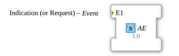

# AE (EVENT)

**Plug (Adapter-Ausgang)**

**Socket (Adapter-Eingang)**

## Interface

### Events

| Name | Comment                 | With |
| :--- | :---------------------- | :--- |
| E1   | Indication (or Request) |      |
