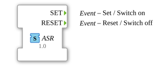

# ASR (EVENT)

**Plug (Adapter-Ausgang)**

**Socket (Adapter-Eingang)**

unidirectional Adapter Interface for 2 Events

## Interface

### Events

| Name  | Comment            | With |
| :---- | :----------------- | :--- |
| SET   | Set / Switch on    |      |
| RESET | Reset / Switch off |      |
