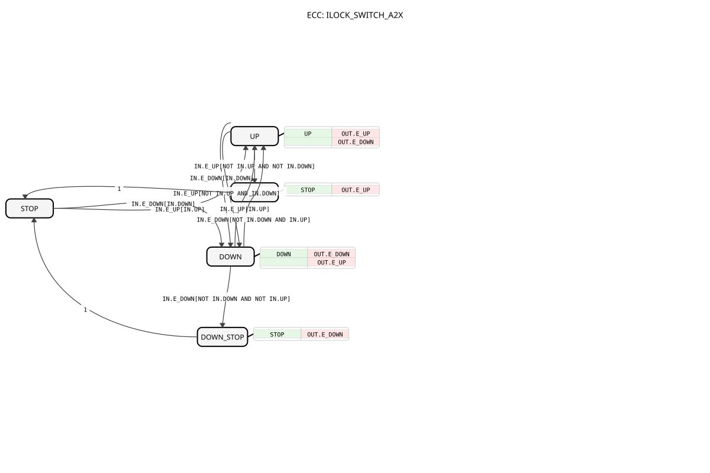

# ILOCK_SWITCH_A2X

* * * * * * * * * *

## Einleitung

Der Funktionsblock `ILOCK_SWITCH_A2X` ist ein Verriegelungsbaustein für zwei Antriebsrichtungen. Er empfängt über einen unidirektionalen `A2X`-Adapter Steuersignale und gibt sie über einen zweiten `A2X`-Adapter ausgegeben. Dabei wird sichergestellt, dass niemals beide Ausgangsrichtungen gleichzeitig aktiv sind. Das zuletzt wirksame Eingangssignal erhält die Priorität und bestimmt die aktive Ausgangsrichtung. Zusätzlich werden definierte Stoppzustände unterstützt.

## Schnittstellenstruktur

Der Baustein besitzt keine klassischen Ereignis- oder Datenein-/ausgänge. Die Kommunikation erfolgt ausschließlich über zwei A2X-Adapter:

- Der Socket `IN` dient als Eingangsschnittstelle.
- Der Plug `OUT` dient als Ausgangsschnittstelle.

### **Ereignis-Eingänge**

Über den Socket `IN` werden folgende Ereignisse empfangen:

- `IN.E_UP` – Ereignis für die Aufwärts-/Vorwärtsrichtung.
- `IN.E_DOWN` – Ereignis für die Abwärts-/Rückwärtsrichtung.

### **Ereignis-Ausgänge**

Über den Plug `OUT` werden folgende Ereignisse gesendet:

- `OUT.E_UP` – Wird ausgegeben, wenn sich der Datenausgang `OUT.UP` ändert.
- `OUT.E_DOWN` – Wird ausgegeben, wenn sich der Datenausgang `OUT.DOWN` ändert.

Da beim Richtungswechsel beide Datenausgänge wechseln, werden in den Zuständen `UP` und `DOWN` jeweils beide Ereignisse gesendet.

### **Daten-Eingänge**

Über den Socket `IN` stehen folgende Datenwerte zur Verfügung:

- `IN.UP` (BOOL) – Zustand des Aufwärts-/Vorwärts-Eingangssignals.
- `IN.DOWN` (BOOL) – Zustand des Abwärts-/Rückwärts-Eingangssignals.

### **Daten-Ausgänge**

Über den Plug `OUT` werden folgende Datenwerte bereitgestellt:

- `OUT.UP` (BOOL) – Aktives Ausgangssignal für die Aufwärts-/Vorwärtsrichtung.
- `OUT.DOWN` (BOOL) – Aktives Ausgangssignal für die Abwärts-/Rückwärtsrichtung.

Es ist immer nur einer der beiden Ausgänge `TRUE`.

### **Adapter**

- `IN` – Socket vom Typ `adapter::types::unidirectional::A2X`; Eingangsadapter für Ansteuersignale.
- `OUT` – Plug vom Typ `adapter::types::unidirectional::A2X`; Ausgangsadapter für die weitergereichten Signale.

Der A2X-Adapter ist unidirektional. Die Informationsrichtung verläuft vom Plug zum Socket. Der Funktionsblock nutzt den Socket `IN` zum Empfangen und den Plug `OUT` zum Senden.

## Funktionsweise

Die Verarbeitung erfolgt über einen ereignisgesteuerten Zustandsautomaten mit fünf Zuständen.

Im Ruhezustand `STOP` wartet der Baustein auf eine aktive Anforderung. Trifft `IN.E_UP` mit `IN.UP = TRUE` ein, wechselt er in den Zustand `UP`. Trifft `IN.E_DOWN` mit `IN.DOWN = TRUE` ein, wechselt er in den Zustand `DOWN`.

Befindet sich der Baustein im Zustand `UP`, wechselt er nach `DOWN`, sobald entweder:

- `IN.E_DOWN` mit `IN.DOWN = TRUE` eintrifft, oder
- `IN.E_UP` mit `IN.UP = FALSE` und `IN.DOWN = TRUE` eintrifft.

Im zweiten Fall wird die Freigabe der Aufwärtsrichtung erkannt, während die Abwärtsrichtung noch aktiv ist. Die Ausgangsrichtung wechselt dann auf `DOWN`. Analog gilt dies für den Wechsel von `DOWN` nach `UP`.

Stoppsignale werden über das Ereignis der zuvor aktiven Richtung übertragen. Bei aktivem `UP` und `IN.E_UP` mit `IN.UP = FALSE` und `IN.DOWN = FALSE` wird der transiente Zustand `UP_STOP` durchlaufen. Dort werden die Ausgänge zurückgesetzt und `OUT.E_UP` gesendet. Anschließend wechselt der Automat sofort in den Ruhezustand `STOP`. Entsprechendes gilt für `DOWN` und `DOWN_STOP` mit dem Ereignis `OUT.E_DOWN`.

## Technische Besonderheiten

- Die komplette Signalübertragung erfolgt ausschließlich über A2X-Adapter.
- Die Interlock-Logik verhindert ein gleichzeitiges Aktivieren beider Ausgangsrichtungen.
- Die „Last-Active-Priorität“ wird durch die Auswertung der Ereignisse zusammen mit den Datenwerten umgesetzt.
- Die transienten Zustände `UP_STOP` und `DOWN_STOP` realisieren eine definierte Stopp-Behandlung mit korrespondierender Ereignisausgabe.
- Der Baustein ist für den Einsatz in Signalverarbeitungsketten vorgesehen und verwendet den Paketnamen `logiBUS::signalprocessing::interlock`.

## Zustandsübersicht

| Zustand | Bedeutung | `OUT.UP` | `OUT.DOWN` | Ereignisausgabe beim Betreten |
|---------|-----------|----------|------------|-------------------------------|
| `STOP` | Ruhezustand | `FALSE` | `FALSE` | – |
| `UP` | Aufwärtsrichtung aktiv | `TRUE` | `FALSE` | `OUT.E_UP`, `OUT.E_DOWN` |
| `DOWN` | Abwärtsrichtung aktiv | `FALSE` | `TRUE` | `OUT.E_DOWN`, `OUT.E_UP` |
| `UP_STOP` | Transienter Stopp von `UP` | `FALSE` | `FALSE` | `OUT.E_UP` |
| `DOWN_STOP` | Transienter Stopp von `DOWN` | `FALSE` | `FALSE` | `OUT.E_DOWN` |

## Anwendungsszenarien

- Ansteuerung von Motoren, Ventilen oder Aktoren, die nur eine Richtung gleichzeitig aktiv haben dürfen.
- Verriegelung zwischen einer Bedieneinheit und einem Antrieb, z. B. bei Hebe- und Senkmechanismen.
- Aufbereitung konkurrierender Steuersignale in Automatisierungs- und Steuerungssystemen.
- Einsatz in A2X-basierten Signalverarbeitungsketten, bei denen eine Richtungsfreigabe mit Priorität benötigt wird.

## Vergleich mit ähnlichen Bausteinen

- Ein einfacher Durchschleif-Baustein würde die Signale unverändert weitergeben, ohne eine Verriegelung oder Priorisierung vorzunehmen.
- Gegenüber rein kombinatorischen Verriegelungslogiken bietet dieser Baustein eine explizite Ereignissteuerung und definierte Stoppzustände.
- Die „Last-Active-Priorität“ unterscheidet ihn von Bausteinen, die feste Vorrangregeln als Schaltpriorität verwenden.

## Fazit

Der `ILOCK_SWITCH_A2X` ist eine geeignete Lösung zur sicheren Weiterleitung von zwei Richtungsbefehlen über eine A2X-Schnittstelle. Er verhindert gleichzeitige Aktivierungen, gewährleistet eine eindeutige Richtungspriorität und stellt über die transienten Zustände eine klare Stopp-Semantik bereit. Damit eignet er sich für vielfältige Steuerungsaufgaben in der Automatisierungstechnik.
