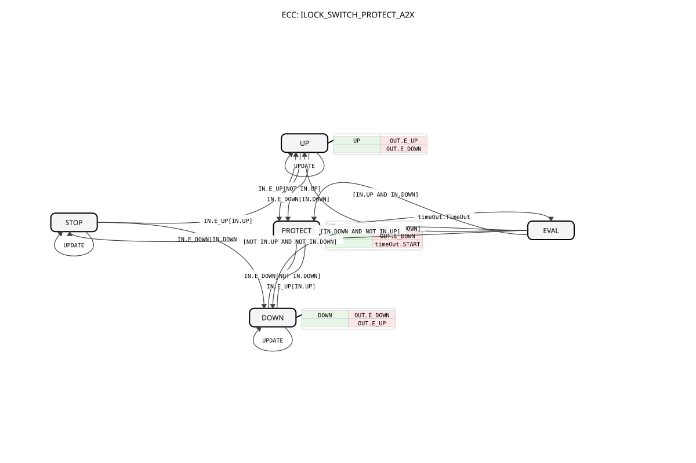

# ILOCK_SWITCH_PROTECT_A2X

* * * * * * * * * *
## Einleitung
Der Funktionsblock `ILOCK_SWITCH_PROTECT_A2X` realisiert eine Interlock-Schutzfunktion für die Ansteuerung einer bidirektionalen Bewegung (z. B. Auf/Ab, Vorwärts/Rückwärts). Er priorisiert den zuletzt aktiven Eingang und schaltet erst nach Ablauf einer konfigurierbaren Schutz-Totzeit um. Dadurch werden mechanische oder elektrische Schäden durch schnelles Richtungswechseln verhindert. Die Besonderheit dieser Variante liegt in der Adapter-basierten Schnittstelle: Sowohl der Eingang als auch der Ausgang verwenden den unidirektionalen A2X-Adapter, der Ereignisse und Daten für beide Richtungen bündelt.

## Schnittstellenstruktur

### **Ereignis-Eingänge**
- **UPDATE** – Über dieses Ereignis werden die Parameter (insbesondere `DT_PROTECT`) aktualisiert.

### **Ereignis-Ausgänge**
- Keine direkten Ereignis-Ausgänge vorhanden. Die Ausgabe erfolgt ausschließlich über den Adapter `OUT`, der die Ereignisse `E_UP` und `E_DOWN` an die verbundene Logik sendet.

### **Daten-Eingänge**
- **DT_PROTECT** (Typ: TIME, Initialwert: `T#50ms`) – Legt die Dauer der Schutz-Totzeit fest, die vor jedem Richtungswechsel abgewartet wird.

### **Daten-Ausgänge**
- Keine direkten Daten-Ausgänge vorhanden. Die Richtungsdaten (`UP` und `DOWN`) werden über den Adapter `OUT` als boolesche Werte bereitgestellt.

### **Adapter**
- **IN** (Typ: `adapter::types::unidirectional::A2X`) – Eingangsadapter für Ereignisse und Daten der Richtungen (UP/DOWN).
- **OUT** (Typ: `adapter::types::unidirectional::A2X`) – Ausgangsadapter, der die aktive Richtung als Ereignis (`E_UP`/`E_DOWN`) und als Datenwert (`UP`/`DOWN`) weitergibt.
- **timeOut** (Typ: `iec61499::events::ATimeOut`) – Adapter zur Steuerung des internen Schutz-Timers. Er wird beim Eintritt in den Schutzzustand gestartet und signalisiert über das Ereignis `TimeOut` das Ende der Totzeit.

## Funktionsweise
Der Funktionsblock arbeitet als endlicher Zustandsautomat (ECC). Die Eingangssignale kommen über den `IN`-Adapter: Ereignisse `E_UP` bzw. `E_DOWN` lösen Richtungsanforderungen aus, und die zugehörigen Daten `UP` bzw. `DOWN` geben den aktuellen Zustand der Eingänge an. 

Im Normalbetrieb (Zustand `STOP`) wartet der FB auf eine Anforderung. Erfolgt eine Anforderung `E_UP` mit aktivem `UP`-Signal, wechselt er in den Zustand `UP`; analog geht eine `DOWN`-Anforderung in den Zustand `DOWN`. In diesen Zuständen werden die Ausgänge entsprechend gesetzt (`OUT.UP := TRUE` bzw. `OUT.DOWN := TRUE`) und die jeweiligen Ereignisse am `OUT`-Adapter ausgelöst.

Sobald während der aktiven Richtung ein Signalwechsel erkannt wird – zum Beispiel ein `E_UP`-Ereignis, obwohl `UP` nicht mehr aktiv ist, oder ein konkurrierendes `E_DOWN`-Ereignis – wechselt der FB in den Zustand `PROTECT`. Dort setzt er alle Ausgänge auf inaktiv (`HALT`) und startet den Schutz-Timer über den `timeOut`-Adapter. Nach Ablauf der Totzeit (`timeOut.TimeOut`) geht er in den Zustand `EVAL`. In `EVAL` wird anhand der aktuellen Eingangsdaten entschieden:
- Ist nur `UP` aktiv → wechselt in `UP`
- Ist nur `DOWN` aktiv → wechselt in `DOWN`
- Sind beide inaktiv → zurück in `STOP`
- Sind beide aktiv (unerlaubter Zustand) → erneut in `PROTECT`, was die Totzeit erneut startet.

Während aller Zustände kann das Ereignis `UPDATE` den Parameter `DT_PROTECT` aktualisieren; der Zustand selbst bleibt erhalten.

## Technische Besonderheiten
- **Adapter-basierte Ein-/Ausgabe:** Alle Signale werden über die A2X-Adapter gebündelt, was die Verdrahtung und Wiederverwendung vereinfacht.
- **Integrierter Schutz-Timer:** Der ATimeOut-Adapter übernimmt die zeitliche Steuerung der Totzeit, ohne dass zusätzliche Timer-Bausteine erforderlich sind.
- **Priorisierung des letzten aktiven Eingangs:** Die Logik wertet nach Ablauf der Totzeit die zuletzt gültigen Eingangsdaten aus und schaltet entsprechend um.
- **Unerlaubter Eingangszustand:** Wenn sowohl `UP` als auch `DOWN` aktiv sind, wird der aktive Zustand nicht übernommen; stattdessen verharrt der FB in der Schutzschleife, bis sich die Eingangssituation klärt.
- **Selbsthaltender Schutz:** Der Zustand `PROTECT` wird erst nach Ablauf der Totzeit verlassen, wodurch kurze Signalglitches sicher ignoriert werden.

## Zustandsübersicht
Die folgende Tabelle fasst die Zustände und ihre Bedeutung zusammen:

| Zustand   | Beschreibung |
|-----------|--------------|
| `STOP`    | Ausgang inaktiv; wartet auf erste Richtungsanforderung. |
| `UP`      | Ausgang aktiviert die Richtung „UP“ (Ereignis `E_UP` und Datenup `UP=TRUE`). |
| `DOWN`    | Ausgang aktiviert die Richtung „DOWN“ (Ereignis `E_DOWN` und Datendown `DOWN=TRUE`). |
| `PROTECT` | Ausgang inaktiv; Schutz-Totzeit wird durch den Timer abgewartet. |
| `EVAL`    | Auswertung der Eingangsdaten nach der Totzeit; führt je nach Bedingung zu `UP`, `DOWN`, `STOP` oder erneutem `PROTECT`. |

Die Transitionen sind im ECC definiert und reagieren auf die Ereignisse `IN.E_UP`, `IN.E_DOWN`, `timeOut.TimeOut` und die Datenbedingungen `IN.UP`, `IN.DOWN` sowie auf das Parameterupdate `UPDATE`.

## Anwendungsszenarien
Typische Einsatzbereiche sind:
- Steuerung von Motoren oder Aktuatoren, die in zwei Richtungen betrieben werden (z. B. Hub-/Senkmechanismen, Förderbänder, Verstellantriebe).
- Maschinen mit Sicherheitsanforderungen, bei denen ein sofortiges Umschalten der Bewegungsrichtung vermieden werden muss (z. B. Schutz gegen Überschwingen oder mechanische Überlastung).
- Automatisierungssysteme, die eine klare Priorisierung der letzten Bedienanforderung benötigen und gleichzeitig eine Schutzzeit einhalten.
- Adapter-Version, wenn die Ein-/Ausgänge bereits über A2X-Busse angebunden sind (z. B. in logiBUS-Umgebungen).

## Vergleich mit ähnlichen Bausteinen
Im Gegensatz zu einfachen Interlock-Bausteinen, die ohne Totzeit arbeiten und eventbasierte Eingänge direkt übernehmen, bietet dieser FB eine explizite Schutzzeit, die unerwünschte Wechsel unterdrückt. Gegenüber einer Variante mit getrennten Ereignis-Daten-Eingängen (ohne Adapter) vereinfacht die A2X-Adapterschnittstelle die Integration in bestehende Busstrukturen und reduziert die Anzahl der Verbindungen. Andere Bausteine könnten die Totzeit extern über einen eigenen Timer realisieren, während dieser FB den Timer integriert hat und dadurch die Verdrahtung weiter minimiert.

## Fazit
`ILOCK_SWITCH_PROTECT_A2X` ist ein spezialisierter Funktionsblock für sichere Richtungssteuerung mit Schutz-Totzeit. Er kombiniert eine klare Zustandslogik mit einer kompakten Adapter-Schnittstelle und integriertem Timer. Durch die Priorisierung des letzten aktiven Eingangs und die eingebaute Schutzschleife eignet er sich besonders für Anwendungen, bei denen ein schneller Richtungswechsel vermieden werden muss. Die Adapter-basierte Architektur sorgt für eine flexible und wiederverwendbare Einbindung in industrielle Automatisierungsumgebungen.