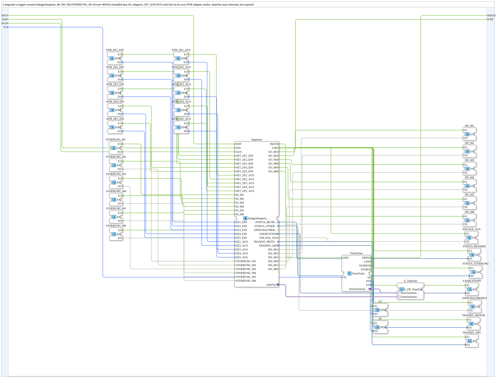

# AnlagenSequenz_06_ADAPTER

* * * * * * * * * *

## Einleitung

`AnlagenSequenz_06_ADAPTER` ist ein Composite-Wrapper um [AnlagenSequenz_06](AnlagenSequenz_06.md): dieselbe Ring-Sequenzer-Logik für sechs Motoren, aber mit allen datentragenden Ein-/Ausgängen auf Adapterverbindungen umgestellt, damit der Baustein in einer Anwendung ausschließlich über Adapter (`AX`, `AS`, `ATM`) verdrahtet werden kann, ohne einzelne Event/BOOL/TIME-Leitungen ziehen zu müssen. Die Zeitsteuerung (`timeOut`) bleibt intern und wird nicht nach außen geführt.

## Verwendete Funktionsbausteine (FBs)

### Sub-Bausteine: AnlagenSequenz_06_ADAPTER

- **Typ**: Composite (FBNetwork)
- **Verwendete interne FBs**:
    - **Sequence**: `logiBUS::utils::sequence::timed::AnlagenSequenz_06` — der eigentliche Ring-Sequenzer, siehe [AnlagenSequenz_06](AnlagenSequenz_06.md) für die vollständige Zustandsübersicht.
    - **TimeTicker**: `adapter::events::TimeOut::TimeTicker` — erzeugt den zyklischen Zeittakt (`TC`, Default `T#200ms`) für die interne Zeitsteuerung.
    - **E_TimeOut**: `adapter::events::TimeOut::E_FB_TimeOut` — koppelt `Sequence.timeOut` an `TimeTicker`, damit die Vor-/Nachlauf-Zeiten ohne eigenen Timer-FB in der Anwendung ablaufen.
- **Funktionsweise**: Bündelt die sechs `DO_Mx`-Laufbefehle und sechs `STOERUNG_Mx`-Störungseingänge sowie alle Statuswerte (`STATUS_BETRIEB`, `STATUS_STOERUNG`, `ZAEHLSTAND`, `EINSCHALTBEREIT`, `TRANSIT_MOTOR`, `TRANSIT_ART`, `ANLAGE_AUS`) in `AX`/`AS`-Adapter, und jede der zehn Verweildauern (`ZE1..5_EIN`/`_AUS`) über einen eigenen `ATM`-Adapter-Socket, statt sie als einzelne `TIME`-Dateneingänge freizulegen. `PT`/`ET` (Process-/Elapsed-Time) werden als `ATM`-Plugs für ein Readback der internen Zeitsteuerung nach außen geführt.

## Programmablauf und Verbindungen

1. `EIN`/`AUS` werden unverändert an `Sequence.EIN`/`Sequence.AUS` durchgereicht.
2. Jeder `ATM_ZEk_EIN`/`ATM_ZEk_AUS`-Adapter liefert seine Zeit (`.D1`) an `Sequence.ZEk_EIN`/`Sequence.ZEk_AUS` und löst gleichzeitig (`.E1`) das entsprechende `Sequence.SET_ZEk_EIN`/`SET_ZEk_AUS`-Setzereignis aus.
3. Jeder `STOERUNG_Mx`-Adapter liefert sein Störungssignal (`.D1`) an `Sequence.STOERUNG_Mx` und löst (`.E1`) `Sequence.EI_Mx` aus.
4. `Sequence.CNF` löst gleichzeitig alle Status-Adapter aus (`STATUS_BETRIEB`, `STATUS_STOERUNG`, `ZAEHLSTAND`, `EINSCHALTBEREIT`, `TRANSIT_MOTOR`, `TRANSIT_ART`, `ANLAGE_AUS`); die zugehörigen Datenwerte laufen parallel über deren `.D1`.
5. Jedes `Sequence.EO_Mx` löst `DO_Mx.E1`, mit dem Laufbefehl über `DO_Mx.D1`.
6. `Sequence.INITO` startet den `TimeTicker`; dessen `CNF`/`STARTO` speisen `ET`/`PT` für ein reines Zeit-Readback nach außen.
7. `Sequence.timeOut` (Adapter-Socket) ist intern mit `E_TimeOut.TimeOutSocket` verbunden, `TimeTicker.TimeTickSocket` mit `E_TimeOut.TimeTickSocket` — die komplette Zeitsteuerung bleibt innerhalb des Composite gekapselt.

## Anwendungsszenarien

- Anwendungen, die konsequent auf Adapterverbindungen setzen (z. B. für VT-Anbindung oder OPC-UA-Exposition über bereits vorhandene Adapter-Konvertierungsketten) und keine einzelnen Event-/Daten-Leitungen zur Motorsequenz ziehen wollen.
- Wiederverwendung derselben Ring-Sequenzer-Logik in mehreren Anlagenteilen, wobei die Verdrahtung über standardisierte Adaptertypen (`AX`, `AS`, `ATM`) einheitlich bleibt.

## ⚖️ Vergleich mit ähnlichen Bausteinen

- **[AnlagenSequenz_06](AnlagenSequenz_06.md)**: Die zugrundeliegende Basic-FB-Logik mit klassischen Event-/Daten-Anschlüssen. `AnlagenSequenz_06_ADAPTER` verändert nur die Schnittstelle, nicht das Zustandsverhalten.
- **[sequence_T_08_ADAPTER](sequence_T_08_ADAPTER.md)**: Gleiches Adapter-Wrapper-Muster, angewendet auf den generischen 8-Schritt-Sequenzer statt auf die feste 6-Motoren-Ringtopologie.

## Fazit

`AnlagenSequenz_06_ADAPTER` macht die komplette Ring-Sequenzer-Logik für sechs Motoren über reine Adapterverbindungen nutzbar, ohne die zugrundeliegende Zustandslogik zu verändern — die Zeitsteuerung bleibt vollständig intern gekapselt.

---

### 🌐 Passende Themen-Unterseiten auf ms-muc-docs.de

- [🌐 Eclipse 4diac IDE & Farb-Referenz auf ms-muc-docs.de](https://www.ms-muc-docs.de/iec-61499/eclipse-4diac/)
