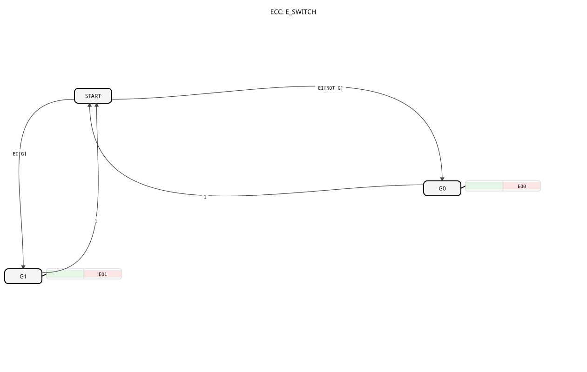

# E_SWITCH

## 🎧 Podcast

- [E_SWITCH: Die Weiche der Automatisierung – Warum Einfachheit IEC 61499 revolutioniert](https://podcasters.spotify.com/pod/show/iec-61499-grundkurs-de/episodes/E_SWITCH-Die-Weiche-der-Automatisierung--Warum-Einfachheit-IEC-61499-revolutioniert-e3681fl)
- [E_SWITCH: The Unsung Hero of Industrial Automation's Modular Design](https://podcasters.spotify.com/pod/show/iec-61499-prime-course-en/episodes/E_SWITCH-The-Unsung-Hero-of-Industrial-Automations-Modular-Design-e367npq)

## Einleitung

Der `E_SWITCH` (Event Switch) ist ein grundlegender Funktionsbaustein nach IEC 61499, der als bedingte Ereignisweiche oder 1-zu-2-Demultiplexer fungiert. Er leitet ein einzelnes Eingangereignis (`EI`) basierend auf dem Zustand einer booleschen Steuervariable (`G`) an einen von zwei Ausgängen weiter.

## Schnittstellenstruktur

### **Ereignis-Eingänge:**

- **EI (Event Input)**: Das Eingangereignis, das weitergeleitet werden soll.
    - **Verbundene Daten**: `G`

### **Ereignis-Ausgänge:**

- **EO0**: Der erste Ereignisausgang.
- **EO1**: Der zweite Ereignisausgang.

### **Daten-Eingänge:**

- **G (Guard)**: Die boolesche Bedingung, die die Weiche steuert (Datentyp: `BOOL`).

## Funktionsweise

1.  **Ereignisempfang**: Der Baustein wartet auf ein Ereignis am Eingang `EI`.
2.  **Prüfung der Bedingung**: Wenn das `EI`-Ereignis eintrifft, wird der Wert der Datenvariable `G` ausgewertet.
3.  **Bedingte Weiterleitung**:
    - **Wenn `G` = `FALSE` ist**: Das Ereignis wird an den Ausgang `EO0` weitergeleitet.
    - **Wenn `G` = `TRUE` ist**: Das Ereignis wird an den Ausgang `EO1` weitergeleitet.

Das Ereignis am Eingang `EI` wird also immer an genau einen der beiden Ausgänge geleitet, abhängig von der Steuerbedingung `G`.

## Technische Besonderheiten

- **Ereignisweiche**: Dient als grundlegendes "Switch" oder "If-Else"-Konstrukt für den Ereignisfluss.
- **Zustandslos**: Der Baustein selbst hat keinen internen Speicher; seine Entscheidung basiert ausschließlich auf dem Wert von `G` im Moment des `EI`-Ereignisses.

## Anwendungsszenarien

- **Bedingte Logik**: Ausführen von alternativen Aktionen basierend auf einer Bedingung. Wenn `G` wahr ist, führe Aktion A (`EO1`) aus, ansonsten führe Aktion B (`EO0`) aus.
- **Modusabhängige Verarbeitung**: Weiterleiten von Befehlen an unterschiedliche Verarbeitungspfade, je nachdem, ob sich das System in einem "Automatik"-Modus (`G=TRUE`) oder "Hand"-Modus (`G=FALSE`) befindet.
- **Fehlerbehandlung**: Weiterleiten eines Sensor-Ereignisses entweder an die normale Verarbeitungslogik (`G=FALSE` für "kein Fehler") oder an eine Fehlerbehandlungsroutine (`G=TRUE` für "Fehler erkannt").

## ⚖️ Vergleich mit ähnlichen Bausteinen

| Feature | E_SWITCH | E_SELECT | E_DEMUX |
| --------------- | ---------- | ---------- | --------- |
| Auswahlkriterium | Boolesch (`G`) | Boolesch (`G`) | Index (`K`) |
| Richtung | 1:2 (Demultiplexer) | 2:1 (Multiplexer) | 1:n (Demultiplexer) |
| Zustandsmodell | BasicFB | BasicFB | BasicFB/Generic |

## 🛠️ Zugehörige Übungen

- [Uebung_004b](https://docs.ms-muc-docs.de/projects/visual-programming-languages-docs/de/latest/Uebungen/test_B/Uebungen_doc/Uebung_004b/)
- [Uebung_004b2](https://docs.ms-muc-docs.de/projects/visual-programming-languages-docs/de/latest/Uebungen/test_B/Uebungen_doc/Uebung_004b2/)
- [Uebung_004b3](https://docs.ms-muc-docs.de/projects/visual-programming-languages-docs/de/latest/Uebungen/test_B/Uebungen_doc/Uebung_004b3/)
- [Uebung_005](https://docs.ms-muc-docs.de/projects/visual-programming-languages-docs/de/latest/Uebungen/test_B/Uebungen_doc/Uebung_005/)
- [Uebung_006a3_sub](https://docs.ms-muc-docs.de/projects/visual-programming-languages-docs/de/latest/Uebungen/test_B/Uebungen_doc/Uebung_006a3_sub/)
- [Uebung_007a3](https://docs.ms-muc-docs.de/projects/visual-programming-languages-docs/de/latest/Uebungen/test_B/Uebungen_doc/Uebung_007a3/)
- [Uebung_008](https://docs.ms-muc-docs.de/projects/visual-programming-languages-docs/de/latest/Uebungen/test_B/Uebungen_doc/Uebung_008/)
- [Uebung_009](https://docs.ms-muc-docs.de/projects/visual-programming-languages-docs/de/latest/Uebungen/test_B/Uebungen_doc/Uebung_009/)
- [Uebung_019c](https://docs.ms-muc-docs.de/projects/visual-programming-languages-docs/de/latest/Uebungen/test_B/Uebungen_doc/Uebung_019c/)
- [Uebung_020a](https://docs.ms-muc-docs.de/projects/visual-programming-languages-docs/de/latest/Uebungen/test_B/Uebungen_doc/Uebung_020a/)
- [Uebung_020b](https://docs.ms-muc-docs.de/projects/visual-programming-languages-docs/de/latest/Uebungen/test_B/Uebungen_doc/Uebung_020b/)
- [Uebung_020c3](https://docs.ms-muc-docs.de/projects/visual-programming-languages-docs/de/latest/Uebungen/test_B/Uebungen_doc/Uebung_020c3/)
- [Uebung_020d](https://docs.ms-muc-docs.de/projects/visual-programming-languages-docs/de/latest/Uebungen/test_B/Uebungen_doc/Uebung_020d/)
- [Uebung_020e2](https://docs.ms-muc-docs.de/projects/visual-programming-languages-docs/de/latest/Uebungen/test_B/Uebungen_doc/Uebung_020e2/)
- [Uebung_020f2](https://docs.ms-muc-docs.de/projects/visual-programming-languages-docs/de/latest/Uebungen/test_B/Uebungen_doc/Uebung_020f2/)
- [Uebung_020i](https://docs.ms-muc-docs.de/projects/visual-programming-languages-docs/de/latest/Uebungen/test_B/Uebungen_doc/Uebung_020i/)
- [Uebung_025](https://docs.ms-muc-docs.de/projects/visual-programming-languages-docs/de/latest/Uebungen/test_B/Uebungen_doc/Uebung_025/)
- [Uebung_026_sub](https://docs.ms-muc-docs.de/projects/visual-programming-languages-docs/de/latest/Uebungen/test_B/Uebungen_doc/Uebung_026_sub/)
- [Uebung_039a_sub_Outputs](https://docs.ms-muc-docs.de/projects/visual-programming-languages-docs/de/latest/Uebungen/test_B/Uebungen_doc/Uebung_039a_sub_Outputs/)
- [Uebung_086](https://docs.ms-muc-docs.de/projects/visual-programming-languages-docs/de/latest/Uebungen/test_B/Uebungen_doc/Uebung_086/)
- [Uebung_088](https://docs.ms-muc-docs.de/projects/visual-programming-languages-docs/de/latest/Uebungen/test_B/Uebungen_doc/Uebung_088/)
- [Uebung_089](https://docs.ms-muc-docs.de/projects/visual-programming-languages-docs/de/latest/Uebungen/test_B/Uebungen_doc/Uebung_089/)

## Fazit

Der `E_SWITCH`-Baustein ist ein fundamentaler und weit verbreiteter Baustein zur Implementierung von bedingten Verzweigungen in der ereignisgesteuerten Logik von IEC 61499. Seine Einfachheit und klare Funktion als "If-Else"-Weiche für Ereignisse machen ihn zu einem unverzichtbaren Werkzeug für die Erstellung von flexibler und robuster Steuerungssoftware.
