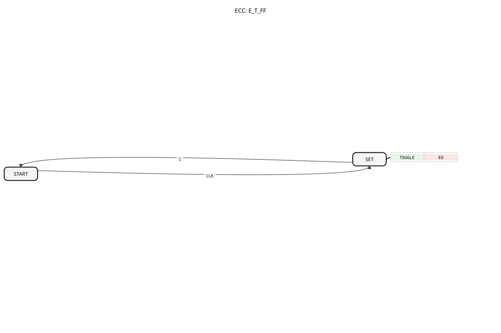

# E_T_FF

## 🎧 Podcast

- [Der E_T_FF in IEC 61499: Modulares Kippen für die Industrie 4.0](https://podcasters.spotify.com/pod/show/iec-61499-grundkurs-de/episodes/Der-E_T_FF-in-IEC-61499-Modulares-Kippen-fr-die-Industrie-4-0-e3674m7)
- [Der E_T_FF_SR-Baustein: Herzstück der IEC 61499 – Speichern, Umschalten, Reagieren](https://podcasters.spotify.com/pod/show/iec-61499-grundkurs-de/episodes/Der-E_T_FF_SR-Baustein-Herzstck-der-IEC-61499--Speichern--Umschalten--Reagieren-e3682dm)
- [Unpacking E_T_FF_SR: The Secret Toggle Switch of Industrial Control Systems](https://podcasters.spotify.com/pod/show/iec-61499-prime-course-en/episodes/Unpacking-E_T_FF_SR-The-Secret-Toggle-Switch-of-Industrial-Control-Systems-e367ntv)

## Einleitung

Der `E_T_FF` (Event-driven Toggle Flip-Flop) ist ein ereignisgesteuerter Kippschalter, der seinen Zustand (`Q`) bei jedem eingehenden Taktereignis (`CLK`) wechselt. Er ist das digitale Äquivalent eines "Stromstoßschalters" (Stromstoßrelais), bei dem ein kurzer Impuls den Zustand dauerhaft ändert.

## Schnittstellenstruktur

### **Ereignis-Eingänge:**

- **CLK (Clock)**: Das Taktereignis, das den Zustand von `Q` umschaltet.

### **Ereignis-Ausgänge:**

- **EO (Event Output)**: Wird ausgelöst, wenn sich der Zustand von `Q` ändert.
    - **Verbundene Daten**: `Q`

### **Daten-Ausgänge:**

- **Q**: Der aktuelle Zustand des Flip-Flops (Datentyp: `BOOL`).

## Funktionsweise

Der `E_T_FF`-Baustein ist ein einfacher Toggle Flip-Flop:

1.  **Zustandswechsel**: Bei jedem eingehenden `CLK`-Ereignis ändert der Ausgang `Q` seinen Zustand: War `Q` `TRUE`, wird es `FALSE`, und war `Q` `FALSE`, wird es `TRUE`.
2.  **Ereignisauslösung**: Jede Zustandsänderung von `Q` löst das `EO`-Ereignis aus.

## Technische Besonderheiten

- **Stromstoßschalter-Analogie**: Der Baustein verhält sich wie ein Stromstoßschalter: Ein kurzer Impuls (`CLK`) schaltet das Licht (`Q`) ein, der nächste Impuls schaltet es aus.
- **Speicherfunktion**: `Q` speichert den letzten Zustand des Flip-Flops.
- **Zustandslos zwischen Takten**: Änderungen am `CLK`-Eingang beeinflussen `Q` nur zum Zeitpunkt des Ereignisses.

## Anwendungsbeispiele

### Taster für eine Lampe

Mit einem `E_T_FF` lässt sich eine Taster-Logik für eine Lampe realisieren:

- **Konzept**: Ein Taster erzeugt ein `CLK`-Ereignis. Jedes Drücken schaltet die Lampe (`Q`) ein oder aus.
- **Grafische Darstellung**:
    - Mapping: 
    - Applikation: 
    - Embedded Ressource: 

### Blinker

Durch Rückkopplung mit einem Zeitgeber lässt sich ein Blinker realisieren:

- **Konzept**: Das `EO`-Ereignis des `E_T_FF` startet einen `E_DELAY`, dessen `EO` wiederum als `CLK` für den `E_T_FF` dient. Dies erzeugt einen periodischen Zustandswechsel.
- **Grafische Darstellung**:
    - Mapping: 
    - Applikation: 
    - Embedded Ressource: 

## 🛠️ Zugehörige Übungen

- [Uebung_004a](https://docs.ms-muc-docs.de/projects/visual-programming-languages-docs/en/latest/Uebungen/test_B/Uebungen_doc/Uebung_004a/)
- [Uebung_004a2](https://docs.ms-muc-docs.de/projects/visual-programming-languages-docs/en/latest/Uebungen/test_B/Uebungen_doc/Uebung_004a2/)
- [Uebung_004a2_2](https://docs.ms-muc-docs.de/projects/visual-programming-languages-docs/en/latest/Uebungen/test_B/Uebungen_doc/Uebung_004a2_2/)
- [Uebung_004a2_3](https://docs.ms-muc-docs.de/projects/visual-programming-languages-docs/en/latest/Uebungen/test_B/Uebungen_doc/Uebung_004a2_3/)
- [Uebung_004a3](https://docs.ms-muc-docs.de/projects/visual-programming-languages-docs/en/latest/Uebungen/test_B/Uebungen_doc/Uebung_004a3/)
- [Uebung_004a4](https://docs.ms-muc-docs.de/projects/visual-programming-languages-docs/en/latest/Uebungen/test_B/Uebungen_doc/Uebung_004a4/)
- [Uebung_004a5](https://docs.ms-muc-docs.de/projects/visual-programming-languages-docs/en/latest/Uebungen/test_B/Uebungen_doc/Uebung_004a5/)
- [Uebung_004a6](https://docs.ms-muc-docs.de/projects/visual-programming-languages-docs/en/latest/Uebungen/test_B/Uebungen_doc/Uebung_004a6/)
- [Uebung_004a8](https://docs.ms-muc-docs.de/projects/visual-programming-languages-docs/en/latest/Uebungen/test_B/Uebungen_doc/Uebung_004a8/)
- [Uebung_004a9](https://docs.ms-muc-docs.de/projects/visual-programming-languages-docs/en/latest/Uebungen/test_B/Uebungen_doc/Uebung_004a9/)
- [Uebung_004c1](https://docs.ms-muc-docs.de/projects/visual-programming-languages-docs/en/latest/Uebungen/test_B/Uebungen_doc/Uebung_004c1/)
- [Uebung_004c2](https://docs.ms-muc-docs.de/projects/visual-programming-languages-docs/en/latest/Uebungen/test_B/Uebungen_doc/Uebung_004c2/)
- [Uebung_004c3](https://docs.ms-muc-docs.de/projects/visual-programming-languages-docs/en/latest/Uebungen/test_B/Uebungen_doc/Uebung_004c3/)
- [Uebung_004c4](https://docs.ms-muc-docs.de/projects/visual-programming-languages-docs/en/latest/Uebungen/test_B/Uebungen_doc/Uebung_004c4/)
- [Uebung_004c5](https://docs.ms-muc-docs.de/projects/visual-programming-languages-docs/en/latest/Uebungen/test_B/Uebungen_doc/Uebung_004c5/)
- [Uebung_004c6](https://docs.ms-muc-docs.de/projects/visual-programming-languages-docs/en/latest/Uebungen/test_B/Uebungen_doc/Uebung_004c6/)
- [Uebung_004c7](https://docs.ms-muc-docs.de/projects/visual-programming-languages-docs/en/latest/Uebungen/test_B/Uebungen_doc/Uebung_004c7/)
- [Uebung_005](https://docs.ms-muc-docs.de/projects/visual-programming-languages-docs/en/latest/Uebungen/test_B/Uebungen_doc/Uebung_005/)
- [Uebung_006a3_sub](https://docs.ms-muc-docs.de/projects/visual-programming-languages-docs/en/latest/Uebungen/test_B/Uebungen_doc/Uebung_006a3_sub/)
- [Uebung_007](https://docs.ms-muc-docs.de/projects/visual-programming-languages-docs/en/latest/Uebungen/test_B/Uebungen_doc/Uebung_007/)
- [Uebung_007a1](https://docs.ms-muc-docs.de/projects/visual-programming-languages-docs/en/latest/Uebungen/test_B/Uebungen_doc/Uebung_007a1/)
- [Uebung_007a2](https://docs.ms-muc-docs.de/projects/visual-programming-languages-docs/en/latest/Uebungen/test_B/Uebungen_doc/Uebung_007a2/)
- [Uebung_010b2](https://docs.ms-muc-docs.de/projects/visual-programming-languages-docs/en/latest/Uebungen/test_B/Uebungen_doc/Uebung_010b2/)
- [Uebung_010b3](https://docs.ms-muc-docs.de/projects/visual-programming-languages-docs/en/latest/Uebungen/test_B/Uebungen_doc/Uebung_010b3/)
- [Uebung_010b6](https://docs.ms-muc-docs.de/projects/visual-programming-languages-docs/en/latest/Uebungen/test_B/Uebungen_doc/Uebung_010b6/)
- [Uebung_010b7](https://docs.ms-muc-docs.de/projects/visual-programming-languages-docs/en/latest/Uebungen/test_B/Uebungen_doc/Uebung_010b7/)
- [Uebung_010b8](https://docs.ms-muc-docs.de/projects/visual-programming-languages-docs/en/latest/Uebungen/test_B/Uebungen_doc/Uebung_010b8/)
- [Uebung_010b9](https://docs.ms-muc-docs.de/projects/visual-programming-languages-docs/en/latest/Uebungen/test_B/Uebungen_doc/Uebung_010b9/)
- [Uebung_010bA](https://docs.ms-muc-docs.de/projects/visual-programming-languages-docs/en/latest/Uebungen/test_B/Uebungen_doc/Uebung_010bA/)
- [Uebung_010bA2](https://docs.ms-muc-docs.de/projects/visual-programming-languages-docs/en/latest/Uebungen/test_B/Uebungen_doc/Uebung_010bA2/)
- [Uebung_010bA3](https://docs.ms-muc-docs.de/projects/visual-programming-languages-docs/en/latest/Uebungen/test_B/Uebungen_doc/Uebung_010bA3/)
- [Uebung_010bA4](https://docs.ms-muc-docs.de/projects/visual-programming-languages-docs/en/latest/Uebungen/test_B/Uebungen_doc/Uebung_010bA4/)
- [Uebung_035a2](https://docs.ms-muc-docs.de/projects/visual-programming-languages-docs/en/latest/Uebungen/test_B/Uebungen_doc/Uebung_035a2/)
- [Uebung_080c](https://docs.ms-muc-docs.de/projects/visual-programming-languages-docs/en/latest/Uebungen/test_B/Uebungen_doc/Uebung_080c/)
- [Uebung_087](https://docs.ms-muc-docs.de/projects/visual-programming-languages-docs/en/latest/Uebungen/test_B/Uebungen_doc/Uebung_087/)
- [Uebung_087a1](https://docs.ms-muc-docs.de/projects/visual-programming-languages-docs/en/latest/Uebungen/test_B/Uebungen_doc/Uebung_087a1/)
- [Uebung_088](https://docs.ms-muc-docs.de/projects/visual-programming-languages-docs/en/latest/Uebungen/test_B/Uebungen_doc/Uebung_088/)
- [Uebung_089](https://docs.ms-muc-docs.de/projects/visual-programming-languages-docs/en/latest/Uebungen/test_B/Uebungen_doc/Uebung_089/)
- [Uebung_091](https://docs.ms-muc-docs.de/projects/visual-programming-languages-docs/en/latest/Uebungen/test_B/Uebungen_doc/Uebung_091/)
- [Uebung_093](https://docs.ms-muc-docs.de/projects/visual-programming-languages-docs/en/latest/Uebungen/test_B/Uebungen_doc/Uebung_093/)
- [Uebung_093b](https://docs.ms-muc-docs.de/projects/visual-programming-languages-docs/en/latest/Uebungen/test_B/Uebungen_doc/Uebung_093b/)
- [Uebung_094](https://docs.ms-muc-docs.de/projects/visual-programming-languages-docs/en/latest/Uebungen/test_B/Uebungen_doc/Uebung_094/)
- [Uebung_094a](https://docs.ms-muc-docs.de/projects/visual-programming-languages-docs/en/latest/Uebungen/test_B/Uebungen_doc/Uebung_094a/)
- [Uebung_095](https://docs.ms-muc-docs.de/projects/visual-programming-languages-docs/en/latest/Uebungen/test_B/Uebungen_doc/Uebung_095/)
- [Uebung_152](https://docs.ms-muc-docs.de/projects/visual-programming-languages-docs/en/latest/Uebungen/test_B/Uebungen_doc/Uebung_152/)
- [Uebung_153](https://docs.ms-muc-docs.de/projects/visual-programming-languages-docs/en/latest/Uebungen/test_B/Uebungen_doc/Uebung_153/)

## Fazit

Der `E_T_FF`-Baustein ist ein einfacher, aber äußerst vielseitiger Speicherbaustein. Seine "Stromstoßschalter"-Funktion ist fundamental für die Implementierung von Taster-Logiken, Blinkern und anderen bistabilen Steuerungen in IEC 61499-Anwendungen.
