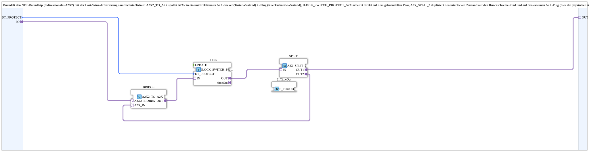

# A2X2_ILOCK_SWITCH_PROTECT

* * * * * * * * * *

## Introduction

The **A2X2_ILOCK_SWITCH_PROTECT** subapplication bundles a bidirectional A2X2 network round-trip with a last-wins arbitration mechanism including a protective dead time. It combines three logical functions in a single composite component: a bidirectional-to-unidirectional adapter bridge, an interlock switch protector operating on the paired adapter channels, and a splitter that duplicates the interlocked state both to the write-back return path and to an external plug for physical output driving.

The subapplication follows a "SUB style" architecture where the bridge, interlock, and splitter reside inside the composite (subapplication), rather than being placed in the device resource. This encapsulation hides the internal complexity and makes the component reusable across different hardware configurations.

## Interface Structure

The subapplication interface consists of one data input, one bidirectional socket adapter, and one unidirectional plug adapter. No explicit event inputs or event outputs are exposed at the composite boundary; all event flow is carried implicitly through the adapter connections.

### **Event Inputs**

None. All event handling is encapsulated within the adapter-based communication flow.

### **Event Outputs**

None. Results propagate through the adapter channels.

### **Data Inputs**

| Name | Type | Initial Value | Comment |
|------|------|---------------|---------|
| `DT_PROTECT` | `TIME` | `T#50ms` | Protective dead time before direction change is permitted. |

`DT_PROTECT` defines the minimum time period that must elapse before a direction reversal is accepted, suppressing rapid toggling and mechanical bounce effects.

### **Data Outputs**

None.

### **Adapters**

| Direction | Name | Type | Comment |
|-----------|------|------|---------|
| Socket | `IO` | `adapter::types::bidirectional::A2X2` | Bundled network round-trip: button state enters, write-back state exits. |
| Plug | `OUT` | `adapter::types::unidirectional::A2X` | Interlocked UP/DOWN state, intended for physical output drivers. |

- **`IO`** is the bidirectional A2X2 socket receiving the raw operator button states (up/down) from the network and sending back the acknowledged/interlocked state.
- **`OUT`** is a unidirectional A2X plug that provides the interlocked UP/DOWN output signals to be connected to actual output hardware (e.g., relays, contactors, motor drivers).

## Functionality

The subapplication implements a complete interlock-protected switching chain for two-directional actuators (e.g., a lift, a slide, a directional valve). The logic flow is as follows:

1. **Bridge stage** – The internally instantiated `A2X2_TO_A2X` function block splits the bidirectional A2X2 socket into two unidirectional A2X channels: one acting as the input (button state reception) and one as the output (write-back transmission).

2. **Interlock stage** – The `ILOCK_SWITCH_PROTECT_A2X` block receives the raw input from the bridge and applies a **last-wins arbitration** algorithm. When a direction change is requested, the protection logic enforces a dead time (`DT_PROTECT`) during which the new direction cannot be activated. This prevents simultaneous activation of both directions and guards against rapid switching.

3. **Time-out stage** – An internal `E_TimeOut` event block is triggered by the interlock's timeout mechanism. It provides the temporal reference signal that controls when the protection window expires and the new direction is accepted.

4. **Split stage** – The `A2X_SPLIT_2` block takes the interlocked output from the interlock stage and duplicates it:
   - The first copy (`OUT1`) is routed to the subapplication's external `OUT` plug for driving physical outputs.
   - The second copy (`OUT2`) is fed back into the bridge's input channel (`A2X_IN`), which propagates the state back through the `IO` socket as the acknowledged write-back signal.

This closed-loop structure ensures that the state acknowledged to the network always matches the state physically commanded at the output, while the interlock prevents hazardous direction conflicts.

## Technical Features

- **Bidirectional round-trip support**: Uses the `A2X2` bidirection adapter, carrying both the incoming operator request and the outgoing acknowledged state on a single combined channel.
- **Last-wins arbitration**: Implements priority handling where the most recent button command takes precedence, with a time-based guard against rapid reversals.
- **Configurable protective dead time**: The `DT_PROTECT` input allows the user to tune the minimum time between direction changes (default 50 ms) per application requirements.
- **Integrated time-out generation**: The internal `E_TimeOut` block functions as the watchdog/timing engine, eliminating the need for external timing resources.
- **Internal state duplication**: The splitter stage generates two synchronized output copies—one for the external physical world, one for the network write-back—guaranteeing consistency.
- **Composite encapsulation**: All three functional stages (bridge, interlock, splitter) are contained within the subapplication, simplifying resource integration and promoting reuse.
- **No explicit event interface**: The subapplication relies entirely on adapter-based event propagation, reducing interface complexity at the composite level.

## State Overview

Although the subapplication does not expose an explicit state machine, the internal interlock behavior implies the following logical states:

| State | Condition | Output Behavior |
|-------|-----------|-----------------|
| **Idle** | No button pressed, or both buttons released | Both UP and DOWN outputs are inactive (off). |
| **UP Active** | UP button pressed, no active DOWN conflict | UP output active; DOWN output inactive. |
| **DOWN Active** | DOWN button pressed, no active UP conflict | DOWN output active; UP output inactive. |
| **Blocked / Switching** | A direction change was requested during the dead time (`DT_PROTECT` still running) | The previous direction is maintained until the dead time expires; the new direction is then applied (last-wins). |
| **Timeout Expired** | `E_TimeOut` fires after the configured delay | The pending direction change is committed; the output state transitions accordingly. |

The `E_TimeOut` block acts as a flip-flop reset mechansim: it triggers the transition from "Blocked" to the new active direction once the protection window has elapsed.

## Application Scenarios

- **Lift / elevator control**: Interlocking the UP and DOWN commands of a hoist drive to prevent simultaneous activation, with a dead time to suppress bounce from mechanical limit switches.
- **Directional valve control** in hydraulic or pneumatic systems: Ensures that a spool valve is not commanded to two opposite positions at once.
- **Electric actuator control** (e.g., sliding gates, blinds, awnings): Protects the drive motor from rapid reversals that could cause overheating or mechanical wear.
- **Remote push-button panels**: Used as a central safety proxy between a network-based control panel (A2X2) and the local power electronics.
- **Machine safety circuits**: Provides a configurable switching delay between directions where a mandatory cool-down or mechanical settling period is required.

## Comparison with Similar Blocks

| Feature | A2X2_ILOCK_SWITCH_PROTECT | Direct ILOCK_SWITCH_PROTECT_A2X (standalone) | Simple interlock without dead time |
|---------|---------------------------|----------------------------------------------|-------------------------------------|
| Adapter interface | Bidirectional A2X2 + unidirectional A2X | Already operates on a bundled pair (A2X) | Typically discrete Boolean inputs |
| Dead-time protection | Yes, configurable via `DT_PROTECT` | Yes (if configured directly) | No |
| Network round-trip support | Yes, internal bridge handles A2X2 splitting | Requires external bridging | Not applicable |
| Output duplication | Internal splitter provides output + write-back | Output only, write-back must be added externally | Output only |
| Integration complexity | Low (single composite component) | Medium (requires external bridging and splitting) | High (requires external logic) |
| Encapsulation level | Complete (bridge + interlock + splitter) | Partial | None |

The key advantage of this composite over using `ILOCK_SWITCH_PROTECT_A2X` alone is the integrated handling of the bidirectional A2X2 adapter channel and the automatic duplication of the result for both physical output and write-back feedback. This reduces wiring errors and external block count.

## Conclusion

The **A2X2_ILOCK_SWITCH_PROTECT** subapplication provides a complete, encapsulated solution for interlocked, direction-protected switch control over a bidirectional A2X2 network connection. By combining the adapter conversion, last-wins arbitration with protective dead time, and feedback duplication into a single composite, it simplifies system integration, reduces external dependencies, and ensures consistent state propagation between the network and the physical output stage. Its configurable `DT_PROTECT` parameter makes it adaptable to a wide range of machinery and automation applications where safe directional switching is critical.
