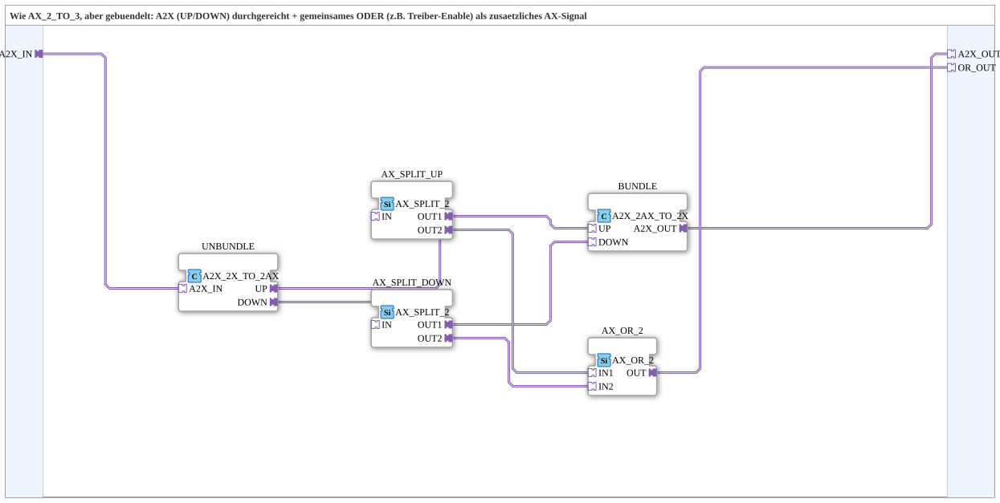

# A2X_TO_A2X_AX

* * * * * * * * * *

## Introduction

`A2X_TO_A2X_AX` is the bundled counterpart to `AX_2_TO_3`: Instead of two separate `AX` sockets/plugs (`UP_IN`/`DOWN_IN`, `UP_OUT`/`DOWN_OUT`), this block receives UP/DOWN signals bundled together as a single `A2X` signal, passes it through unchanged, and additionally provides a single `AX` signal that is the OR of both directions (e.g., for a common driver enable).

## Function Blocks (FBs) Used

### Sub-Blocks: A2X_TO_A2X_AX

- **Type**: SubAppType
- **Internal FBs Used**:

- **UNBUNDLE**: `adapter::conversion::unidirectional::A2X_2X_TO_2AX` — splits the incoming `A2X_IN` into two separate `AX` signals (UP, DOWN).

- **AX_SPLIT_UP** / **AX_SPLIT_DOWN**: each `adapter::events::unidirectional::AX_SPLIT_2` — each branch into a return path (back to the bundled output signal) and a branch for OR operation.

- **BUNDLE**: `adapter::conversion::unidirectional::A2X_2AX_TO_2X` — re-bundles UP/DOWN into a single `A2X_OUT`.

- **AX_OR_2**: `adapter::booleanOperators::AX_OR_2` — returns on `OR_OUT` whether the actuator is currently moving in either direction.

- **Functionality**: `A2X_IN` is unbundled, each direction is split (once back into the bundle, once into the OR operation), UP/DOWN are bundled again (`A2X_OUT`), and the OR operation of both directions is additionally located on `OR_OUT`.

## Program Flow and Connections

1. `A2X_IN` → `UNBUNDLE.A2X_IN` → `UNBUNDLE.UP` → `AX_SPLIT_UP.IN`; `UNBUNDLE.DOWN` → `AX_SPLIT_DOWN.IN`.

2. `AX_SPLIT_UP.OUT1` → `BUNDLE.UP`; `AX_SPLIT_DOWN.OUT1` → `BUNDLE.DOWN`; `BUNDLE.A2X_OUT` → `A2X_OUT`.

3. `AX_SPLIT_UP.OUT2` → `AX_OR_2.IN1`; `AX_SPLIT_DOWN.OUT2` → `AX_OR_2.IN2`; `AX_OR_2.OUT` → `OR_OUT`.

## Technical Features

- **Unchanged passthrough despite bundling**: Externally, `A2X` remains bundled; internally, UP/DOWN is passed through unchanged, as with `AX_2_TO_3`.

- **One split per direction**: Necessary because each of the two unbundled signals must go to two destinations—back into the bundling and into the OR gate.

## Application Scenarios

- Circuits where UP/DOWN are already implemented as a single `A2X` signal (e.g., direction on a double-action valve) and should not be split into two separate `AX` signals.

## Comparison with Similar Components

If UP/DOWN are already implemented individually as `AX`, `AX_2_TO_3` should be used instead—functionally identical (pass-through plus OR as a third signal), but with an unbundled interface.

## Summary

`A2X_TO_A2X_AX` passes a bundled `A2X` signal through unchanged and adds an additional `AX` OR signal—the bundled counterpart to `AX_2_TO_3`.

---

### 🌐 Related topic subpages on ms-muc-docs.de

- [🌐 Eclipse 4diac IDE & Color Reference on ms-muc-docs.de ](https://www.ms-muc-docs.de/iec-61499/eclipse-4diac/)
