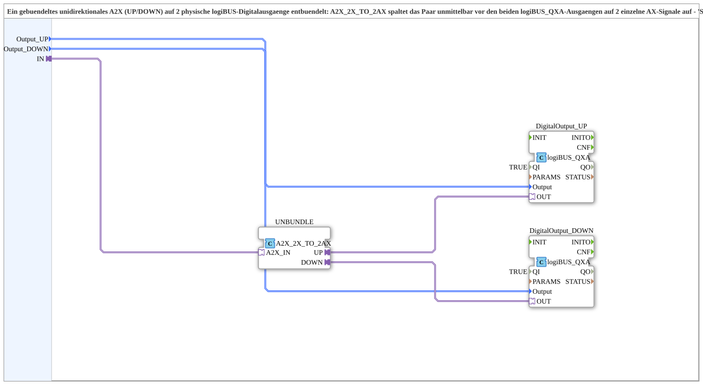

# A2X_TO_QXA2

* * * * * * * * * *

## Introduction

The **A2X_TO_QXA2** subapplication (composite type) acts as a bundling/unbundling adapter between a single bidirectional A2X signal (UP/DOWN) and two physical logicBUS digital outputs. It takes a bundled A2X adapter input and splits it into two separate AX signals, which are then routed to two independent logicBUS QXA digital output function blocks. The unbundling logic is encapsulated within the composite itself, so the device resource remains simple and does not need to handle the separation. This design follows a "sub style" approach: the composite contains the unbundling and output mapping, making it reusable and modular.

## Interface Structure

### **Event Inputs**

None.

### **Event Outputs**

None.

### **Data Inputs**

| Name       | Type                                   | Initial Value | Comment                                   |
|------------|----------------------------------------|---------------|-------------------------------------------|
| `Output_UP`   | `logiBUS::io::DQ::logiBUS_DO_S`        | `Invalid`     | Physical output for forward/up direction. |
| `Output_DOWN` | `logiBUS::io::DQ::logiBUS_DO_S`        | `Invalid`     | Physical output for backward/down direction. |

These data inputs are directly connected to the `Output` parameter of the internal logicBUS QXA function blocks.

### **Data Outputs**

None.

### **Adapters**

| Direction | Name | Type                                        | Comment                                   |
|-----------|------|---------------------------------------------|-------------------------------------------|
| Socket    | `IN` | `adapter::types::unidirectional::A2X`       | Bundled UP/DOWN input signal.             |

## Functionality

The subapplication receives a bundled A2X adapter signal (`IN`). Internally, this signal is fed into an instance of the `A2X_2X_TO_2AX` conversion adapter (named `UNBUNDLE`), which splits the bundled A2X into two separate AX signals: `UP` and `DOWN`. These two signals are then individually connected to the `OUT` adapter ports of two `logiBUS_QXA` function blocks (`DigitalOutput_UP` and `DigitalOutput_DOWN`). Each of these QXA blocks drives a physical logicBUS digital output, whose configuration is provided via the subapplication's data inputs `Output_UP` and `Output_DOWN`.

The internal data connections directly assign the subapplication data inputs to the respective QXA block's `Output` parameter, while the adapter connections carry the signal flow from the input through the unbundler and to the two QXA outputs.

## Technical Features

- **Composite encapsulation**: All unbundling and output-driving logic is contained within the subapplication, simplifying the upper-level resource design.
- **Modularity**: The subapplication can be reused wherever a single A2X input must control two separate physical outputs (e.g., a forward/reverse motor drive).
- **No events**: The block operates purely on data and adapter connections; there are no event inputs or outputs, which keeps the interface simple and suitable for cyclic or continuous processing.
- **Parameterization**: The QXA function blocks have their `QI` parameter preset to `TRUE`, meaning they are always enabled.
- **Type compatibility**: Uses standard 4diac adapter types (`adapter::types::unidirectional::A2X` and `adapter::conversion::unidirectional::A2X_2X_TO_2AX`) and logicBUS I/O types.

## State Overview

The subapplication itself does not maintain any internal state. The state behavior is entirely determined by the underlying QXA output blocks and the conversion adapter. No explicit state machine is defined in this composite.

## Application Scenarios

- **Motor control**: When a single control signal (e.g., from a PLC) provides a direction command (UP/DOWN), the subapplication distributes the command to separate output channels for forward and reverse operation.
- **Actuator redundancy**: In systems where two independent physical outputs are required for the same logical signal (e.g., for safety or redundancy), this block provides a clean separation.
- **Interface adaptation**: When a device has a bundled A2X interface but the physical actuators require individual AX signals, this subapplication bridges the gap without additional glue logic.

## Comparison with Similar Blocks

Compared to a direct wiring of the A2X signal to two QXA outputs, this subapplication encapsulates the unbundling step. Other possible approaches:

- **Direct use of `A2X_2X_TO_2AX`**: This would require the developer to manually instantiate the conversion adapter and connect the outputs to QXA blocks in the resource. The `A2X_TO_QXA2` subapplication simplifies this by pre-configuring the connections and parameter values.
- **Similar subapplications**: If other subapplications exist for different unbundling ratios (e.g., A2X to two separate AX outputs), they would differ in the number of outputs and the internal mapping. This specific variant is optimized for two independent physical outputs.

## Conclusion

The `A2X_TO_QXA2` subapplication provides a clear, reusable solution for splitting a bundled A2X signal into two physical logicBUS digital outputs. Its composite nature keeps the device resource clean and promotes system modularity. With no events and straightforward data/adapter connections, it integrates easily into control applications that require directional output separation.
