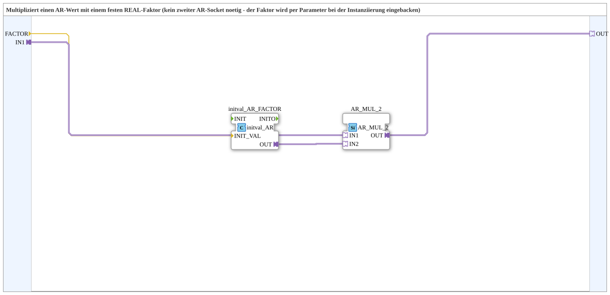

# AR_R_MUL

* * * * * * * * * *
## Introduction
The **AR_R_MUL** function block is a subapplication designed to multiply an AR (Analog/Real) value by a fixed REAL factor. Unlike a generic multiplier that requires two AR inputs, this block uses a constant factor that is set once during instantiation via the `FACTOR` parameter. This simplifies usage in scenarios where the multiplication factor is known ahead of time and does not need to be changed dynamically.

## Interface Structure
The subapplication provides the following interface elements:

### **Event Inputs**
None.

### **Event Outputs**
None.

### **Data Inputs**
| Name    | Type  | Initial Value | Description                              |
|---------|-------|---------------|------------------------------------------|
| `FACTOR`| REAL  | `REAL#1.0`    | Fixed multiplier applied to the input AR value. This value is set as a parameter when the subapplication is instantiated. |

### **Data Outputs**
None.

### **Adapters**
| Direction | Name | Type                                      | Description                         |
|-----------|------|-------------------------------------------|-------------------------------------|
| Socket    | `IN1`| `adapter::types::unidirectional::AR`      | AR value to be scaled.              |
| Plug      | `OUT`| `adapter::types::unidirectional::AR`      | Result of `IN1 × FACTOR`.           |

## Functionality
The subapplication multiplies the AR value received at the `IN1` socket by the constant `FACTOR` and provides the result at the `OUT` plug. Internally, the `FACTOR` data input is converted into a constant AR value using an `initval_AR_FACTOR` function block. This constant AR value is then used as the second operand in an `AR_MUL_2` multiplication block, together with the incoming `IN1` AR value. The product is forwarded to the output.

Since the factor is embedded as a parameter, the subapplication behaves like a fixed‑gain amplifier for AR signals.

## Technical Features
- **Parameter‑driven constant**: The multiplication factor is defined once at design time via the `FACTOR` input, eliminating the need for a second dynamic AR source.
- **Reusability**: The subapplication encapsulates the initialization and multiplication logic, making the overall function easy to instantiate and maintain.
- **Type uniformity**: Both operands are AR type, ensuring compatibility with standard AR signal processing chains.
- **No event involvement**: The block operates purely on data and adapter connections; no event inputs or outputs are required.

## State Overview
The `AR_R_MUL` subapplication does not maintain any internal state. It processes data continuously: as soon as an AR value arrives at `IN1`, it is multiplied by the constant factor and the result is made available at `OUT`. The only relevant state is the fixed `FACTOR` value, which is set during instantiation and remains unchanged during runtime.

## Application Scenarios
- **Sensor scaling**: Convert a raw analog measurement (e.g., 0–10 V) to an engineering unit by applying a fixed scale factor.
- **Unit conversion**: Multiply AR values by a constant to switch between units (e.g., meters to feet).
- **Signal conditioning**: Apply a constant gain to an AR signal for amplification or attenuation.
- **Static calibration**: Incorporate a fixed offset or gain correction in an existing AR processing chain.

## Comparison with Similar Blocks
| Block | Description                                                      | Key Difference                                  |
|-------|------------------------------------------------------------------|-------------------------------------------------|
| `AR_R_MUL` | Multiplies an AR value by a fixed REAL factor.                  | Only one AR input required; factor is static.   |
| `AR_MUL_2` | Multiplies two AR values dynamically.                           | Requires two AR inputs; factor can vary at runtime. |
| `AR_ADD_2` | Adds two AR values.                                             | Performs addition instead of multiplication.    |

The main advantage of `AR_R_MUL` over `AR_MUL_2` is its simplicity when the multiplier is a constant – it saves the effort of creating and maintaining a separate constant source, and reduces wiring complexity.

## Conclusion
`AR_R_MUL` provides a clean and efficient way to apply a fixed scaling factor to an AR signal. By embedding the factor as a parameter in the instantiation, it simplifies the design of control and measurement applications where a constant gain is required. Its straightforward interface and lack of event handling make it easy to integrate into larger 4diac systems.