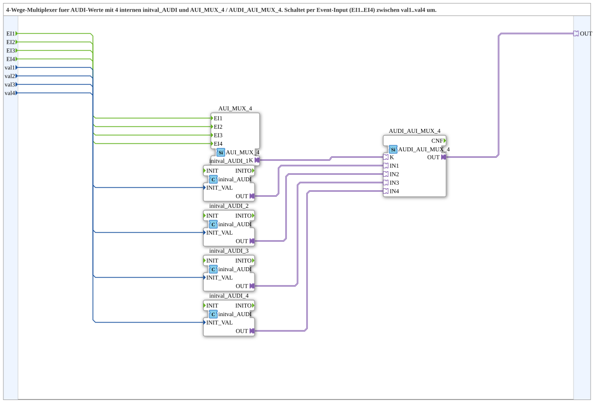

# AUDI_AUI_MUX_4_VAL

* * * * * * * * * *

## Introduction

AUDI_AUI_MUX_4_VAL is a composite subapplication that implements a 4-way multiplexer for AUDI adapter values. It selects between four internal AUDI values using the event inputs EI1 to EI4. Each data input val1 to val4 provides the initial value for one internal AUDI channel. The selected value is made available through a single AUDI adapter output plug.

## Interface Structure

The subapplication has four event inputs, four data inputs, and one adapter output. It does not provide any event outputs or data outputs.

### **Event Inputs**

| Name | Type  | Comment                                |
|------|-------|----------------------------------------|
| EI1  | Event | Event for selecting val1               |
| EI2  | Event | Event for selecting val2               |
| EI3  | Event | Event for selecting val3               |
| EI4  | Event | Event for selecting val4               |

### **Event Outputs**

There are no event outputs.

### **Data Inputs**

| Name | Type  | Comment                                 |
|------|-------|-----------------------------------------|
| val1 | UDINT | Initial output value for EI1            |
| val2 | UDINT | Initial output value for EI2            |
| val3 | UDINT | Initial output value for EI3            |
| val4 | UDINT | Initial output value for EI4            |

### **Data Outputs**

There are no data outputs.

### **Adapters**

| Direction | Name | Type                                      | Comment                            |
|-----------|------|-------------------------------------------|------------------------------------|
| Plug      | OUT  | adapter::types::unidirectional::AUDI      | Selected AUDI adapter output       |

## Functionality

AUDI_AUI_MUX_4_VAL combines four internal `initval_AUDI` instances with two adapter-based multiplexing elements. Each `initval_AUDI` instance receives one of the UDINT data inputs and converts it into an internal AUDI adapter value. The four resulting AUDI channels are connected to the selection block `AUDI_AUI_MUX_4`.

The event inputs EI1 to EI4 are forwarded to the internal event multiplexer `AUI_MUX_4`. Its control output `K` drives `AUDI_AUI_MUX_4` to select the corresponding AUDI input. When an event occurs on EIn, the AUDI value associated with valn is propagated to the `OUT` adapter plug.

This architecture allows the subapplication to switch between four different AUDI values purely by event control, without requiring additional data selection logic on the outside.

## Technical Features

- 4-way event-driven selection of AUDI adapter values.
- Four independent UDINT input values.
- No event outputs or data outputs.
- Output provided as a unidirectional AUDI adapter plug.
- Built from standard adapter-based function blocks:
  - `AUI_MUX_4`
  - `AUDI_AUI_MUX_4`
  - Four `initval_AUDI` instances
- Uses an internal control connection `K` between the event multiplexer and the AUDI selection block.

## State Overview

The subapplication is defined as a composite network and does not contain its own explicit ECC state machine. Its behavior is event-driven: the active AUDI output value depends on the most recently triggered event input. The internal blocks handle the selection and forwarding of the adapter values.

## Application Scenarios

AUDI_AUI_MUX_4_VAL is suitable for applications that need to select one out of four AUDI adapter values at runtime. Typical use cases include:

- Switching between four preconfigured AUDI parameter sets.
- Event-based routing of AUDI data channels.
- Selecting initialization values for different operating modes.
- Multiplexing AUDI values in automation or control networks.

## Comparison with Similar Blocks

AUDI_AUI_MUX_4_VAL is the 4-way variant of the 3-way subapplication `AUDI_AUI_MUX_3_VAL`. Compared to that block, it provides one additional event input, one additional data input, and a fourth internal AUDI value channel. This makes it useful when exactly four alternatives must be handled. For applications with fewer inputs, the 3-way variant may be more compact; for larger selections, additional variants or cascaded multiplexers are required.

## Conclusion

AUDI_AUI_MUX_4_VAL provides a clean and reusable way to multiplex four UDINT-based AUDI adapter values through a single output. Its event-driven interface is simple to integrate into 4diac applications, and the internal composition hides the adapter selection complexity from the surrounding logic.
