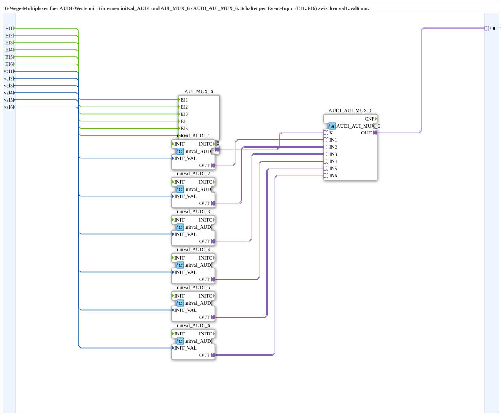

# AUDI_AUI_MUX_6_VAL

* * * * * * * * * *

## Introduction

The AUDI_AUI_MUX_6_VAL is a 6-way multiplexer subapplication designed for selecting AUDI values. It combines six internal initval_AUDI blocks with an AUI_MUX_6 event multiplexer and an AUDI_AUI_MUX_6 selection adapter. The subapp switches between six UDINT input values (val1 to val6) based on event inputs EI1 to EI6, providing the selected value as an AUDI adapter output.

## Interface Structure

### **Event Inputs**

| Event | Type | Comment |
|-------|------|---------|
| EI1 | Event | Event to select val1 |
| EI2 | Event | Event to select val2 |
| EI3 | Event | Event to select val3 |
| EI4 | Event | Event to select val4 |
| EI5 | Event | Event to select val5 |
| EI6 | Event | Event to select val6 |

### **Event Outputs**

No event outputs are provided by this subapplication.

### **Data Inputs**

| Data | Type | Comment |
|------|------|---------|
| val1 | UDINT | Initial output value at EI1 |
| val2 | UDINT | Initial output value at EI2 |
| val3 | UDINT | Initial output value at EI3 |
| val4 | UDINT | Initial output value at EI4 |
| val5 | UDINT | Initial output value at EI5 |
| val6 | UDINT | Initial output value at EI6 |

### **Data Outputs**

No data outputs are provided by this subapplication.

### **Adapters**

| Adapter | Type | Comment |
|---------|------|---------|
| OUT | adapter::types::unidirectional::AUDI | Selected AUDI adapter output |

## Functionality

The subapplication implements a 6-to-1 multiplexer for AUDI values. Internally, it contains:

- Six initval_AUDI instances (initval_AUDI_1 to initval_AUDI_6) that convert the UDINT input values (val1 to val6) into AUDI adapter format. Each initval block receives its corresponding value via the INIT_VAL data input.
- An AUI_MUX_6 event multiplexer block that receives the six event inputs (EI1 to EI6).
- An AUDI_AUI_MUX_6 selection adapter that combines the multiplexed event output (K) and the six initialized AUDI values (IN1 to IN6).

When an event arrives on one of the event inputs (EI1 to EI6), the AUI_MUX_6 block routes the corresponding selection signal to the AUDI_AUI_MUX_6 block. The AUDI_AUI_MUX_6 then forwards the corresponding initialized AUDI value to the OUT adapter.

## Technical Features

- Six-channel event-driven selection
- UDINT input values converted to AUDI adapter values
- Unidirectional AUDI adapter output
- Clean separation of event selection and data routing
- Scalable design based on the 3-way variant

## State Overview

The subapplication itself does not maintain an explicit state machine. The selection behavior is determined by the internal AUI_MUX_6 block, which reacts to the incoming events. After initialization, the output reflects the AUDI value associated with the most recently triggered event input.

## Application Scenarios

- Selecting between multiple sensor values represented as AUDI data
- Switching between different preset AUDI configurations
- Multiplexing AUDI data streams in an IEC 61499-based control application

## Comparison with Similar Blocks

This block is a 6-way extension of the 3-way variant (AUDI_AUI_MUX_3_VAL). Compared to its smaller counterpart, it provides two additional event inputs and data inputs (EI4/EI5/EI6 and val4/val5/val6), enabling the selection between six different AUDI values. The internal architecture follows the same pattern, using initval_AUDI blocks and a shared AUDI_AUI_MUX_6 selection adapter.

## Conclusion

The AUDI_AUI_MUX_6_VAL subapplication provides a convenient, event-driven way to select between six UDINT values and output the corresponding AUDI adapter value. Its modular design makes it suitable for applications requiring multiple selectable AUDI data sources.
