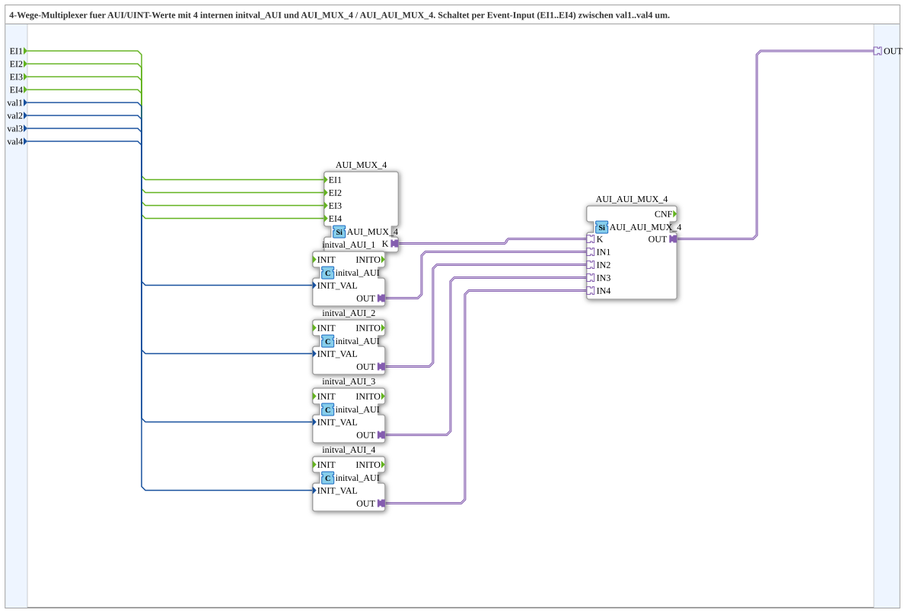

# AUI_AUI_MUX_4_VAL

* * * * * * * * * *

## Introduction

AUI_AUI_MUX_4_VAL is a composite subapplication that implements a 4‑way multiplexer specifically for AUI (Application User Interface) adapter values of type UINT. It combines a set of internal initial value generators (`initval_AUI`) with an event‑driven selection mechanism (`AUI_MUX_4`) and a final adapter switch (`AUI_AUI_MUX_4`). The subapplication is designed to select one of four UINT input values and route it to a single AUI output adapter based on which of the four event inputs is activated.

## Interface Structure

### Event Inputs

| Event   | Description                          |
|---------|--------------------------------------|
| `EI1`   | Event to select the value `val1`     |
| `EI2`   | Event to select the value `val2`     |
| `EI3`   | Event to select the value `val3`     |
| `EI4`   | Event to select the value `val4`     |

### Event Outputs

*None* – the subapplication does not provide event outputs.

### Data Inputs

| Data Input | Type  | Description                        |
|------------|-------|------------------------------------|
| `val1`     | UINT  | UINT value to be output on `EI1`   |
| `val2`     | UINT  | UINT value to be output on `EI2`   |
| `val3`     | UINT  | UINT value to be output on `EI3`   |
| `val4`     | UINT  | UINT value to be output on `EI4`   |

### Data Outputs

*None* – all data is passed through the adapter interface.

### Adapters

| Adapter | Type                                         | Description                              |
|---------|----------------------------------------------|------------------------------------------|
| `OUT`   | `adapter::types::unidirectional::AUI`        | Selected UINT value as an AUI adapter output |

## Functionality

The subapplication operates as follows:

1. The four UINT input values (`val1` … `val4`) are fed into four internal `initval_AUI` blocks, which convert them into AUI adapter values (likely by wrapping the UINT into the AUI adapter structure).
2. The internal `AUI_MUX_4` block receives the event inputs (`EI1` … `EI4`) and, based on the event that occurs, generates a selection signal (`K`) that indicates which input channel is to be chosen.
3. The `AUI_AUI_MUX_4` comparator/switch uses this selection signal to forward the corresponding AUI adapter value from the four internal `initval_AUI` blocks to the single output adapter `OUT`.

Thus, whenever an event `EIx` is triggered, the value `valx` becomes available on the output adapter `OUT`. Only one event is processed at a time; the last event received determines the active output.

## Technical Features

- **Event‑driven selection:** The output is only updated when one of the four event inputs is activated, avoiding continuous polling.
- **Internal initial value handling:** The `initval_AUI` blocks ensure that each input value is properly converted to the AUI adapter format before multiplexing.
- **Adapter‑based output:** The result is provided as an AUI adapter, allowing seamless integration with other AUI‑compatible components.
- **Modular structure:** The subapplication is built from reusable blocks (`AUI_MUX_4`, `AUI_AUI_MUX_4`, `initval_AUI`), promoting maintainability and reusability.

## State Overview

The subapplication does not maintain an internal state machine in the traditional sense. Its behavior is purely combinational with respect to the most recent event: the output reflects the value corresponding to the last event that was received. There is no explicit state storage; the selection is performed asynchronously by the internal adapter switch.

## Application Scenarios

- **Multi‑source data selection:** When a system must choose between several UINT‑based data streams (e.g., sensor readings, configuration values) and output the selected one via an AUI adapter.
- **Control scenario switching:** In an automation environment where different parameter sets (val1…val4) are applied based on discrete control events (EI1…EI4).
- **AUI integration:** For systems already using AUI adapters, this subapp provides a convenient way to multiplex UINT values without leaving the AUI paradigm.

## Comparison with Similar Blocks

- **AUI_AUI_MUX_4** (the internal selection block) itself is a plain adapter multiplexer that requires an additional selection signal. This subapplication **adds event inputs** and **automatic conversion from UINT to AUI**, simplifying the user interface.
- **Standard demultiplexer/multiplexer blocks** often work with plain data types and separate selection inputs; here the selection is embedded in the events, making the component self‑contained and event‑oriented.
- **Similar subapplications** may combine the same internal blocks but offer fewer inputs (e.g., 2‑way), whereas this version supports four independent channels.

## Conclusion

AUI_AUI_MUX_4_VAL provides a compact and efficient solution for selecting one of four UINT values and forwarding it as an AUI adapter output, driven entirely by events. Its internal structure reuses proven building blocks, ensuring reliability and ease of integration in IEC 61499 automation systems. The subapplication is particularly suited for scenarios where several value sources need to be switched dynamically without overcomplicating the application logic.
