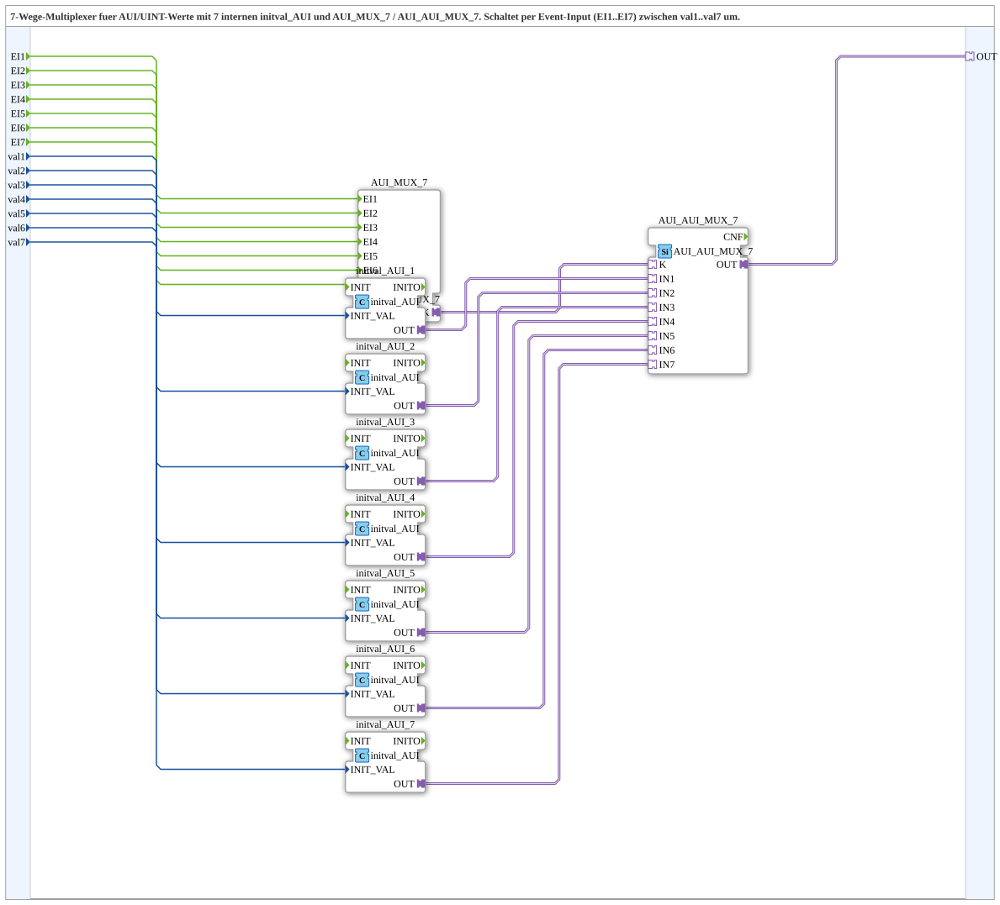

# AUI_AUI_MUX_7_VAL

* * * * * * * * * *

## Introduction

The **AUI_AUI_MUX_7_VAL** is a composite subapplication that implements a 7‑way multiplexer for AUI (Adapter Unified Interface) values derived from UINT inputs. It selects one of seven UINT values (`val1` … `val7`) based on a corresponding event input (`EI1` … `EI7`) and provides the selected value as a unidirectional AUI adapter output (`OUT`). Internally, the subapplication uses pre‑built function blocks to convert the UINT data to AUI format and to perform the actual selection, offering a ready‑to‑use, reusable component for scenarios requiring event‑driven data selection in IEC 61499‑based systems.

## Interface Structure

The subapplication exposes a clean interface comprising event inputs, data inputs, and an adapter output. No event outputs or additional adapters are present.

### **Event Inputs**

| Name | Type   | Comment                              |
|------|--------|---------------------------------------|
| EI1  | Event  | Event to select `val1`               |
| EI2  | Event  | Event to select `val2`               |
| EI3  | Event  | Event to select `val3`               |
| EI4  | Event  | Event to select `val4`               |
| EI5  | Event  | Event to select `val5`               |
| EI6  | Event  | Event to select `val6`               |
| EI7  | Event  | Event to select `val7`               |

### **Event Outputs**

None.

### **Data Inputs**

| Name | Type  | Comment                              |
|------|-------|---------------------------------------|
| val1 | UINT  | Value to be output when `EI1` occurs |
| val2 | UINT  | Value to be output when `EI2` occurs |
| val3 | UINT  | Value to be output when `EI3` occurs |
| val4 | UINT  | Value to be output when `EI4` occurs |
| val5 | UINT  | Value to be output when `EI5` occurs |
| val6 | UINT  | Value to be output when `EI6` occurs |
| val7 | UINT  | Value to be output when `EI7` occurs |

### **Data Outputs**

None.

### **Adapters**

| Name | Type                                    | Direction    | Comment                          |
|------|-----------------------------------------|--------------|----------------------------------|
| OUT  | `adapter::types::unidirectional::AUI`   | Output (Plug) | Selected AUI adapter output     |

## Functionality

The subapplication acts as an event‑driven selector. When an event arrives on one of the event inputs (`EI1` … `EI7`), the corresponding UINT data input (`val1` … `val7`) is converted into an AUI adapter value and propagated to the output adapter `OUT`. The selection is entirely event‑driven; no continuous data sampling occurs—the output is only updated upon the arrival of a triggering event.

Internally, the subapplication is composed of:

- Seven `initval_AUI` function blocks that convert each UINT input into an AUI value.
- An `AUI_MUX_7` block that handles the event selection logic (likely routing the triggering event to the appropriate internal channel).
- An `AUI_AUI_MUX_7` block that performs the final selection of the AUI values from the seven converted inputs and forwards the chosen one to the output adapter `OUT`.

The event input is mapped directly to the selection mechanism, ensuring that a single event selects exactly one data source. The combination of these internal blocks yields a robust, reusable multiplexer with a simple external interface.

## Technical Features

- **Event‑driven selection**: Only one event determines the active input; no polling or continuous evaluation.
- **UINT to AUI conversion**: Each UINT value is converted internally to an AUI adapter type, enabling seamless integration with AUI‑based communication patterns.
- **7‑channel multiplexing**: Supports up to seven distinct input values, each selectable via its own event.
- **Unidirectional AUI output**: The output is a unidirectional adapter, suitable for scenarios where data flows from the subapplication to a connected consumer.
- **Reuse of standard blocks**: The subapplication leverages existing, tested function blocks (`initval_AUI`, `AUI_MUX_7`, `AUI_AUI_MUX_7`) to reduce development and verification effort.
- **No hidden state**: The subapplication is stateless; the output depends solely on the most recent event and the current input values.

## State Overview

The subapplication does not maintain any internal state. Its behaviour is purely combinatorial with respect to the event inputs—the output is updated synchronously when an event occurs. There is no startup, idle, or error state; the block is always ready to respond to events. This simplifies integration and testing, as no re‑initialisation is required.

## Application Scenarios

- **Multi‑source data selection**: In systems where multiple data sources (e.g., sensor readings, configuration values) must be chosen on demand, this subapplication provides a clean event‑driven interface.
- **AUI‑based communication**: When the surrounding application uses AUI adapters for data exchange, this component bridges the gap between simple UINT values and the AUI data type.
- **Rapid prototyping**: Because the subapplication encapsulates the conversion and selection logic, it can be dropped into a 4diac‑based design with minimal configuration.
- **Distributed control systems**: The event‑driven nature aligns well with IEC 61499 event‑based execution models, making the subapplication suitable for distributed automation and process control.

## Comparison with Similar Blocks

- **vs. Standard MUX blocks**: Typical multiplexer FBs in IEC 61499 often use a data input as the selector (e.g., a `K` input) and do not provide per‑event selection. This subapplication uses individual event inputs, which is more natural for event‑driven control flows.
- **vs. AUI‑only multiplexers**: Some multiplexers operate entirely within the AUI domain, but they may not offer the UINT‑to‑AUI conversion. Here, the conversion is intrinsic, simplifying the user interface.
- **vs. Single‑value selectors**: For fewer channels, a simpler selector might suffice, but the 7‑channel configuration provides a scalable solution without needing multiple instances.

## Conclusion

The **AUI_AUI_MUX_7_VAL** subapplication is a well‑designed, reusable component for selecting one of seven UINT values based on event triggers and exposing the result as a unidirectional AUI adapter. Its event‑driven nature, combined with built‑in UINT‑to‑AUI conversion, makes it a practical building block for IEC 61499 applications needing flexible and reliable data multiplexing. With its clear interface and absence of internal state, it is easy to integrate, test, and maintain.
