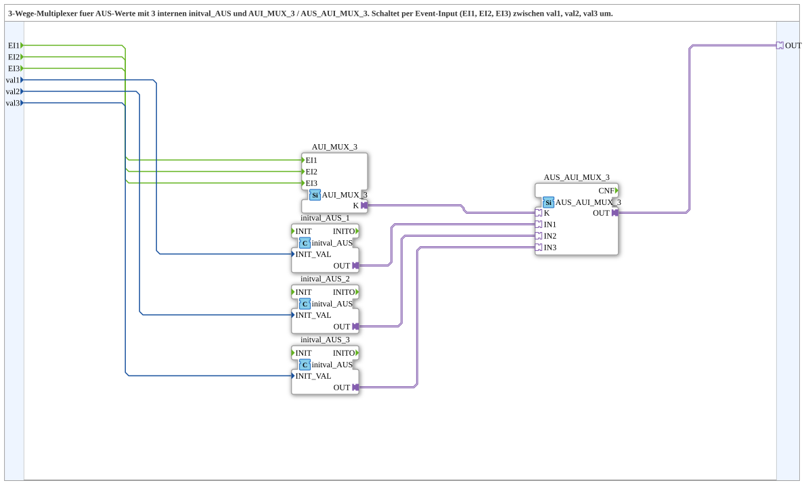

# AUS_AUI_MUX_3_VAL

* * * * * * * * * *

## Introduction

`AUS_AUI_MUX_3_VAL` is a composite subapplication that implements a three-way multiplexer for AUS (Automation Unit Service) values. It provides three independent USINT input values (`val1`, `val2`, `val3`) and, based on which of the three event inputs (`EI1`, `EI2`, `EI3`) is triggered, routes the corresponding value to a unidirectional AUS adapter output (`OUT`).

Internally, the subapplication combines three initial-value adapters (`initval_AUS`) with an event selection block (`AUI_MUX_3`) and an adapter multiplexer (`AUS_AUI_MUX_3`). This allows the user to supply plain numeric values on the subapplication interface while internally converting them to the required AUS adapter representation.

## Interface Structure

### **Event Inputs**

| Name | Type | Comment |
|------|------|---------|
| `EI1` | Event | Event to select `val1` as active output |
| `EI2` | Event | Event to select `val2` as active output |
| `EI3` | Event | Event to select `val3` as active output |

### **Event Outputs**

None. The subapplication does not provide any event outputs.

### **Data Inputs**

| Name | Type | Comment |
|------|------|---------|
| `val1` | USINT | Initial output value used when `EI1` is triggered |
| `val2` | USINT | Initial output value used when `EI2` is triggered |
| `val3` | USINT | Initial output value used when `EI3` is triggered |

### **Data Outputs**

None. The result of the multiplexing is delivered via the adapter plug `OUT`.

### **Adapters**

| Name | Direction | Type | Comment |
|------|-----------|------|---------|
| `OUT` | Plug | `adapter::types::unidirectional::AUS` | Carries the currently selected AUS value |

## Functionality

The subapplication is composed of five internal function blocks that work together to perform the multiplexing task:

1. **`initval_AUS_1`, `initval_AUS_2`, `initval_AUS_3`** – Each of these blocks (type `adapter::types::unidirectional::AUS::initval::initval_AUS`) receives one of the USINT data inputs (`val1`, `val2`, `val3`) on its `INIT_VAL` input and exposes it as a unidirectional AUS adapter on its `OUT` output. This converts the plain numeric value into the AUS adapter form required by the downstream selection block.

2. **`AUI_MUX_3`** – An event multiplexer (type `adapter::events::unidirectional::AUI_MUX_3`) that receives the three event inputs. When an event is received, it sets the selection signal on its adapter output `K` to indicate which channel has been requested.

3. **`AUS_AUI_MUX_3`** – An adapter selection block (type `adapter::selection::unidirectional::AUS_AUI_MUX_3`) that takes the three prepared AUS adapter inputs (`IN1`, `IN2`, `IN3`) plus the selection signal `K`. Based on the value of `K`, it forwards the corresponding input to its `OUT` adapter.

**Signal flow summary:**

- `EI1`/`EI2`/`EI3` → `AUI_MUX_3.EI1/2/3` → `AUI_MUX_3.K` (selection)
- `val1`/`val2`/`val3` → `initval_AUS_1/2/3.INIT_VAL` → `initval_AUS_1/2/3.OUT` → `AUS_AUI_MUX_3.IN1/2/3`
- `AUS_AUI_MUX_3.OUT` → subapplication plug `OUT`

When, for example, `EI1` is triggered, `AUI_MUX_3` encodes this on `K`, which instructs `AUS_AUI_MUX_3` to pass the AUS value generated from `val1` to the `OUT` adapter.

## Technical Features

- **Three independent event-triggered channels** – Each input value is selected exclusively by its corresponding event.
- **USINT data type** – All three input values are unsigned short integers (0–255), suitable for small control values, addresses, or counters.
- **Adapter-based output** – The result is provided through a unidirectional AUS adapter, enabling direct connection to other AUS-compatible blocks in the application.
- **Internal value conversion** – The `initval_AUS` blocks transparently convert raw USINT values into the AUS adapter format, hiding internal representation details from the user.
- **Modular composition** – The subapplication reuses standard blocks (`AUI_MUX_3`, `AUS_AUI_MUX_3`, `initval_AUS`) and can be easily adapted or extended.
- **No data or event outputs** – Simplicity; the only external result is the selected AUS adapter value.
- **Deterministic selection** – The selection logic is purely event-driven; the most recently triggered event determines the active output.

## State Overview

The subapplication does not contain an explicit state machine with multiple persistent states. Instead, it behaves as a **one-hot selection logic**:

- After receipt of `EI1`, the output presents the AUS value derived from `val1`.
- After receipt of `EI2`, the output presents the AUS value derived from `val2`.
- After receipt of `EI3`, the output presents the AUS value derived from `val3`.

The "current state" can be described as the identity of the last received event (or the corresponding selected channel). The output is updated immediately upon the event, without additional data processing steps. Because the selection is event-triggered, no polling or continuous evaluation of the data inputs is required.

## Application Scenarios

- **Mode / profile selection** – Selecting among three pre-defined parameter sets (e.g., operating modes, speed profiles) via discrete event signals.
- **Input routing in process control** – Redirecting a control value from one of three sources to a common output depending on external triggers.
- **Value presets for automation units** – Supplying a fixed value to an AUS-consuming block (e.g., a setpoint or limit) and switching between presets on demand.
- **Testing and simulation** – Switching between different simulation values in a test environment without reconfiguration.
- **HMI or master control integration** – Where operator actions (buttons, commands) generate events that select the corresponding operation value.

## Comparison with Similar Blocks

| Feature | `AUS_AUI_MUX_3` (standalone) | `AUS_AUI_MUX_3_VAL` (this subapplication) |
|---------|------------------------------|-------------------------------------------|
| Input handling | Requires already-prepared AUS adapters on `IN1`, `IN2`, `IN3` | Accepts plain USINT values and converts them internally |
| Value provisioning | External blocks must supply AUS values | Self-contained; values are provided directly on the subapp interface |
| Number of external connections | More complex wiring (multiple AUS plugs) | Simplified – only three numeric inputs and one event per channel |
| Use of `initval_AUS` | Not included | Integrated internally |
| Ease of use | Lower – requires in-depth adapter knowledge | Higher – user only provides simple values and events |

Compared to a generic IEC 61499 MUX function block, this subapplication adds the AUS **adapter conversion layer**, making it directly interoperable with AUS-based components while keeping the interface numeric. Unlike a binary-coded multiplexer, selection here is **event-driven** rather than address-driven.

## Conclusion

`AUS_AUI_MUX_3_VAL` provides a clean, self-contained solution for selecting one of three AUS values via discrete events. By wrapping the `initval_AUS`, `AUI_MUX_3`, and `AUS_AUI_MUX_3` blocks into a single composite, it hides the internal adapter transformations and offers a simple numeric interface. This makes it an ideal building block for applications that need to switch between preset values in an event-oriented manner, while remaining compatible with the 4diac adapter ecosystem.