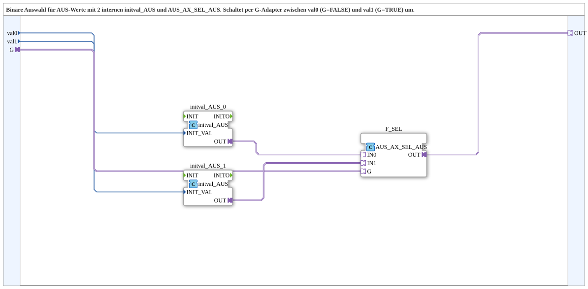

# AUS_AX_SEL_AUS_2_VAL

* * * * * * * * * *

## Introduction

The **AUS_AX_SEL_AUS_2_VAL** is a subapplication that implements a binary selection of two `AUS` (output) adapter values based on a select signal carried by an `AX` adapter. It encapsulates two internal `initval_AUS` blocks that convert raw `USINT` values into valid `AUS` adapter data, and a central `AUS_AX_SEL_AUS` selection block. Depending on the state of the select input `G`, the subapp forwards one of the two configured values (`val0` or `val1`) to its output adapter `OUT`.

## Interface Structure

The subapplication provides no direct event inputs or outputs; all interaction takes place through data inputs and adapter connections.

### **Event Inputs**

None.

### **Event Outputs**

None.

### **Data Inputs**

| Name  | Type  | Comment                                      |
|-------|-------|----------------------------------------------|
| `val0` | `USINT` | Output value when `G` = `FALSE` (IN0)      |
| `val1` | `USINT` | Output value when `G` = `TRUE` (IN1)       |

### **Data Outputs**

None.

### **Adapters**

| Direction | Name  | Type                                      | Comment                               |
|-----------|-------|-------------------------------------------|---------------------------------------|
| Socket (Input) | `G`   | `adapter::types::unidirectional::AX`      | Selection signal `G`                  |
| Plug (Output)  | `OUT` | `adapter::types::unidirectional::AUS`     | Selected `AUS` adapter output         |

## Functionality

The internal network consists of three function blocks and the associated connections:

1. **`initval_AUS_0`** – Takes the `val0` data input and generates an `AUS` adapter value as its output.
2. **`initval_AUS_1`** – Takes the `val1` data input and generates an `AUS` adapter value as its output.
3. **`F_SEL`** (type `AUS_AX_SEL_AUS`) – Receives the two `AUS` values on its `IN0` and `IN1` inputs, and the selection signal `G` (type `AX`) on its `G` input. It forwards the selected `AUS` value to its `OUT` output, which is connected to the subapplication's `OUT` plug.

The selection logic is straightforward: when `G` is `FALSE`, the value from `val0` (via `initval_AUS_0`) is forwarded; when `G` is `TRUE`, the value from `val1` (via `initval_AUS_1`) is forwarded.

## Technical Features

- **Encapsulated initialization** – The raw `USINT` values are wrapped into `AUS` adapter objects by the two internal `initval_AUS` blocks, keeping the subapp interface clean and adapter-based.
- **Adapters only interface** – External communication is performed exclusively through unidirectional adapters (`AX` for selection, `AUS` for the output), making the block compatible with adapter-based system designs.
- **Combinational behavior** – The output follows the selection input without internal state memory; changes on `val0`, `val1`, or `G` are directly reflected.
- **No event dependencies** – The subapp works without event triggers, simplifying its integration in cyclic or continuous processing environments.

## State Overview

This subapplication is purely combinational and does not maintain an internal state. The output is determined solely by the current values of the data inputs `val0`, `val1`, and the adapter input `G`. No initialization sequence, reset handling, or state transition logic is required.

## Application Scenarios

- **Preset value switching** – Selecting between two predefined `AUS` output values (e.g., two different speed commands or configuration codes) based on a binary control signal.
- **Redundant parameter selection** – Switching between a primary and a fallback value in automation systems where an `AUS` adapter delivers the active parameter.
- **Adapter-based I/O routing** – In systems that standardize on unidirectional `AUS`/`AX` adapters, this subapp provides a reusable, interface-compatible selection element.
- **Configuration time setting** – Used to map static configuration values into adapter-formatted outputs, as the `initval` blocks convert constants or externally provided values.

## Comparison with Similar Blocks

| Feature                     | `AUS_AX_SEL_AUS_2_VAL`                                        | Standard `SEL` / `MUX` (IEC 61131)    |
|-----------------------------|----------------------------------------------------------------|----------------------------------------|
| Interface type              | Adapter-based (`AX` / `AUS`)                                  | Direct data pins (e.g., `USINT`)      |
| Value initialization        | Implicit via internal `initval_AUS` blocks                    | Requires external value preparation    |
| Output type                 | Adapter (`AUS`)                                               | Raw data type                          |
| Use in adapter-heavy designs| Fully compatible                                              | Requires additional conversion blocks  |

Unlike a plain `SEL` function block, this subapp encapsulates both the value initialization and the adapter connection logic, reducing the wiring effort and increasing reusability in adapter-oriented architectures.

## Conclusion

`AUS_AX_SEL_AUS_2_VAL` provides a clean, adapter-based solution for selecting between two `AUS` values under the control of an `AX` selection signal. Its internal use of `initval_AUS` blocks hides the conversion complexity from the application programmer and ensures that the subapp can be dropped directly into 4diac projects relying on unidirectional adapters. With its combinational nature and simple interface, it is a practical building block for binary configuration and routing in IEC 61499-based automation systems.
