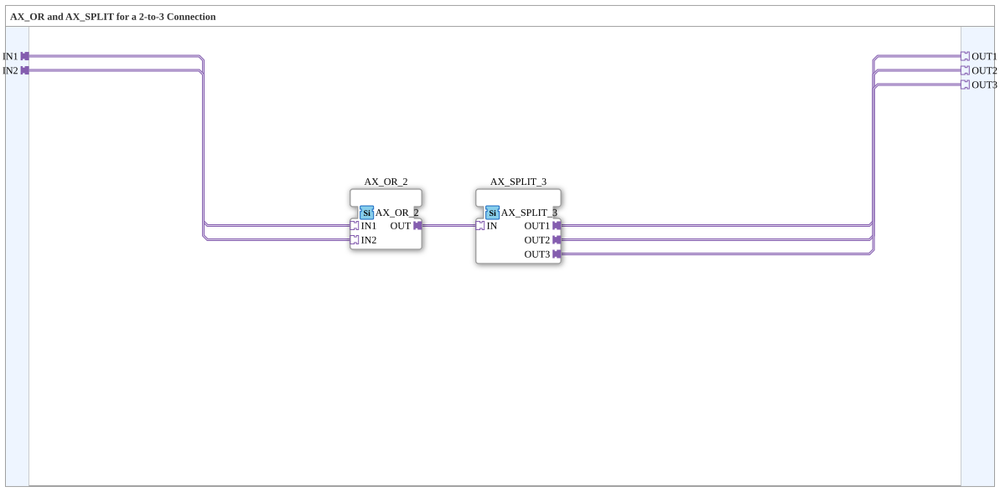

# AX_2_3

* * * * * * * * * *

## Introduction

`AX_2_3` combines `AX_OR_2` and `AX_SPLIT_3` into a single, complete module: Two `AX` sources (`IN1`, `IN2`) are ORed together to form a single signal and then distributed to three destinations (`OUT1`, `OUT2`, `OUT3`).

## Function Blocks (FBs) Used

### Sub-Blocks: AX_2_3

- **Type**: SubAppType
- **Internal FBs Used**:
    - **AX_OR_2**: `adapter::booleanOperators::AX_OR_2` — ORs `IN1` and `IN2`.
    - **AX_SPLIT_3**: `adapter::events::unidirectional::AX_SPLIT_3` — distributes the OR result to three outputs.
- **How it works**: `IN1`/`IN2` → `AX_OR_2.OUT` → `AX_SPLIT_3.IN` → `OUT1`/`OUT2`/`OUT3`.

## Program Flow and Connections

1. `IN1` → `AX_OR_2.IN1`; `IN2` → `AX_OR_2.IN2`.

2. `AX_OR_2.OUT` → `AX_SPLIT_3.IN`.

3. `AX_SPLIT_3.OUT1` → `OUT1`; `AX_SPLIT_3.OUT2` → `OUT2`; `AX_SPLIT_3.OUT3` → `OUT3`.

## Application Scenarios

- Merging two `AX` sources (e.g., two command paths) whose combined output must be distributed to three independent destinations (e.g., hardware, VT display, OPC UA publishing).

## Comparison with Similar Components

For other source/destination counts: [`AX_3_2`](./AX_3_2.md) (3→2), [`AX_3_3`](./AX_3_3.md) (3→3). Not to be confused with [`AX_2_TO_3`](./AX_2_TO_3.md): this one passes UP/DOWN through individually and only provides the OR as a third additional signal, instead of generically combining OR+SPLIT.

## Summary

`AX_2_3` is purely a wiring aid that combines two `AX` sources via OR and distributes them to three destinations—without its own state logic.

---

### 🌐 Related topic subpages on ms-muc-docs.de

- [🌐 Eclipse 4diac IDE & Color Reference on ms-muc-docs.de](https://www.ms-muc-docs.de/iec-61499/eclipse-4diac/)
