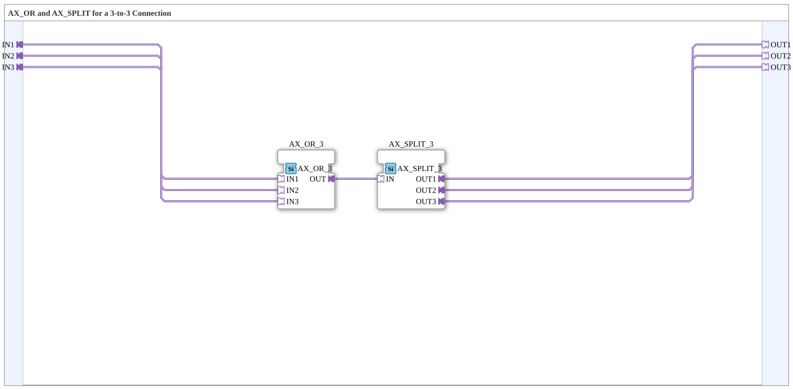

# AX_3_3

* * * * * * * * * *

## Introduction

`AX_3_3` combines `AX_OR_3` and `AX_SPLIT_3` into a single, complete module: Three `AX` sources (`IN1`, `IN2`, `IN3`) are ORed together to form a single signal and then distributed to three destinations (`OUT1`, `OUT2`, `OUT3`).

## Function Blocks (FBs) Used

### Sub-Blocks: AX_3_3

- **Type**: SubAppType
- **Internal FBs Used**:

- **AX_OR_3**: `adapter::booleanOperators::AX_OR_3` — ORs `IN1`/`IN2`/`IN3`.

- **AX_SPLIT_3**: `adapter::events::unidirectional::AX_SPLIT_3` — distributes the OR result to three outputs.

- **How it works**: `IN1`/`IN2`/`IN3` → `AX_OR_3.OUT` → `AX_SPLIT_3.IN` → `OUT1`/`OUT2`/`OUT3`.

## Program Flow and Connections

1. `IN1` → `AX_OR_3.IN1`; `IN2` → `AX_OR_3.IN2`; `IN3` → `AX_OR_3.IN3`.
2. `AX_OR_3.OUT` → `AX_SPLIT_3.IN`.
3. `AX_SPLIT_3.OUT1` → `OUT1`; `AX_SPLIT_3.OUT2` → `OUT2`; `AX_SPLIT_3.OUT3` → `OUT3`.

## Application Scenarios

- Merging three `AX` sources (e.g., three command paths) whose combined output must be distributed to three independent destinations.

## Comparison with Similar Building Blocks

For other source/destination counts: [`AX_2_3`](./AX_2_3.md) (2→3), [`AX_3_2`](./AX_3_2.md) (3→2).

## Summary

`AX_3_3` is a simple wiring aid that combines three `AX` sources using an OR operation and distributes them to three destinations—without its own state logic.

---

### 🌐 Related topic subpages on ms-muc-docs.de

- [🌐 Eclipse 4diac IDE & Color Reference on ms-muc-docs.de](https://www.ms-muc-docs.de/iec-61499/eclipse-4diac/)
