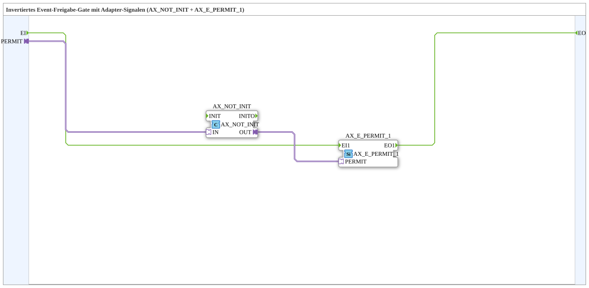

# AX_E_PERMIT_INVERT_1

* * * * * * * * * *

## Introduction

AX_E_PERMIT_INVERT_1 is a composite subapplication that implements an inverted event-permission gate. It combines the adapter-based blocks `AX_NOT_INIT` and `AX_E_PERMIT_1` to allow an event to pass from the event input `EI` to the event output `EO` only when the adapter signal `PERMIT` is **FALSE**.

This subapp is useful when an external permission condition is expressed through a unidirectional adapter and the desired logic is "pass the event when the permission is not active".

## Interface Structure

### **Event Inputs**

| Name | Type | Description |
|------|------|-------------|
| `EI` | Event | Event input. The event is forwarded to `EO` only when the `PERMIT` adapter value is FALSE. |

### **Event Outputs**

| Name | Type | Description |
|------|------|-------------|
| `EO` | Event | Event output. Fires when an event arrives on `EI` and `PERMIT` is FALSE. |

### **Data Inputs**

There are no data inputs.

### **Data Outputs**

There are no data outputs.

### **Adapters**

| Name | Type | Direction | Description |
|------|------|-----------|-------------|
| `PERMIT` | `adapter::types::unidirectional::AX` | Socket | Adapter signal used as the gate condition. Events are allowed to pass when this signal is FALSE. |

## Functionality

The internal network consists of two connected adapter-based function blocks:

1. `AX_NOT_INIT`  
   Receives the `PERMIT` adapter signal and produces its logical inversion on `OUT`.

2. `AX_E_PERMIT_1`  
   Receives the inverted signal on its `PERMIT` adapter input. It forwards events from its event input `EI1` to its event output `EO1` when the inverted signal is TRUE.

The event flow is:

- An event at `EI` is connected to `AX_E_PERMIT_1.EI1`.
- If the external `PERMIT` signal is FALSE, `AX_NOT_INIT` outputs TRUE.
- `AX_E_PERMIT_1` therefore opens the gate and propagates the event to `EO`.
- If the external `PERMIT` signal is TRUE, the gate remains closed and the incoming event is not forwarded.

In other words, the subapp behaves as an event gate with inverted permission logic:

| External `PERMIT` | Event `EI` | Event `EO` |
|-------------------|------------|------------|
| FALSE             | arrives    | fires      |
| TRUE              | arrives    | does not fire |

## Technical Features

- IEC 61499-2 compliant subapplication type.
- No data inputs or data outputs.
- One unidirectional adapter socket `PERMIT`.
- One event input and one event output.
- Internally composed of two reusable adapter-based function blocks.
- The event path and the adapter condition path are strictly separated.
- The inversion of the adapter signal is encapsulated inside the subapp, simplifying the external interface.

## State Overview

The subapp does not expose an internal state machine. Its behavior is event-driven and depends on the current value of the `PERMIT` adapter at the moment an event arrives on `EI`.

There is no latching or retention of events. If the gate is closed when `EI` occurs, that event is discarded. If `PERMIT` changes afterward, the next event on `EI` is evaluated using the new adapter value.

## Application Scenarios

- **Active-low permission logic**  
  Useful when a system should process an event only while a permission signal is not active.

- **Adapter-based event filtering**  
  Can be placed in an event chain to suppress events when an adapter condition is TRUE.

- **Polarity conversion in larger subapplications**  
  Allows standard `AX_E_PERMIT_1` logic to be reused with an inverted enable signal without additional external wiring.

- **Safety and interlock patterns**  
  Suitable for cases where an event must only be forwarded when a certain release condition is absent, such as "not in manual mode" or "no suppression active".

## Comparison with Similar Blocks

| Block / Subapp | Gate Condition | Behavior |
|----------------|----------------|----------|
| `AX_E_PERMIT_1` | Adapter signal TRUE | Forwards event when the adapter signal is TRUE. |
| `AX_E_PERMIT_INVERT_1` | External adapter signal FALSE | Forwards event when the external adapter signal is FALSE. |
| `E_PERMIT` (classic) | BOOL data input TRUE | Forwards event when the BOOL permission input is TRUE. |

The main difference is that `AX_E_PERMIT_INVERT_1` encapsulates the inversion of an adapter signal. This makes it directly usable in adapter-based architectures where the permission condition is already provided as a unidirectional `AX` adapter.

## Conclusion

AX_E_PERMIT_INVERT_1 provides a clean, reusable way to implement an inverted event-permission gate. By combining `AX_NOT_INIT` and `AX_E_PERMIT_1`, it converts a permit adapter signal into a blocking condition and only passes events when the permit is FALSE. This makes it a useful building block for adapter-oriented IEC 61499 applications that require active-low event gating.
