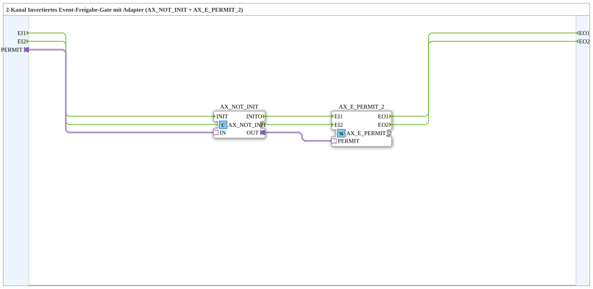

# AX_E_PERMIT_INVERT_2

* * * * * * * * * *

## Introduction

The **AX_E_PERMIT_INVERT_2** is a composite subapplication that provides a two-channel inverted event gating mechanism. It combines a boolean NOT operator (`AX_NOT_INIT`) with a two-channel event permit gate (`AX_E_PERMIT_2`) to create an event pass-through logic where events are only forwarded when the externally supplied permit signal is **inactive** (i.e., `FALSE`). This is particularly useful in safety-oriented control systems where events must be suppressed unless an explicit release condition is met.

## Interface Structure

The subapplication exposes two event inputs, two event outputs, and one adapter socket. It contains no data inputs or data outputs.

### **Event Inputs**

| Name  | Type    | Description                      |
|-------|---------|----------------------------------|
| `EI1` | Event   | Event input channel 1            |
| `EI2` | Event   | Event input channel 2            |

### **Event Outputs**

| Name  | Type    | Description                      |
|-------|---------|----------------------------------|
| `EO1` | Event   | Event output channel 1           |
| `EO2` | Event   | Event output channel 2           |

### **Data Inputs**

None.

### **Data Outputs**

None.

### **Adapters**

| Name     | Type                                      | Description                          |
|----------|-------------------------------------------|--------------------------------------|
| `PERMIT` | `adapter::types::unidirectional::AX`      | Inverted enable signal (socket)      |

## Functionality

The subapplication implements a two-stage processing pipeline:

1. **Signal Inversion Stage**: The incoming `PERMIT` adapter signal is routed to the `AX_NOT_INIT` function block, which performs a logical NOT operation on the boolean value carried by the adapter.

2. **Event Gating Stage**: The inverted boolean result is forwarded to the `PERMIT` input of the `AX_E_PERMIT_2` function block. This block acts as an event gate that conditionally forwards incoming events based on the state of its permit input.

The event flow is straightforward:

- `EI1` → `AX_E_PERMIT_2.EI1` → `EO1`
- `EI2` → `AX_E_PERMIT_2.EI2` → `EO2`

**Gating Behavior**:

- When the external `PERMIT` signal is `FALSE`, the inverted signal becomes `TRUE`. The events arriving at `EI1`/`EI2` are passed through to `EO1`/`EO2`.
- When the external `PERMIT` signal is `TRUE`, the inverted signal becomes `FALSE`. The events arriving at `EI1`/`EI2` are **blocked** and not propagated to the outputs.

This inverted behavior distinguishes the block from a standard permit gate: events are allowed **by default** and are only suppressed when an explicit inhibit signal is asserted.

## Technical Features

- **Two Identical Channels**: Both channels operate independently and identically, allowing simultaneous event processing on two separate paths.
- **Adapter-based Signal Interface**: The permit signal is exchanged via a unidirectional adapter type (`AX`), enabling seamless integration with other 4diac IDE components using the same adapter type.
- **Composite Design**: The subapplication is built from standard, reusable function blocks, making its internal logic transparent and maintainable.
- **No Internal State**: The absence of internal state variables makes the block deterministic and stateless with respect to event processing.
- **Eclipse Public License 2.0**: The implementation is distributed under EPL-2.0, allowing free use and modification.

## State Overview

The subapplication does not maintain any internal state machine. Its behavior is purely combinational in the signal domain:

- The boolean inversion stage is static and immediate.
- The permit gate, `AX_E_PERMIT_2`, may maintain its own internal permit state, which is entirely determined by the inverted adapter signal.

Consequently, there are no distinct operational states to enumerate. The block behaves identically at all times, reacting to the current values of the permit signal and incoming events.

## Application Scenarios

- **Safety Interlocks**: Suppress process events when a safety condition (e.g., emergency stop or guard open) is active, thereby preventing unintended operations.
- **Maintenance Mode**: Block event-triggered actions during maintenance windows by asserting the permit signal, while allowing normal operation when the signal is deasserted.
- **Inverted Permission Logic**: Implement logic where the absence of an explicit deny signal permits event processing, simplifying default-open policies.
- **Supervisory Control**: In multi-channel control systems, gate two independent event streams with a single shared inhibit signal.

## Comparison with Similar Blocks

| Feature                         | `AX_E_PERMIT_2`                       | `AX_E_PERMIT_INVERT_2`                     |
|---------------------------------|---------------------------------------|--------------------------------------------|
| Permit semantics                | Events pass when permit is `TRUE`     | Events pass when permit is `FALSE`         |
| Number of channels              | 2                                     | 2                                          |
| Inversion stage                 | None (direct permit)                  | Built-in `AX_NOT_INIT` inversion           |
| Use case                        | Enable-based gating                   | Inhibit-based gating                       |
| Complexity                      | Lower                                 | Slightly higher (added NOT operator)       |

The inverted variant is functionally equivalent to inserting a NOT gate between the permit source and a standard permit block, but encapsulates this logic into a single reusable component.

## Conclusion

The **AX_E_PERMIT_INVERT_2** subapplication provides a clean and reusable solution for two-channel event gating with inverted permit semantics. By integrating a boolean inversion stage with a standard event permit gate, it enables applications where events flow freely until an explicit inhibit signal is applied. Its adapter-based interface ensures compatibility with the broader 4diac ecosystem, while the composite structure keeps the logic transparent and easily maintainable. This block is particularly well suited for safety, maintenance, and supervisory control applications requiring default-open event behavior.
